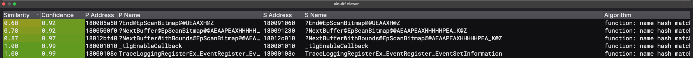

# CVE-2025-53766 GDI+ patch analysis

This marimo case study compares vulnerable and patched Windows 11 `gdiplus.dll`
builds associated with CVE-2025-53766. It includes Rust Diff results from Binary
Ninja, a Ghidriff report, and screenshots of the relevant decompilation.

## Binary pair

| Role | File version | SHA-256 |
| --- | --- | --- |
| Vulnerable | `10.0.26100.4768` | `a58796b75c8704c8ef4ead5dab615c5ee497dd3b51d7f472eedda9fc5d26ee86` |
| Patched | `10.0.26100.4946` | `d6aeb0c28f0e026348ee1b207767a2d02432a3be9037f27d629a3f5853d3c6c2` |

The patched build shipped with Windows update KB5063878. The notebook records
the Microsoft Symbol Server locations used to acquire both DLLs. The binaries
themselves are not committed.

## Finding

The comparison identifies a change in `EpScanBitmap::NextBuffer`. The vulnerable
build multiplies an unchecked value loaded from `this + 0x508` by `0x278` when
computing a buffer offset. The patched build adds a feature-gated bounds check,
compares the current position plus the requested amount with the buffer limit,
and clamps the amount to the remaining space before calling
`EpAlphaBlender::Blend`.

Treat this as patch-diff evidence, not a standalone exploitability proof. The
notebook preserves the decompiler output and the assumptions used to identify
the likely fix.



## Run the notebook

Requirements:

- Python 3.13
- [uv](https://docs.astral.sh/uv/)
- the input JSON already included as `CVE_2025_53766.json`

```bash
git clone https://github.com/meerkatone/patch_chewsday_cve_2025_53766.git
cd patch_chewsday_cve_2025_53766
uv venv --python 3.13
source .venv/bin/activate
uv pip install marimo
marimo edit CVE_2025_53766_diffing.py
```

The notebook may ask marimo to install additional packages through uv.

## Included evidence

- `CVE_2025_53766.json`: Rust Diff result loaded by the notebook
- `CVE_2025_53766_diffing.py`: marimo analysis notebook
- `vulnerable_...ghidriff.md`: independent Ghidriff comparison
- `screenshots/`: acquisition, matching, and decompilation evidence

## References

- [Microsoft CVE-2025-53766 advisory](https://msrc.microsoft.com/update-guide/vulnerability/CVE-2025-53766)
- [KB5063878, OS build 26100.4946](https://support.microsoft.com/en-gb/topic/august-12-2025-kb5063878-os-build-26100-4946-e4b87262-75c8-4fef-9df7-4a18099ee294)
- [Winbindex entry for gdiplus.dll](https://winbindex.m417z.com/?file=gdiplus.dll)
- [Ghidriff](https://github.com/clearbluejar/ghidriff)
