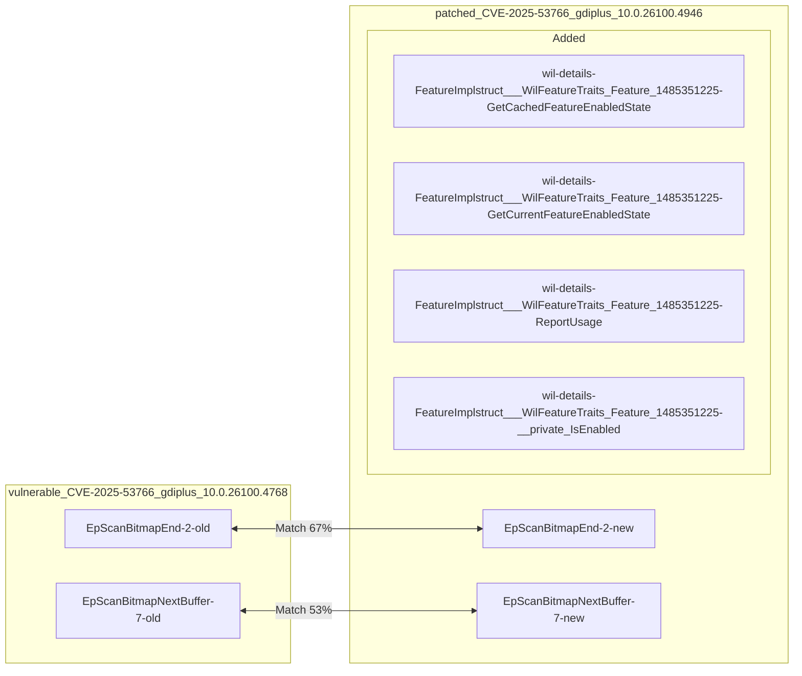
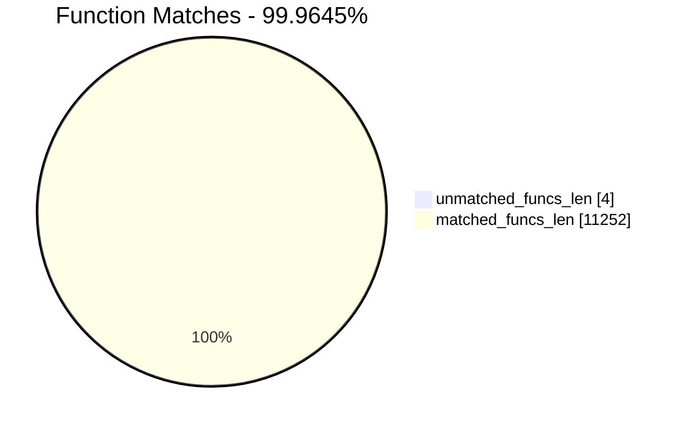
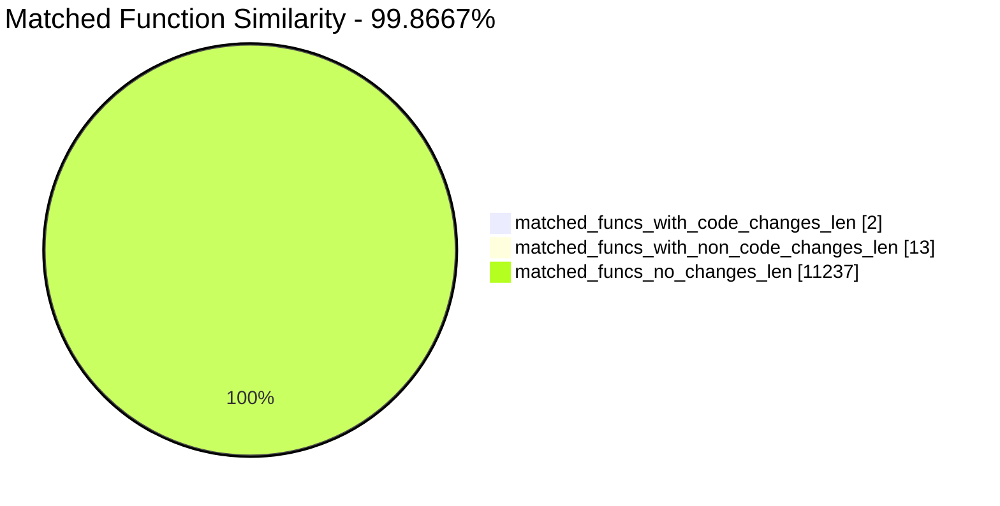
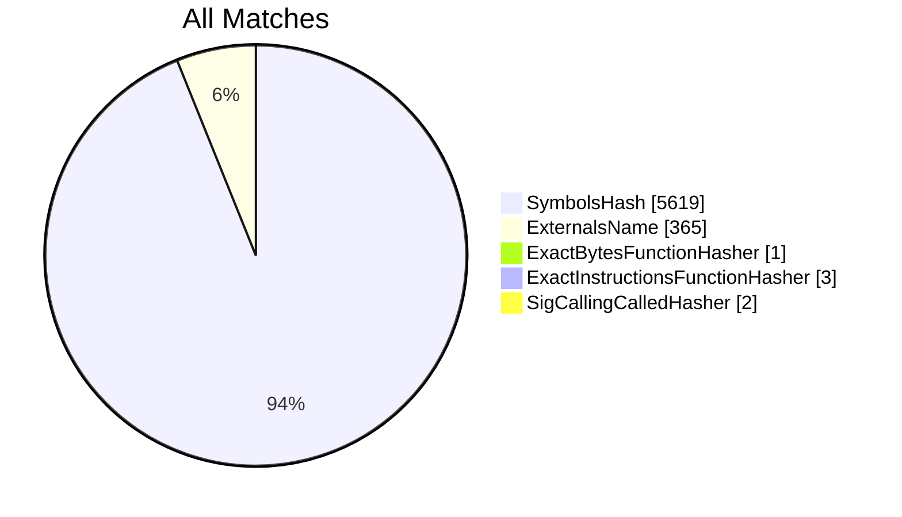
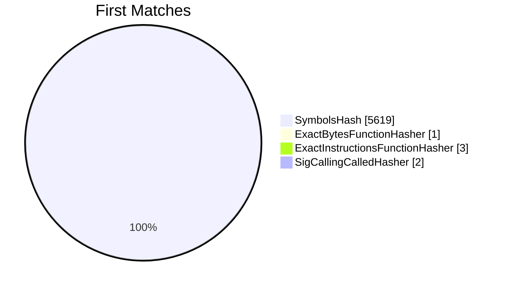
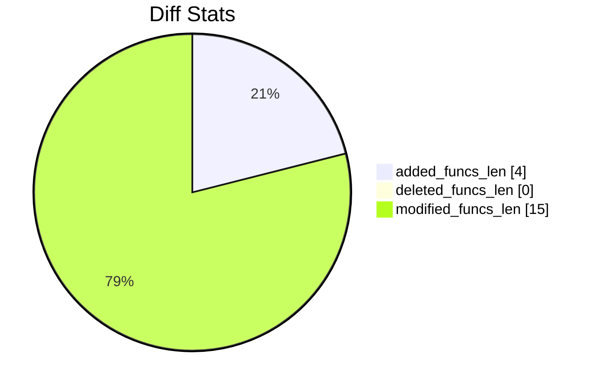
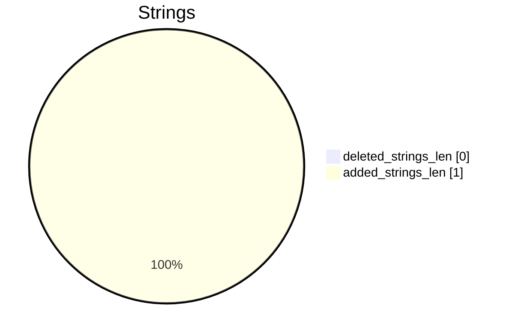

# vulnerable_CVE-2025-53766_gdiplus_10.0.26100.4768-patched_CVE-2025-53766_gdiplus_10.0.26100.4946 Diff

# TOC

* [Visual Chart Diff](#visual-chart-diff)
* [Metadata](#metadata)
	* [Ghidra Diff Engine](#ghidra-diff-engine)
		* [Command Line](#command-line)
	* [Binary Metadata Diff](#binary-metadata-diff)
	* [Program Options](#program-options)
	* [Diff Stats](#diff-stats)
	* [Strings](#strings)
* [Deleted](#deleted)
* [Added](#added)
	* [wil::details::FeatureImpl<struct___WilFeatureTraits_Feature_1485351225>::GetCachedFeatureEnabledState](#wildetailsfeatureimplstruct___wilfeaturetraits_feature_1485351225getcachedfeatureenabledstate)
	* [wil::details::FeatureImpl<struct___WilFeatureTraits_Feature_1485351225>::GetCurrentFeatureEnabledState](#wildetailsfeatureimplstruct___wilfeaturetraits_feature_1485351225getcurrentfeatureenabledstate)
	* [wil::details::FeatureImpl<struct___WilFeatureTraits_Feature_1485351225>::ReportUsage](#wildetailsfeatureimplstruct___wilfeaturetraits_feature_1485351225reportusage)
	* [wil::details::FeatureImpl<struct___WilFeatureTraits_Feature_1485351225>::__private_IsEnabled](#wildetailsfeatureimplstruct___wilfeaturetraits_feature_1485351225__private_isenabled)
* [Modified](#modified)
	* [EpScanBitmap::End](#epscanbitmapend)
	* [EpScanBitmap::NextBuffer](#epscanbitmapnextbuffer)
* [Modified (No Code Changes)](#modified-no-code-changes)
	* [NTDLL.DLL::RtlLogUnexpectedCodepath](#ntdlldllrtllogunexpectedcodepath)
	* [EnsureSubscribedToFeatureConfigurationChanges](#ensuresubscribedtofeatureconfigurationchanges)
	* [__GSHandlerCheck](#__gshandlercheck)
	* [TraceLoggingUnsupportedGdiPlusUsage](#traceloggingunsupportedgdiplususage)
	* [WilApi_GetFeatureEnabledState](#wilapi_getfeatureenabledstate)
	* [ReportUsageToService](#reportusagetoservice)
	* [Blend](#blend)
	* [push_back](#push_back)
	* [SetLoopCountProperty](#setloopcountproperty)
	* [API-MS-WIN-CORE-SYNCH-L1-1-0.DLL::AcquireSRWLockExclusive](#api-ms-win-core-synch-l1-1-0dllacquiresrwlockexclusive)
	* [__security_check_cookie](#__security_check_cookie)
	* [~unique_storage<struct_wil::details::resource_policy<struct__RTL_SRWLOCK*___ptr64,void_(__cdecl*)(struct__RTL_SRWLOCK*___ptr64),&void___cdecl_ReleaseSRWLockExclusive(struct__RTL_SRWLOCK*___ptr64),struct_wistd::integral_constant<unsigned___int64,1>,struct__RTL_SRWLOCK*___ptr64,struct__RTL_SRWLOCK*___ptr64,0,std::nullptr_t>_>](#unique_storagestruct_wildetailsresource_policystruct__rtl_srwlock___ptr64void___cdeclstruct__rtl_srwlock___ptr64void___cdecl_releasesrwlockexclusivestruct__rtl_srwlock___ptr64struct_wistdintegral_constantunsigned___int641struct__rtl_srwlock___ptr64struct__rtl_srwlock___ptr640stdnullptr_t_)

# Visual Chart Diff










# Metadata

## Ghidra Diff Engine

### Command Line

#### Captured Command Line


```
ghidriff --project-location ghidra_projects --project-name ghidriff --symbols-path symbols --gzfs-path gzfs --threaded --log-level INFO --file-log-level INFO --log-path ghidriff.log --min-func-len 10 --gdt [] --bsim --max-ram-percent 60.0 --max-section-funcs 200 vulnerable_CVE-2025-53766_gdiplus_10.0.26100.4768 patched_CVE-2025-53766_gdiplus_10.0.26100.4946
```


#### Verbose Args


<details>

```
--old ['vulnerable_CVE-2025-53766_gdiplus_10.0.26100.4768'] --new [['patched_CVE-2025-53766_gdiplus_10.0.26100.4946']] --engine VersionTrackingDiff --output-path ghidriffs --summary False --project-location ghidra_projects --project-name ghidriff --symbols-path symbols --gzfs-path gzfs --base-address None --program-options None --threaded True --force-analysis False --force-diff False --no-symbols False --log-level INFO --file-log-level INFO --log-path ghidriff.log --va False --min-func-len 10 --use-calling-counts False --gdt [] --bsim True --bsim-full False --max-ram-percent 60.0 --print-flags False --jvm-args None --side-by-side False --max-section-funcs 200 --md-title None
```


</details>

#### Download Original PEs


```
wget https://msdl.microsoft.com/download/symbols/gdiplus/654171D41DE000/gdiplus -O gdiplus.x64.10.0.26100.4768
wget https://msdl.microsoft.com/download/symbols/gdiplus/3C2E90F01DF000/gdiplus -O gdiplus.x64.10.0.26100.4946
```


## Binary Metadata Diff


```diff
--- vulnerable_CVE-2025-53766_gdiplus_10.0.26100.4768 Meta
+++ patched_CVE-2025-53766_gdiplus_10.0.26100.4946 Meta
@@ -1,44 +1,44 @@
-Program Name: vulnerable_CVE-2025-53766_gdiplus_10.0.26100.4768
+Program Name: patched_CVE-2025-53766_gdiplus_10.0.26100.4946
 Language ID: x86:LE:64:default (4.6)
 Compiler ID: windows
 Processor: x86
 Endian: Little
 Address Size: 64
 Minimum Address: 180000000
 Maximum Address: ff0000184f
-# of Bytes: 1960496
+# of Bytes: 1964592
 # of Memory Blocks: 10
-# of Instructions: 386409
-# of Defined Data: 15288
-# of Functions: 5626
-# of Symbols: 55854
-# of Data Types: 1861
+# of Instructions: 386535
+# of Defined Data: 15280
+# of Functions: 5630
+# of Symbols: 55883
+# of Data Types: 1862
 # of Data Type Categories: 54
 Analyzed: true
 Compiler: visualstudio:unknown
 Created With Ghidra Version: 11.4.2
-Date Created: Thu Oct 30 08:25:18 GMT 2025
+Date Created: Thu Oct 30 08:25:28 GMT 2025
 Executable Format: Portable Executable (PE)
-Executable Location: /Users/user/CVE-2025-53766/vulnerable_CVE-2025-53766_gdiplus_10.0.26100.4768
-Executable MD5: 9be07e9e30d46916548d4e3b536c2c87
-Executable SHA256: a58796b75c8704c8ef4ead5dab615c5ee497dd3b51d7f472eedda9fc5d26ee86
-FSRL: file:///Users/user/CVE-2025-53766/vulnerable_CVE-2025-53766_gdiplus_10.0.26100.4768?MD5=9be07e9e30d46916548d4e3b536c2c87
+Executable Location: /Users/user/CVE-2025-53766/patched_CVE-2025-53766_gdiplus_10.0.26100.4946
+Executable MD5: 53a5ebf0d9d20d4bb8c6c6dd1e5aae56
+Executable SHA256: d6aeb0c28f0e026348ee1b207767a2d02432a3be9037f27d629a3f5853d3c6c2
+FSRL: file:///Users/user/CVE-2025-53766/patched_CVE-2025-53766_gdiplus_10.0.26100.4946?MD5=53a5ebf0d9d20d4bb8c6c6dd1e5aae56
 PDB Age: 1
 PDB File: gdiplus.pdb
-PDB GUID: 4f9e2154-11d4-0b2d-1b89-81fe21be3f4a
+PDB GUID: 3d1cf322-4904-b865-c0d2-0406030b5924
 PDB Loaded: true
 PDB Version: RSDS
 PE Property[CompanyName]: Microsoft Corporation
 PE Property[FileDescription]: Microsoft GDI+
-PE Property[FileVersion]: 10.0.26100.4768 (WinBuild.160101.0800)
+PE Property[FileVersion]: 10.0.26100.4946 (WinBuild.160101.0800)
 PE Property[InternalName]: gdiplus
 PE Property[LegalCopyright]: © Microsoft Corporation. All rights reserved.
 PE Property[OriginalFilename]: gdiplus
 PE Property[ProductName]: Microsoft® Windows® Operating System
-PE Property[ProductVersion]: 10.0.26100.4768
+PE Property[ProductVersion]: 10.0.26100.4946
 PE Property[Translation]: 4b00409
 Preferred Root Namespace Category: 
 RTTI Found: false
 Relocatable: true
 SectionAlignment: 4096
 Should Ask To Analyze: false

```


## Program Options


<details>
<summary>Ghidra vulnerable_CVE-2025-53766_gdiplus_10.0.26100.4768 Decompiler Options</summary>


|Decompiler Option|Value|
| :---: | :---: |
|Prototype Evaluation|__fastcall|

</details>


<details>
<summary>Ghidra vulnerable_CVE-2025-53766_gdiplus_10.0.26100.4768 Specification extensions Options</summary>


|Specification extensions Option|Value|
| :---: | :---: |
|FormatVersion|0|
|VersionCounter|0|

</details>


<details>
<summary>Ghidra vulnerable_CVE-2025-53766_gdiplus_10.0.26100.4768 Analyzers Options</summary>


|Analyzers Option|Value|
| :---: | :---: |
|ASCII Strings|true|
|ASCII Strings.Create Strings Containing Existing Strings|true|
|ASCII Strings.Create Strings Containing References|true|
|ASCII Strings.Force Model Reload|false|
|ASCII Strings.Minimum String Length|LEN_5|
|ASCII Strings.Model File|StringModel.sng|
|ASCII Strings.Require Null Termination for String|true|
|ASCII Strings.Search Only in Accessible Memory Blocks|true|
|ASCII Strings.String Start Alignment|ALIGN_1|
|ASCII Strings.String end alignment|4|
|Aggressive Instruction Finder|false|
|Aggressive Instruction Finder.Create Analysis Bookmarks|true|
|Apply Data Archives|true|
|Apply Data Archives.Archive Chooser|[Auto-Detect]|
|Apply Data Archives.Create Analysis Bookmarks|true|
|Apply Data Archives.GDT User File Archive Path|None|
|Apply Data Archives.User Project Archive Path|None|
|Call Convention ID|true|
|Call Convention ID.Analysis Decompiler Timeout (sec)|60|
|Call-Fixup Installer|true|
|Condense Filler Bytes|false|
|Condense Filler Bytes.Filler Value|Auto|
|Condense Filler Bytes.Minimum number of sequential bytes|1|
|Create Address Tables|true|
|Create Address Tables.Allow Offcut References|false|
|Create Address Tables.Auto Label Table|false|
|Create Address Tables.Create Analysis Bookmarks|true|
|Create Address Tables.Maxmimum Pointer Distance|16777215|
|Create Address Tables.Minimum Pointer Address|4132|
|Create Address Tables.Minimum Table Size|2|
|Create Address Tables.Pointer Alignment|1|
|Create Address Tables.Relocation Table Guide|true|
|Create Address Tables.Table Alignment|4|
|Data Reference|true|
|Data Reference.Address Table Alignment|1|
|Data Reference.Address Table Minimum Size|2|
|Data Reference.Align End of Strings|false|
|Data Reference.Ascii String References|true|
|Data Reference.Create Address Tables|true|
|Data Reference.Minimum String Length|5|
|Data Reference.References to Pointers|true|
|Data Reference.Relocation Table Guide|true|
|Data Reference.Respect Execute Flag|true|
|Data Reference.Subroutine References|true|
|Data Reference.Switch Table References|false|
|Data Reference.Unicode String References|true|
|Decompiler Parameter ID|true|
|Decompiler Parameter ID.Analysis Clear Level|ANALYSIS|
|Decompiler Parameter ID.Analysis Decompiler Timeout (sec)|60|
|Decompiler Parameter ID.Commit Data Types|true|
|Decompiler Parameter ID.Commit Void Return Values|false|
|Decompiler Parameter ID.Prototype Evaluation|__fastcall|
|Decompiler Switch Analysis|true|
|Decompiler Switch Analysis.Analysis Decompiler Timeout (sec)|60|
|Demangler Microsoft|true|
|Demangler Microsoft.Apply Function Calling Conventions|true|
|Demangler Microsoft.Apply Function Signatures|true|
|Demangler Microsoft.C-Style Symbol Interpretation|FUNCTION_IF_EXISTS|
|Demangler Microsoft.Demangle Only Known Mangled Symbols|false|
|Disassemble Entry Points|true|
|Disassemble Entry Points.Respect Execute Flag|true|
|Embedded Media|true|
|Embedded Media.Create Analysis Bookmarks|true|
|External Entry References|true|
|Function ID|true|
|Function ID.Always Apply FID Labels|false|
|Function ID.Create Analysis Bookmarks|true|
|Function ID.Instruction Count Threshold|14.6|
|Function ID.Multiple Match Threshold|30.0|
|Function Start Search|true|
|Function Start Search.Bookmark Functions|false|
|Function Start Search.Search Data Blocks|false|
|Non-Returning Functions - Discovered|true|
|Non-Returning Functions - Discovered.Create Analysis Bookmarks|true|
|Non-Returning Functions - Discovered.Function Non-return Threshold|3|
|Non-Returning Functions - Discovered.Repair Flow Damage|true|
|Non-Returning Functions - Known|true|
|Non-Returning Functions - Known.Create Analysis Bookmarks|true|
|PDB MSDIA|false|
|PDB MSDIA.Search untrusted symbol servers|false|
|PDB Universal|true|
|PDB Universal.Import Source Line Info|true|
|PDB Universal.Search untrusted symbol servers|false|
|Reference|true|
|Reference.Address Table Alignment|1|
|Reference.Address Table Minimum Size|2|
|Reference.Align End of Strings|false|
|Reference.Ascii String References|true|
|Reference.Create Address Tables|true|
|Reference.Minimum String Length|5|
|Reference.References to Pointers|true|
|Reference.Relocation Table Guide|true|
|Reference.Respect Execute Flag|true|
|Reference.Subroutine References|true|
|Reference.Switch Table References|false|
|Reference.Unicode String References|true|
|Scalar Operand References|true|
|Scalar Operand References.Relocation Table Guide|true|
|Shared Return Calls|true|
|Shared Return Calls.Allow Conditional Jumps|false|
|Shared Return Calls.Assume Contiguous Functions Only|true|
|Stack|true|
|Stack.Create Local Variables|true|
|Stack.Create Param Variables|false|
|Stack.Max Threads|2|
|Stack.useNewFunctionStackAnalysis|true|
|Subroutine References|true|
|Subroutine References.Create Thunks Early|true|
|Variadic Function Signature Override|false|
|Variadic Function Signature Override.Create Analysis Bookmarks|false|
|Windows x86 PE Exception Handling|true|
|Windows x86 PE RTTI Analyzer|true|
|Windows x86 Thread Environment Block (TEB) Analyzer|true|
|Windows x86 Thread Environment Block (TEB) Analyzer.Starting Address of the TEB||
|Windows x86 Thread Environment Block (TEB) Analyzer.Windows OS Version|Windows 7|
|WindowsPE x86 Propagate External Parameters|false|
|WindowsResourceReference|true|
|WindowsResourceReference.Create Analysis Bookmarks|true|
|x86 Constant Reference Analyzer|true|
|x86 Constant Reference Analyzer.Create Data from pointer|false|
|x86 Constant Reference Analyzer.Function parameter/return Pointer analysis|true|
|x86 Constant Reference Analyzer.Max Threads|2|
|x86 Constant Reference Analyzer.Min absolute reference|4|
|x86 Constant Reference Analyzer.Require pointer param data type|false|
|x86 Constant Reference Analyzer.Speculative reference max|256|
|x86 Constant Reference Analyzer.Speculative reference min|1024|
|x86 Constant Reference Analyzer.Stored Value Pointer analysis|true|
|x86 Constant Reference Analyzer.Trust values read from writable memory|true|

</details>


<details>
<summary>Ghidra patched_CVE-2025-53766_gdiplus_10.0.26100.4946 Decompiler Options</summary>


|Decompiler Option|Value|
| :---: | :---: |
|Prototype Evaluation|__fastcall|

</details>


<details>
<summary>Ghidra patched_CVE-2025-53766_gdiplus_10.0.26100.4946 Specification extensions Options</summary>


|Specification extensions Option|Value|
| :---: | :---: |
|FormatVersion|0|
|VersionCounter|0|

</details>


<details>
<summary>Ghidra patched_CVE-2025-53766_gdiplus_10.0.26100.4946 Analyzers Options</summary>


|Analyzers Option|Value|
| :---: | :---: |
|ASCII Strings|true|
|ASCII Strings.Create Strings Containing Existing Strings|true|
|ASCII Strings.Create Strings Containing References|true|
|ASCII Strings.Force Model Reload|false|
|ASCII Strings.Minimum String Length|LEN_5|
|ASCII Strings.Model File|StringModel.sng|
|ASCII Strings.Require Null Termination for String|true|
|ASCII Strings.Search Only in Accessible Memory Blocks|true|
|ASCII Strings.String Start Alignment|ALIGN_1|
|ASCII Strings.String end alignment|4|
|Aggressive Instruction Finder|false|
|Aggressive Instruction Finder.Create Analysis Bookmarks|true|
|Apply Data Archives|true|
|Apply Data Archives.Archive Chooser|[Auto-Detect]|
|Apply Data Archives.Create Analysis Bookmarks|true|
|Apply Data Archives.GDT User File Archive Path|None|
|Apply Data Archives.User Project Archive Path|None|
|Call Convention ID|true|
|Call Convention ID.Analysis Decompiler Timeout (sec)|60|
|Call-Fixup Installer|true|
|Condense Filler Bytes|false|
|Condense Filler Bytes.Filler Value|Auto|
|Condense Filler Bytes.Minimum number of sequential bytes|1|
|Create Address Tables|true|
|Create Address Tables.Allow Offcut References|false|
|Create Address Tables.Auto Label Table|false|
|Create Address Tables.Create Analysis Bookmarks|true|
|Create Address Tables.Maxmimum Pointer Distance|16777215|
|Create Address Tables.Minimum Pointer Address|4132|
|Create Address Tables.Minimum Table Size|2|
|Create Address Tables.Pointer Alignment|1|
|Create Address Tables.Relocation Table Guide|true|
|Create Address Tables.Table Alignment|4|
|Data Reference|true|
|Data Reference.Address Table Alignment|1|
|Data Reference.Address Table Minimum Size|2|
|Data Reference.Align End of Strings|false|
|Data Reference.Ascii String References|true|
|Data Reference.Create Address Tables|true|
|Data Reference.Minimum String Length|5|
|Data Reference.References to Pointers|true|
|Data Reference.Relocation Table Guide|true|
|Data Reference.Respect Execute Flag|true|
|Data Reference.Subroutine References|true|
|Data Reference.Switch Table References|false|
|Data Reference.Unicode String References|true|
|Decompiler Parameter ID|true|
|Decompiler Parameter ID.Analysis Clear Level|ANALYSIS|
|Decompiler Parameter ID.Analysis Decompiler Timeout (sec)|60|
|Decompiler Parameter ID.Commit Data Types|true|
|Decompiler Parameter ID.Commit Void Return Values|false|
|Decompiler Parameter ID.Prototype Evaluation|__fastcall|
|Decompiler Switch Analysis|true|
|Decompiler Switch Analysis.Analysis Decompiler Timeout (sec)|60|
|Demangler Microsoft|true|
|Demangler Microsoft.Apply Function Calling Conventions|true|
|Demangler Microsoft.Apply Function Signatures|true|
|Demangler Microsoft.C-Style Symbol Interpretation|FUNCTION_IF_EXISTS|
|Demangler Microsoft.Demangle Only Known Mangled Symbols|false|
|Disassemble Entry Points|true|
|Disassemble Entry Points.Respect Execute Flag|true|
|Embedded Media|true|
|Embedded Media.Create Analysis Bookmarks|true|
|External Entry References|true|
|Function ID|true|
|Function ID.Always Apply FID Labels|false|
|Function ID.Create Analysis Bookmarks|true|
|Function ID.Instruction Count Threshold|14.6|
|Function ID.Multiple Match Threshold|30.0|
|Function Start Search|true|
|Function Start Search.Bookmark Functions|false|
|Function Start Search.Search Data Blocks|false|
|Non-Returning Functions - Discovered|true|
|Non-Returning Functions - Discovered.Create Analysis Bookmarks|true|
|Non-Returning Functions - Discovered.Function Non-return Threshold|3|
|Non-Returning Functions - Discovered.Repair Flow Damage|true|
|Non-Returning Functions - Known|true|
|Non-Returning Functions - Known.Create Analysis Bookmarks|true|
|PDB MSDIA|false|
|PDB MSDIA.Search untrusted symbol servers|false|
|PDB Universal|true|
|PDB Universal.Import Source Line Info|true|
|PDB Universal.Search untrusted symbol servers|false|
|Reference|true|
|Reference.Address Table Alignment|1|
|Reference.Address Table Minimum Size|2|
|Reference.Align End of Strings|false|
|Reference.Ascii String References|true|
|Reference.Create Address Tables|true|
|Reference.Minimum String Length|5|
|Reference.References to Pointers|true|
|Reference.Relocation Table Guide|true|
|Reference.Respect Execute Flag|true|
|Reference.Subroutine References|true|
|Reference.Switch Table References|false|
|Reference.Unicode String References|true|
|Scalar Operand References|true|
|Scalar Operand References.Relocation Table Guide|true|
|Shared Return Calls|true|
|Shared Return Calls.Allow Conditional Jumps|false|
|Shared Return Calls.Assume Contiguous Functions Only|true|
|Stack|true|
|Stack.Create Local Variables|true|
|Stack.Create Param Variables|false|
|Stack.Max Threads|2|
|Stack.useNewFunctionStackAnalysis|true|
|Subroutine References|true|
|Subroutine References.Create Thunks Early|true|
|Variadic Function Signature Override|false|
|Variadic Function Signature Override.Create Analysis Bookmarks|false|
|Windows x86 PE Exception Handling|true|
|Windows x86 PE RTTI Analyzer|true|
|Windows x86 Thread Environment Block (TEB) Analyzer|true|
|Windows x86 Thread Environment Block (TEB) Analyzer.Starting Address of the TEB||
|Windows x86 Thread Environment Block (TEB) Analyzer.Windows OS Version|Windows 7|
|WindowsPE x86 Propagate External Parameters|false|
|WindowsResourceReference|true|
|WindowsResourceReference.Create Analysis Bookmarks|true|
|x86 Constant Reference Analyzer|true|
|x86 Constant Reference Analyzer.Create Data from pointer|false|
|x86 Constant Reference Analyzer.Function parameter/return Pointer analysis|true|
|x86 Constant Reference Analyzer.Max Threads|2|
|x86 Constant Reference Analyzer.Min absolute reference|4|
|x86 Constant Reference Analyzer.Require pointer param data type|false|
|x86 Constant Reference Analyzer.Speculative reference max|256|
|x86 Constant Reference Analyzer.Speculative reference min|1024|
|x86 Constant Reference Analyzer.Stored Value Pointer analysis|true|
|x86 Constant Reference Analyzer.Trust values read from writable memory|true|

</details>

## Diff Stats


|Stat|Value|
| :---: | :---: |
|added_funcs_len|4|
|deleted_funcs_len|0|
|modified_funcs_len|15|
|added_symbols_len|0|
|deleted_symbols_len|0|
|diff_time|11.941366910934448|
|deleted_strings_len|0|
|added_strings_len|1|
|match_types|Counter({'SymbolsHash': 5619, 'ExternalsName': 365, 'ExactInstructionsFunctionHasher': 3, 'SigCallingCalledHasher': 2, 'ExactBytesFunctionHasher': 1})|
|items_to_process|19|
|diff_types|Counter({'refcount': 14, 'address': 12, 'calling': 12, 'code': 2, 'length': 2, 'called': 2})|
|unmatched_funcs_len|4|
|total_funcs_len|11256|
|matched_funcs_len|11252|
|matched_funcs_with_code_changes_len|2|
|matched_funcs_with_non_code_changes_len|13|
|matched_funcs_no_changes_len|11237|
|match_func_similarity_percent|99.8667%|
|func_match_overall_percent|99.9645%|
|first_matches|Counter({'SymbolsHash': 5619, 'ExactInstructionsFunctionHasher': 3, 'SigCallingCalledHasher': 2, 'ExactBytesFunctionHasher': 1})|











```mermaid
pie showData
    title Symbols
"added_symbols_len" : 0
"deleted_symbols_len" : 0
```

## Strings




### Strings Diff


```diff
--- deleted strings
+++ added strings
@@ -0,0 +1 @@
+s_GIF89aGIF87a

```


### String References

#### Old


|String|Ref Count|Ref Func|
| :---: | :---: | :---: |

#### New


|String|Ref Count|Ref Func|
| :---: | :---: | :---: |
|s_GIF89aGIF87a_180198008|1||

# Deleted

# Added

## wil::details::FeatureImpl<struct___WilFeatureTraits_Feature_1485351225>::GetCachedFeatureEnabledState

### Function Meta


|Key|patched_CVE-2025-53766_gdiplus_10.0.26100.4946|
| :---: | :---: |
|name|GetCachedFeatureEnabledState|
|fullname|wil::details::FeatureImpl<struct___WilFeatureTraits_Feature_1485351225>::GetCachedFeatureEnabledState|
|refcount|3|
|length|293|
|called|API-MS-WIN-CORE-SYNCH-L1-1-0.DLL::AcquireSRWLockExclusive<br>wil::details::EnsureSubscribedToFeatureConfigurationChanges<br>wil::details::FeatureImpl<struct___WilFeatureTraits_Feature_1485351225>::GetCurrentFeatureEnabledState<br>wil::details::unique_storage<struct_wil::details::resource_policy<struct__RTL_SRWLOCK*___ptr64,void_(__cdecl*)(struct__RTL_SRWLOCK*___ptr64),&void___cdecl_ReleaseSRWLockExclusive(struct__RTL_SRWLOCK*___ptr64),struct_wistd::integral_constant<unsigned___int64,1>,struct__RTL_SRWLOCK*___ptr64,struct__RTL_SRWLOCK*___ptr64,0,std::nullptr_t>_>::~unique_storage<struct_wil::details::resource_policy<struct__RTL_SRWLOCK*___ptr64,void_(__cdecl*)(struct__RTL_SRWLOCK*___ptr64),&void___cdecl_ReleaseSRWLockExclusive(struct__RTL_SRWLOCK*___ptr64),struct_wistd::integral_constant<unsigned___int64,1>,struct__RTL_SRWLOCK*___ptr64,struct__RTL_SRWLOCK*___ptr64,0,std::nullptr_t>_><br>wil::details_abi::heap_buffer::push_back|
|calling|wil::details::FeatureImpl<struct___WilFeatureTraits_Feature_1485351225>::ReportUsage<br>wil::details::FeatureImpl<struct___WilFeatureTraits_Feature_1485351225>::__private_IsEnabled|
|paramcount|1|
|address|18012be24|
|sig|wil_details_FeatureStateCache __thiscall GetCachedFeatureEnabledState(FeatureImpl<struct___WilFeatureTraits_Feature_1485351225> * this)|
|sym_type|Function|
|sym_source|ANALYSIS|
|external|False|


```diff
--- wil::details::FeatureImpl<struct___WilFeatureTraits_Feature_1485351225>::GetCachedFeatureEnabledState
+++ wil::details::FeatureImpl<struct___WilFeatureTraits_Feature_1485351225>::GetCachedFeatureEnabledState
@@ -0,0 +1,82 @@
+
+/* WARNING: Removing unreachable block (ram,0x00018012be76) */
+/* WARNING: Removing unreachable block (ram,0x00018012be7c) */
+/* private: union wil_details_FeatureStateCache __cdecl wil::details::FeatureImpl<struct
+   __WilFeatureTraits_Feature_1485351225>::GetCachedFeatureEnabledState(void) __ptr64 */
+
+void __thiscall
+wil::details::FeatureImpl<struct___WilFeatureTraits_Feature_1485351225>::
+GetCachedFeatureEnabledState(FeatureImpl<struct___WilFeatureTraits_Feature_1485351225> *this)
+
+{
+  uint uVar1;
+  uint uVar2;
+  uint uVar3;
+  FeatureImpl<struct___WilFeatureTraits_Feature_1485351225> *this_00;
+  uint uVar4;
+  uint *in_RDX;
+  bool bVar5;
+  uint local_res10 [2];
+  undefined *local_res18 [2];
+  undefined4 local_38;
+  undefined4 local_34;
+  FeatureImpl<struct___WilFeatureTraits_Feature_1485351225> *local_30;
+  
+  in_RDX[0] = 0;
+  in_RDX[1] = 0;
+  uVar3 = *(uint *)this;
+  *in_RDX = uVar3;
+  if (((byte)uVar3 & 6) == 6) {
+    return;
+  }
+  this_00 = this;
+  uVar2 = EnsureSubscribedToFeatureConfigurationChanges();
+  GetCurrentFeatureEnabledState(this_00,(int *)local_res10);
+  uVar3 = *in_RDX;
+  do {
+    uVar1 = uVar3;
+    *in_RDX = uVar1;
+    uVar4 = uVar1;
+    if ((uVar1 & 4) == 0) {
+      uVar4 = uVar1 & 0xfffffbff | local_res10[0] & 0x400 | 4;
+      *in_RDX = uVar4;
+    }
+    LOCK();
+    uVar3 = *(uint *)this;
+    bVar5 = uVar1 == uVar3;
+    if (bVar5) {
+      *(uint *)this = uVar4;
+      uVar3 = uVar1;
+    }
+    UNLOCK();
+  } while (!bVar5);
+  if (((uVar1 & 4) != 0) ||
+     (g_enabledStateManager == (shutdown_aware_object<class_wil::details::EnabledStateManager>)0x0))
+  goto LAB_18012bf22;
+  AcquireSRWLockExclusive((PSRWLOCK)&DAT_1801b88e0);
+  local_res18[0] = &DAT_1801b88e0;
+  if ((uVar2 == 0) || (uVar2 != DAT_1801b88f4)) {
+LAB_18012bf15:
+    LOCK();
+    *(uint *)this = *(uint *)this & 0xfffffffb;
+    UNLOCK();
+  }
+  else {
+    local_34 = 0;
+    local_38 = 3;
+    local_30 = this;
+    bVar5 = details_abi::heap_buffer::push_back((heap_buffer *)&DAT_1801b8928,&local_38,0x10);
+    if (!bVar5) goto LAB_18012bf15;
+  }
+  unique_storage<struct_wil::details::resource_policy<struct__RTL_SRWLOCK*___ptr64,void_(__cdecl*)(struct__RTL_SRWLOCK*___ptr64),&void___cdecl_ReleaseSRWLockExclusive(struct__RTL_SRWLOCK*___ptr64),struct_wistd::integral_constant<unsigned___int64,1>,struct__RTL_SRWLOCK*___ptr64,struct__RTL_SRWLOCK*___ptr64,0,std::nullptr_t>_>
+  ::
+  ~unique_storage<struct_wil::details::resource_policy<struct__RTL_SRWLOCK*___ptr64,void_(__cdecl*)(struct__RTL_SRWLOCK*___ptr64),&void___cdecl_ReleaseSRWLockExclusive(struct__RTL_SRWLOCK*___ptr64),struct_wistd::integral_constant<unsigned___int64,1>,struct__RTL_SRWLOCK*___ptr64,struct__RTL_SRWLOCK*___ptr64,0,std::nullptr_t>_>
+            ((unique_storage<struct_wil::details::resource_policy<struct__RTL_SRWLOCK*___ptr64,void_(__cdecl*)(struct__RTL_SRWLOCK*___ptr64),&void___cdecl_ReleaseSRWLockExclusive(struct__RTL_SRWLOCK*___ptr64),struct_wistd::integral_constant<unsigned___int64,1>,struct__RTL_SRWLOCK*___ptr64,struct__RTL_SRWLOCK*___ptr64,0,std::nullptr_t>_>
+              *)local_res18);
+LAB_18012bf22:
+  if ((*in_RDX & 2) == 0) {
+    *in_RDX = *in_RDX & 0xfffff63e | local_res10[0] & 0x9c1;
+  }
+  return;
+}
+

```


## wil::details::FeatureImpl<struct___WilFeatureTraits_Feature_1485351225>::GetCurrentFeatureEnabledState

### Function Meta


|Key|patched_CVE-2025-53766_gdiplus_10.0.26100.4946|
| :---: | :---: |
|name|GetCurrentFeatureEnabledState|
|fullname|wil::details::FeatureImpl<struct___WilFeatureTraits_Feature_1485351225>::GetCurrentFeatureEnabledState|
|refcount|2|
|length|174|
|called|wil::details::WilApi_GetFeatureEnabledState|
|calling|wil::details::FeatureImpl<struct___WilFeatureTraits_Feature_1485351225>::GetCachedFeatureEnabledState|
|paramcount|2|
|address|18012bf50|
|sig|wil_details_FeatureStateCache __thiscall GetCurrentFeatureEnabledState(FeatureImpl<struct___WilFeatureTraits_Feature_1485351225> * this, int * param_1)|
|sym_type|Function|
|sym_source|ANALYSIS|
|external|False|


```diff
--- wil::details::FeatureImpl<struct___WilFeatureTraits_Feature_1485351225>::GetCurrentFeatureEnabledState
+++ wil::details::FeatureImpl<struct___WilFeatureTraits_Feature_1485351225>::GetCurrentFeatureEnabledState
@@ -0,0 +1,45 @@
+
+/* private: union wil_details_FeatureStateCache __cdecl wil::details::FeatureImpl<struct
+   __WilFeatureTraits_Feature_1485351225>::GetCurrentFeatureEnabledState(int * __ptr64) __ptr64 */
+
+int * __thiscall
+wil::details::FeatureImpl<struct___WilFeatureTraits_Feature_1485351225>::
+GetCurrentFeatureEnabledState
+          (FeatureImpl<struct___WilFeatureTraits_Feature_1485351225> *this,int *param_1)
+
+{
+  bool bVar1;
+  FEATURE_ENABLED_STATE FVar2;
+  uint uVar3;
+  uint uVar4;
+  uint uVar5;
+  uint uVar6;
+  int *in_R8;
+  
+  FVar2 = WilApi_GetFeatureEnabledState(0x3767c08,(FEATURE_CHANGE_TIME)param_1,in_R8);
+  param_1[0] = 0;
+  param_1[1] = 0;
+  uVar5 = -(uint)((FVar2 & 0x40) != 0) & 0x800 | -(uint)((FVar2 & 0x80) != 0) & 0x400;
+  uVar6 = uVar5 | (FVar2 & 3) << 7;
+  *param_1 = uVar6;
+  if ((FVar2 & 0xffffff3f) == 0) {
+    uVar3 = 0x40;
+  }
+  else {
+    uVar3 = 0;
+    if ((FVar2 & 0xffffff3f) == 2) {
+      uVar3 = 0x40;
+    }
+  }
+  bVar1 = false;
+  uVar4 = 1;
+  if ((uVar5 == 0xc00) || (uVar3 != 0)) {
+    bVar1 = true;
+  }
+  if ((uVar3 == 0) || (!bVar1)) {
+    uVar4 = 0;
+  }
+  *param_1 = uVar6 | uVar3 | uVar4;
+  return param_1;
+}
+

```


## wil::details::FeatureImpl<struct___WilFeatureTraits_Feature_1485351225>::ReportUsage

### Function Meta


|Key|patched_CVE-2025-53766_gdiplus_10.0.26100.4946|
| :---: | :---: |
|name|ReportUsage|
|fullname|wil::details::FeatureImpl<struct___WilFeatureTraits_Feature_1485351225>::ReportUsage|
|refcount|2|
|length|127|
|called|wil::details::FeatureImpl<struct___WilFeatureTraits_Feature_1485351225>::GetCachedFeatureEnabledState<br>wil::details::ReportUsageToService|
|calling|wil::details::FeatureImpl<struct___WilFeatureTraits_Feature_1485351225>::__private_IsEnabled|
|paramcount|4|
|address|18012c0e4|
|sig|void __thiscall ReportUsage(FeatureImpl<struct___WilFeatureTraits_Feature_1485351225> * this, bool param_1, ReportingKind param_2, __uint64 param_3)|
|sym_type|Function|
|sym_source|ANALYSIS|
|external|False|


```diff
--- wil::details::FeatureImpl<struct___WilFeatureTraits_Feature_1485351225>::ReportUsage
+++ wil::details::FeatureImpl<struct___WilFeatureTraits_Feature_1485351225>::ReportUsage
@@ -0,0 +1,31 @@
+
+/* public: void __cdecl wil::details::FeatureImpl<struct
+   __WilFeatureTraits_Feature_1485351225>::ReportUsage(bool,enum wil::ReportingKind,unsigned
+   __int64) __ptr64 */
+
+void __thiscall
+wil::details::FeatureImpl<struct___WilFeatureTraits_Feature_1485351225>::ReportUsage
+          (FeatureImpl<struct___WilFeatureTraits_Feature_1485351225> *this,bool param_1,
+          ReportingKind param_2,__uint64 param_3)
+
+{
+  ulonglong *puVar1;
+  ulonglong uVar2;
+  undefined4 local_res8;
+  undefined2 local_resc;
+  __uint64 in_stack_ffffffffffffffe0;
+  
+  uVar2 = (ulonglong)*(uint *)this;
+  if ((*(uint *)this & 4) == 0) {
+    puVar1 = (ulonglong *)GetCachedFeatureEnabledState(this);
+    uVar2 = *puVar1;
+  }
+  local_res8 = 0;
+  local_resc = 2;
+  ReportUsageToService
+            ((wil_details_FeatureReportingCache *)(this + 8),0x3767c08,(uint)uVar2 >> 10 & 1,
+             (uint)(uVar2 >> 0xb) & 1,(FEATURE_LOGGED_TRAITS *)&local_res8,(uint)param_1,3,
+             in_stack_ffffffffffffffe0);
+  return;
+}
+

```


## wil::details::FeatureImpl<struct___WilFeatureTraits_Feature_1485351225>::__private_IsEnabled

### Function Meta


|Key|patched_CVE-2025-53766_gdiplus_10.0.26100.4946|
| :---: | :---: |
|name|__private_IsEnabled|
|fullname|wil::details::FeatureImpl<struct___WilFeatureTraits_Feature_1485351225>::__private_IsEnabled|
|refcount|2|
|length|53|
|called|wil::details::FeatureImpl<struct___WilFeatureTraits_Feature_1485351225>::GetCachedFeatureEnabledState<br>wil::details::FeatureImpl<struct___WilFeatureTraits_Feature_1485351225>::ReportUsage|
|calling|EpScanBitmap::NextBuffer|
|paramcount|1|
|address|18012c16c|
|sig|bool __thiscall __private_IsEnabled(FeatureImpl<struct___WilFeatureTraits_Feature_1485351225> * this)|
|sym_type|Function|
|sym_source|ANALYSIS|
|external|False|


```diff
--- wil::details::FeatureImpl<struct___WilFeatureTraits_Feature_1485351225>::__private_IsEnabled
+++ wil::details::FeatureImpl<struct___WilFeatureTraits_Feature_1485351225>::__private_IsEnabled
@@ -0,0 +1,18 @@
+
+/* public: bool __cdecl wil::details::FeatureImpl<struct
+   __WilFeatureTraits_Feature_1485351225>::__private_IsEnabled(void) __ptr64 */
+
+bool __thiscall
+wil::details::FeatureImpl<struct___WilFeatureTraits_Feature_1485351225>::__private_IsEnabled
+          (FeatureImpl<struct___WilFeatureTraits_Feature_1485351225> *this)
+
+{
+  ReportingKind in_R8D;
+  __uint64 in_R9;
+  undefined1 local_res10;
+  
+  GetCachedFeatureEnabledState(this);
+  ReportUsage(this,(bool)(local_res10 & 1),in_R8D,in_R9);
+  return (bool)(local_res10 & 1);
+}
+

```


# Modified


*Modified functions contain code changes*
## EpScanBitmap::End

### Match Info


|Key|vulnerable_CVE-2025-53766_gdiplus_10.0.26100.4768 - patched_CVE-2025-53766_gdiplus_10.0.26100.4946|
| :---: | :---: |
|diff_type|code,length,address,called|
|ratio|0.24|
|i_ratio|0.39|
|m_ratio|0.76|
|b_ratio|0.67|
|match_types|SymbolsHash|

### Function Meta Diff


|Key|vulnerable_CVE-2025-53766_gdiplus_10.0.26100.4768|patched_CVE-2025-53766_gdiplus_10.0.26100.4946|
| :---: | :---: | :---: |
|name|End|End|
|fullname|EpScanBitmap::End|EpScanBitmap::End|
|refcount|3|3|
|`length`|715|442|
|`called`|API-MS-WIN-CORE-SYNCH-L1-1-0.DLL::EnterCriticalSection<br>API-MS-WIN-CORE-SYNCH-L1-1-0.DLL::LeaveCriticalSection<br>CopyOnWrite::Release<br>EpScanBitmap::NextBufferWithBounds<br>MapHRESULTToGpStatus<br>TraceLogging::TraceLoggingUnsupportedGdiPlusUsage<br>_guard_dispatch_icall$thunk$10345483385596137414|API-MS-WIN-CORE-SYNCH-L1-1-0.DLL::EnterCriticalSection<br>API-MS-WIN-CORE-SYNCH-L1-1-0.DLL::LeaveCriticalSection<br>CopyOnWrite::Release<br>EpScanBitmap::NextBuffer<br>EpScanBitmap::NextBufferWithBounds<br>MapHRESULTToGpStatus<br>_guard_dispatch_icall$thunk$10345483385596137414|
|calling|||
|paramcount|2|2|
|`address`|180085a50|180091060|
|sig|void __thiscall End(EpScanBitmap * this, int param_1)|void __thiscall End(EpScanBitmap * this, int param_1)|
|sym_type|Function|Function|
|sym_source|ANALYSIS|ANALYSIS|
|external|False|False|

### EpScanBitmap::End Called Diff


```diff
--- EpScanBitmap::End called
+++ EpScanBitmap::End called
@@ -3,0 +4 @@
+EpScanBitmap::NextBuffer
@@ -6 +6,0 @@
-TraceLogging::TraceLoggingUnsupportedGdiPlusUsage
```


### EpScanBitmap::End Diff


```diff
--- EpScanBitmap::End
+++ EpScanBitmap::End
@@ -1,123 +1,78 @@
 
 /* WARNING: Function: _guard_dispatch_icall$thunk$10345483385596137414 replaced with injection:
    guard_dispatch_icall */
 /* public: virtual void __cdecl EpScanBitmap::End(int) __ptr64 */
 
 void __thiscall EpScanBitmap::End(EpScanBitmap *this,int param_1)
 
 {
   int *piVar1;
-  int iVar2;
-  int iVar3;
-  int iVar4;
-  longlong lVar5;
-  undefined8 uVar6;
-  longlong lVar7;
-  longlong *plVar8;
-  bool bVar9;
-  int iVar10;
-  longlong lVar11;
-  longlong lVar12;
-  undefined4 uVar13;
-  EpScanBitmap *pEVar14;
+  longlong lVar2;
+  longlong lVar3;
+  longlong *plVar4;
+  int iVar5;
+  undefined4 uVar6;
   
-  bVar9 = false;
   if (*(int *)(this + 0x598) == 0) {
-    if ((param_1 != 0) && (lVar5 = *(longlong *)(this + 0x558), lVar5 != 0)) {
-      iVar10 = *(int *)(this + 8);
-      iVar2 = *(int *)(this + 0x10);
-      uVar6 = *(undefined8 *)(this + 0x588);
-      lVar7 = *(longlong *)(this + 0x580);
-      lVar11 = (longlong)*(int *)(this + 0x508) * 0x278;
-      iVar3 = *(int *)(this + 0xc);
-      iVar4 = *(int *)(this + 0x14);
-      if (*(int *)(this + lVar11 + 0x80) == 0) {
-        *(longlong *)(this + lVar11 + 0x60) = lVar7;
-      }
-      *(undefined8 *)(this + lVar11 + 0x48) = uVar6;
-      *(int *)(this + lVar11 + 0x38) = iVar10 - iVar2;
-      pEVar14 = this + lVar11 + 0xa8;
-      *(int *)(this + lVar11 + 0x3c) = iVar3 - iVar4;
-      do {
-        lVar11 = lVar7;
-        if (*(longlong *)(pEVar14 + 8) != 1) {
-          lVar11 = *(longlong *)(pEVar14 + 8);
-        }
-        if (lVar11 == 0) {
-          lVar11 = lVar5;
-        }
-        lVar12 = *(longlong *)(pEVar14 + 0x10);
-        if (*(longlong *)(pEVar14 + 0x10) == 0) {
-          bVar9 = true;
-          lVar12 = lVar5;
-        }
-        (**(code **)pEVar14)(lVar12,lVar11,param_1);
-        pEVar14 = pEVar14 + 0x18;
-      } while (!bVar9);
-    }
-    *(undefined8 *)(this + 8) = 0;
-    *(undefined4 *)(this + 0x508) = 0;
-    *(undefined8 *)(this + 0x558) = 0;
-    if ((*(int *)(this + 0x524) < 1) || (*(int *)(this + 0x520) < 1)) {
-      TraceLogging::TraceLoggingUnsupportedGdiPlusUsage
-                (3,0,(longlong)*(int *)(this + 0x520),0,(longlong)*(int *)(this + 0x524));
-    }
+    NextBuffer(this,0,0,0,param_1,0,(__uint64 *)0x0);
   }
   else {
     NextBufferWithBounds(this,0,0,0,param_1,0,(__uint64 *)0x0);
-    iVar10 = *(int *)(this + 0x5a8) + 1;
+    iVar5 = *(int *)(this + 0x5a8) + 1;
     if (*(int *)(this + 0x524) <= *(int *)(this + 0x5a8) + 1) {
-      iVar10 = *(int *)(this + 0x524);
+      iVar5 = *(int *)(this + 0x524);
     }
-    *(int *)(this + 0x5a8) = iVar10;
+    *(int *)(this + 0x5a8) = iVar5;
   }
-  uVar13 = 0;
-  lVar5 = *(longlong *)(this + 0x518);
-  EnterCriticalSection((LPCRITICAL_SECTION)(*(longlong *)(lVar5 + 0x20) + 0x10));
-  lVar7 = *(longlong *)(lVar5 + 0x20);
-  plVar8 = *(longlong **)(lVar7 + 0x58);
-  if (plVar8 != (longlong *)0x0) {
-    iVar10 = (**(code **)(*plVar8 + 0x30))(plVar8,this + 0x530);
-    piVar1 = (int *)(lVar7 + 0x3c);
+  lVar2 = *(longlong *)(this + 0x518);
+  EnterCriticalSection((LPCRITICAL_SECTION)(*(longlong *)(lVar2 + 0x20) + 0x10));
+  lVar3 = *(longlong *)(lVar2 + 0x20);
+  plVar4 = *(longlong **)(lVar3 + 0x58);
+  if (plVar4 != (longlong *)0x0) {
+    iVar5 = (**(code **)(*plVar4 + 0x30))(plVar4,this + 0x530);
+    piVar1 = (int *)(lVar3 + 0x3c);
     *piVar1 = *piVar1 + -1;
-    if (iVar10 < 0) {
-      MapHRESULTToGpStatus(iVar10);
+    if (iVar5 < 0) {
+      MapHRESULTToGpStatus(iVar5);
     }
   }
-  iVar10 = (**(code **)(**(longlong **)(lVar5 + 0x20) + 0x10))();
-  LeaveCriticalSection((LPCRITICAL_SECTION)(*(longlong *)(lVar5 + 0x20) + 0x10));
-  if (iVar10 == 0) {
-    CopyOnWrite::Release(*(CopyOnWrite **)(lVar5 + 0x20));
-    *(undefined8 *)(lVar5 + 0x20) = 0;
+  iVar5 = (**(code **)(**(longlong **)(lVar2 + 0x20) + 0x10))();
+  LeaveCriticalSection((LPCRITICAL_SECTION)(*(longlong *)(lVar2 + 0x20) + 0x10));
+  if (iVar5 == 0) {
+    CopyOnWrite::Release(*(CopyOnWrite **)(lVar2 + 0x20));
+    *(undefined8 *)(lVar2 + 0x20) = 0;
   }
-  lVar5 = *(longlong *)(this + 0x518);
-  iVar10 = *(int *)(*(longlong *)(this + 0x510) + 0x20);
-  EnterCriticalSection((LPCRITICAL_SECTION)(*(longlong *)(lVar5 + 0x20) + 0x10));
-  lVar7 = *(longlong *)(*(longlong *)(lVar5 + 0x20) + 0x58);
-  if (lVar7 != 0) {
-    if (iVar10 != 0) {
-      if (iVar10 == 2) {
-        uVar13 = 2;
-      }
-      else if (iVar10 == 3) {
-        uVar13 = 3;
-      }
-      else {
-        uVar13 = 1;
-        if (iVar10 == 5) {
-          uVar13 = 5;
+  lVar2 = *(longlong *)(this + 0x518);
+  iVar5 = *(int *)(*(longlong *)(this + 0x510) + 0x20);
+  EnterCriticalSection((LPCRITICAL_SECTION)(*(longlong *)(lVar2 + 0x20) + 0x10));
+  lVar3 = *(longlong *)(*(longlong *)(lVar2 + 0x20) + 0x58);
+  if (lVar3 != 0) {
+    if (iVar5 == 0) {
+      uVar6 = 0;
+    }
+    else {
+      uVar6 = 2;
+      if (iVar5 != 2) {
+        if (iVar5 == 3) {
+          uVar6 = 3;
+        }
+        else if (iVar5 == 5) {
+          uVar6 = 5;
+        }
+        else {
+          uVar6 = 1;
         }
       }
     }
-    *(undefined4 *)(lVar7 + 0x88) = uVar13;
+    *(undefined4 *)(lVar3 + 0x88) = uVar6;
   }
-  iVar10 = (**(code **)(**(longlong **)(lVar5 + 0x20) + 0x10))();
-  LeaveCriticalSection((LPCRITICAL_SECTION)(*(longlong *)(lVar5 + 0x20) + 0x10));
-  if (iVar10 == 0) {
-    CopyOnWrite::Release(*(CopyOnWrite **)(lVar5 + 0x20));
-    *(undefined8 *)(lVar5 + 0x20) = 0;
+  iVar5 = (**(code **)(**(longlong **)(lVar2 + 0x20) + 0x10))();
+  LeaveCriticalSection((LPCRITICAL_SECTION)(*(longlong *)(lVar2 + 0x20) + 0x10));
+  if (iVar5 == 0) {
+    CopyOnWrite::Release(*(CopyOnWrite **)(lVar2 + 0x20));
+    *(undefined8 *)(lVar2 + 0x20) = 0;
   }
-  *(undefined8 *)(lVar5 + 0x10) = 0;
+  *(undefined8 *)(lVar2 + 0x10) = 0;
   return;
 }
 

```


## EpScanBitmap::NextBuffer

### Match Info


|Key|vulnerable_CVE-2025-53766_gdiplus_10.0.26100.4768 - patched_CVE-2025-53766_gdiplus_10.0.26100.4946|
| :---: | :---: |
|diff_type|code,refcount,length,address,calling,called|
|ratio|0.44|
|i_ratio|0.25|
|m_ratio|1.0|
|b_ratio|0.53|
|match_types|SymbolsHash|

### Function Meta Diff


|Key|vulnerable_CVE-2025-53766_gdiplus_10.0.26100.4768|patched_CVE-2025-53766_gdiplus_10.0.26100.4946|
| :---: | :---: | :---: |
|name|NextBuffer|NextBuffer|
|fullname|EpScanBitmap::NextBuffer|EpScanBitmap::NextBuffer|
|`refcount`|9|6|
|`length`|469|444|
|`called`|TraceLogging::TraceLoggingUnsupportedGdiPlusUsage<br>_guard_dispatch_icall$thunk$10345483385596137414|EpAlphaBlender::Blend<br>NTDLL.DLL::RtlLogUnexpectedCodepath<br>TraceLogging::TraceLoggingUnsupportedGdiPlusUsage<br>__security_check_cookie<br>wil::details::FeatureImpl<struct___WilFeatureTraits_Feature_1485351225>::__private_IsEnabled|
|`calling`|EpScanBitmap::NextBufferWithBounds|EpScanBitmap::End<br>EpScanBitmap::NextBufferWithBounds|
|paramcount|7|7|
|`address`|1800500f0|180091230|
|sig|void * __thiscall NextBuffer(EpScanBitmap * this, int param_1, int param_2, int param_3, int param_4, int param_5, __uint64 * param_6)|void * __thiscall NextBuffer(EpScanBitmap * this, int param_1, int param_2, int param_3, int param_4, int param_5, __uint64 * param_6)|
|sym_type|Function|Function|
|sym_source|ANALYSIS|ANALYSIS|
|external|False|False|

### EpScanBitmap::NextBuffer Called Diff


```diff
--- EpScanBitmap::NextBuffer called
+++ EpScanBitmap::NextBuffer called
@@ -0,0 +1,2 @@
+EpAlphaBlender::Blend
+NTDLL.DLL::RtlLogUnexpectedCodepath
@@ -2 +4,2 @@
-_guard_dispatch_icall$thunk$10345483385596137414
+__security_check_cookie
+wil::details::FeatureImpl<struct___WilFeatureTraits_Feature_1485351225>::__private_IsEnabled
```


### EpScanBitmap::NextBuffer Calling Diff


```diff
--- EpScanBitmap::NextBuffer calling
+++ EpScanBitmap::NextBuffer calling
@@ -0,0 +1 @@
+EpScanBitmap::End
```


### EpScanBitmap::NextBuffer Diff


```diff
--- EpScanBitmap::NextBuffer
+++ EpScanBitmap::NextBuffer
@@ -1,79 +1,69 @@
 
-/* WARNING: Function: _guard_dispatch_icall$thunk$10345483385596137414 replaced with injection:
-   guard_dispatch_icall */
 /* private: void * __ptr64 __cdecl EpScanBitmap::NextBuffer(int,int,int,int,int,unsigned __int64 *
    __ptr64) __ptr64 */
 
 void * __thiscall
 EpScanBitmap::NextBuffer
           (EpScanBitmap *this,int param_1,int param_2,int param_3,int param_4,int param_5,
           __uint64 *param_6)
 
 {
-  int iVar1;
+  bool bVar1;
   int iVar2;
-  int iVar3;
-  longlong lVar4;
-  undefined8 uVar5;
-  longlong lVar6;
-  int iVar7;
-  longlong lVar8;
-  longlong lVar9;
-  EpScanBitmap *pEVar10;
+  void *extraout_RAX;
+  uint uVar3;
+  undefined1 auStackY_88 [32];
+  undefined4 local_48;
+  undefined8 local_44;
+  ulonglong local_38;
   
-  if ((param_4 != 0) && (lVar4 = *(longlong *)(this + 0x558), lVar4 != 0)) {
-    iVar7 = *(int *)(this + 0xc);
-    iVar1 = *(int *)(this + 8);
-    iVar2 = *(int *)(this + 0x14);
-    iVar3 = *(int *)(this + 0x10);
-    uVar5 = *(undefined8 *)(this + 0x588);
-    lVar8 = (longlong)*(int *)(this + 0x508) * 0x278;
-    lVar6 = *(longlong *)(this + 0x580);
-    if (*(int *)(this + lVar8 + 0x80) == 0) {
-      *(longlong *)(this + lVar8 + 0x60) = lVar6;
+  local_38 = __security_cookie ^ (ulonglong)auStackY_88;
+  if ((param_4 != 0) && (*(longlong *)(this + 0x558) != 0)) {
+    bVar1 = wil::details::FeatureImpl<struct___WilFeatureTraits_Feature_1485351225>::
+            __private_IsEnabled(&`private:_static_class_wil::details::FeatureImpl<struct___WilFeatureTraits_Feature_1485351225>&___ptr64___cdecl_wil::Feature<struct___WilFeatureTraits_Feature_1485351225>::GetImpl(void)'
+                                 ::__l2::impl);
+    if (bVar1) {
+      if (*(int *)(*(longlong *)(this + 0x510) + 4) < *(int *)(this + 8) + param_4) {
+        local_48 = 0x3767bf4;
+        local_44 = 1;
+        RtlLogUnexpectedCodepath(&local_48);
+      }
+      uVar3 = *(int *)(*(longlong *)(this + 0x510) + 4) - *(int *)(this + 8);
+      if ((int)uVar3 <= param_4) {
+        param_4 = uVar3;
+      }
     }
-    *(undefined8 *)(this + lVar8 + 0x48) = uVar5;
-    pEVar10 = this + lVar8 + 0xa8;
-    *(int *)(this + lVar8 + 0x38) = iVar1 - iVar3;
-    *(int *)(this + lVar8 + 0x3c) = iVar7 - iVar2;
-    while( true ) {
-      lVar9 = lVar6;
-      if (*(longlong *)(pEVar10 + 8) != 1) {
-        lVar9 = *(longlong *)(pEVar10 + 8);
-      }
-      if (lVar9 == 0) {
-        lVar9 = lVar4;
-      }
-      if (*(longlong *)(pEVar10 + 0x10) == 0) break;
-      (**(code **)pEVar10)(*(longlong *)(pEVar10 + 0x10),lVar9,param_4,this + lVar8 + 0x20);
-      pEVar10 = pEVar10 + 0x18;
-    }
-    (**(code **)pEVar10)(lVar4,lVar9,param_4,this + lVar8 + 0x20);
+    EpAlphaBlender::Blend
+              ((EpAlphaBlender *)(this + (longlong)*(int *)(this + 0x508) * 0x278 + 0x18),
+               *(void **)(this + 0x558),*(void **)(this + 0x580),param_4,
+               *(int *)(this + 8) - *(int *)(this + 0x10),
+               *(int *)(this + 0xc) - *(int *)(this + 0x14),*(uchar **)(this + 0x588));
   }
   *(int *)(this + 0x508) = param_5;
   *(int *)(this + 8) = param_1;
   *(int *)(this + 0xc) = param_2;
   *(undefined8 *)(this + 0x558) = 0;
   if ((((param_2 < 0) || (*(int *)(this + 0x524) <= param_2)) || (param_1 < 0)) ||
      (*(int *)(this + 0x520) <= param_1)) {
     TraceLogging::TraceLoggingUnsupportedGdiPlusUsage
               (3,(longlong)param_1,(longlong)*(int *)(this + 0x520),(longlong)param_2,
                (longlong)*(int *)(this + 0x524));
   }
   else {
-    iVar7 = *(int *)(this + 0x520) - param_1;
-    if (iVar7 < param_3) {
-      param_3 = iVar7;
+    iVar2 = *(int *)(this + 0x520) - param_1;
+    if (iVar2 < param_3) {
+      param_3 = iVar2;
     }
     if (0 < param_3) {
       *(longlong *)(this + 0x558) =
            (longlong)(param_1 * *(int *)(this + 0x560)) +
            (longlong)(param_2 * *(int *)(this + 0x538)) + *(longlong *)(this + 0x540);
     }
   }
   if (param_6 != (__uint64 *)0x0) {
     *param_6 = *(__uint64 *)(this + 0x590);
   }
-  return *(void **)(this + 0x580);
+  __security_check_cookie(local_38 ^ (ulonglong)auStackY_88);
+  return extraout_RAX;
 }
 

```


# Modified (No Code Changes)


*Slightly modified functions have no code changes, rather differnces in:*
- refcount
- length
- called
- calling
- name
- fullname

## NTDLL.DLL::RtlLogUnexpectedCodepath

### Match Info


|Key|vulnerable_CVE-2025-53766_gdiplus_10.0.26100.4768 - patched_CVE-2025-53766_gdiplus_10.0.26100.4946|
| :---: | :---: |
|diff_type|refcount,calling|
|ratio|1.0|
|i_ratio|1.0|
|m_ratio|1.0|
|b_ratio|1.0|
|match_types|SymbolsHash,ExternalsName|

### Function Meta Diff


|Key|vulnerable_CVE-2025-53766_gdiplus_10.0.26100.4768|patched_CVE-2025-53766_gdiplus_10.0.26100.4946|
| :---: | :---: | :---: |
|name|RtlLogUnexpectedCodepath|RtlLogUnexpectedCodepath|
|fullname|NTDLL.DLL::RtlLogUnexpectedCodepath|NTDLL.DLL::RtlLogUnexpectedCodepath|
|`refcount`|4|5|
|length|0|0|
|called|||
|`calling`|DpRegion::ValidateAndSet<br>DpRegion::ValidateAndSetSlow|DpRegion::ValidateAndSet<br>DpRegion::ValidateAndSetSlow<br>EpScanBitmap::NextBuffer|
|paramcount|0|0|
|address|EXTERNAL:00000030|EXTERNAL:00000030|
|sig|undefined RtlLogUnexpectedCodepath(void)|undefined RtlLogUnexpectedCodepath(void)|
|sym_type|Function|Function|
|sym_source|IMPORTED|IMPORTED|
|external|True|True|

### NTDLL.DLL::RtlLogUnexpectedCodepath Calling Diff


```diff
--- NTDLL.DLL::RtlLogUnexpectedCodepath calling
+++ NTDLL.DLL::RtlLogUnexpectedCodepath calling
@@ -2,0 +3 @@
+EpScanBitmap::NextBuffer
```


## EnsureSubscribedToFeatureConfigurationChanges

### Match Info


|Key|vulnerable_CVE-2025-53766_gdiplus_10.0.26100.4768 - patched_CVE-2025-53766_gdiplus_10.0.26100.4946|
| :---: | :---: |
|diff_type|refcount,address,calling|
|ratio|1.0|
|i_ratio|0.56|
|m_ratio|1.0|
|b_ratio|1.0|
|match_types|SymbolsHash|

### Function Meta Diff


|Key|vulnerable_CVE-2025-53766_gdiplus_10.0.26100.4768|patched_CVE-2025-53766_gdiplus_10.0.26100.4946|
| :---: | :---: | :---: |
|name|EnsureSubscribedToFeatureConfigurationChanges|EnsureSubscribedToFeatureConfigurationChanges|
|fullname|wil::details::EnsureSubscribedToFeatureConfigurationChanges|wil::details::EnsureSubscribedToFeatureConfigurationChanges|
|`refcount`|65|66|
|length|32|32|
|called|wil::details::EnabledStateManager::EnsureSubscribedToFeatureConfigurationChangesImpl|wil::details::EnabledStateManager::EnsureSubscribedToFeatureConfigurationChangesImpl|
|`calling`|<details><summary>Expand for full list:<br>wil::details::FeatureImpl<struct___WilFeatureTraits_Feature_2244743481>::GetCachedFeatureEnabledState<br>wil::details::FeatureImpl<struct___WilFeatureTraits_Feature_4046296378>::GetCachedFeatureEnabledState<br>wil::details::FeatureImpl<struct___WilFeatureTraits_Feature_CadTest>::GetCachedFeatureEnabledState<br>wil::details::FeatureImpl<struct___WilFeatureTraits_Feature_GdiPlusOptimizations>::GetCachedFeatureEnabledState<br>wil::details::FeatureImpl<struct___WilFeatureTraits_Feature_GdiPlusOptimizations_DpOutputSpanStretch>::GetCachedFeatureEnabledState<br>wil::details::FeatureImpl<struct___WilFeatureTraits_Feature_GdiPlusOptimizations_GpBitmapScaler>::GetCachedFeatureEnabledState<br>wil::details::FeatureImpl<struct___WilFeatureTraits_Feature_GdiPlusOptimizations_Misc>::GetCachedFeatureEnabledState<br>wil::details::FeatureImpl<struct___WilFeatureTraits_Feature_GdiPlusOptimizations_ScanOpAlphaMulDiv>::GetCachedFeatureEnabledState<br>wil::details::FeatureImpl<struct___WilFeatureTraits_Feature_GdiPlusOptimizations_ScanOpBlend>::GetCachedFeatureEnabledState<br>wil::details::FeatureImpl<struct___WilFeatureTraits_Feature_GdiPlusOptimizations_ScanOpConvert>::GetCachedFeatureEnabledState<br>wil::details::FeatureImpl<struct___WilFeatureTraits_Feature_GdiPlusOptimizations_ScanOpQuantize>::GetCachedFeatureEnabledState</summary>wil::details::FeatureImpl<struct___WilFeatureTraits_Feature_MTestUx14>::GetCachedFeatureEnabledState<br>wil::details::FeatureImpl<struct___WilFeatureTraits_Feature_MTestUx15>::GetCachedFeatureEnabledState<br>wil::details::FeatureImpl<struct___WilFeatureTraits_Feature_NiwTest>::GetCachedFeatureEnabledState<br>wil::details::FeatureImpl<struct___WilFeatureTraits_Feature_PerfImpTest>::GetCachedFeatureEnabledState<br>wil::details::FeatureImpl<struct___WilFeatureTraits_Feature_PerfTestCen2>::GetCachedFeatureEnabledState<br>wil::details::FeatureImpl<struct___WilFeatureTraits_Feature_Servicing_Dcr_22_12_NonSec>::GetCachedFeatureEnabledState<br>wil::details::FeatureImpl<struct___WilFeatureTraits_Feature_Servicing_Dcr_23_01_NonSec>::GetCachedFeatureEnabledState<br>wil::details::FeatureImpl<struct___WilFeatureTraits_Feature_Servicing_Dcr_23_02_NonSec>::GetCachedFeatureEnabledState<br>wil::details::FeatureImpl<struct___WilFeatureTraits_Feature_Servicing_Dcr_23_03_NonSec>::GetCachedFeatureEnabledState<br>wil::details::FeatureImpl<struct___WilFeatureTraits_Feature_Servicing_Dcr_23_04_NonSec>::GetCachedFeatureEnabledState<br>wil::details::FeatureImpl<struct___WilFeatureTraits_Feature_Servicing_Dcr_23_05_NonSec>::GetCachedFeatureEnabledState<br>wil::details::FeatureImpl<struct___WilFeatureTraits_Feature_Servicing_Dcr_23_06_NonSec>::GetCachedFeatureEnabledState<br>wil::details::FeatureImpl<struct___WilFeatureTraits_Feature_Servicing_Dcr_23_07_NonSec>::GetCachedFeatureEnabledState<br>wil::details::FeatureImpl<struct___WilFeatureTraits_Feature_Servicing_Dcr_23_08_NonSec>::GetCachedFeatureEnabledState<br>wil::details::FeatureImpl<struct___WilFeatureTraits_Feature_Servicing_Dcr_23_09_NonSec>::GetCachedFeatureEnabledState<br>wil::details::FeatureImpl<struct___WilFeatureTraits_Feature_Servicing_Dcr_23_10_NonSec>::GetCachedFeatureEnabledState<br>wil::details::FeatureImpl<struct___WilFeatureTraits_Feature_Servicing_Dcr_23_11_NonSec>::GetCachedFeatureEnabledState<br>wil::details::FeatureImpl<struct___WilFeatureTraits_Feature_Servicing_Dcr_23_12_NonSec>::GetCachedFeatureEnabledState<br>wil::details::FeatureImpl<struct___WilFeatureTraits_Feature_Servicing_Dcr_24_01_NonSec>::GetCachedFeatureEnabledState<br>wil::details::FeatureImpl<struct___WilFeatureTraits_Feature_Servicing_Dcr_24_02_NonSec>::GetCachedFeatureEnabledState<br>wil::details::FeatureImpl<struct___WilFeatureTraits_Feature_Servicing_Dcr_24_03_NonSec>::GetCachedFeatureEnabledState<br>wil::details::FeatureImpl<struct___WilFeatureTraits_Feature_Servicing_Dcr_24_04_NonSec>::GetCachedFeatureEnabledState<br>wil::details::FeatureImpl<struct___WilFeatureTraits_Feature_Servicing_Dcr_24_05_NonSec>::GetCachedFeatureEnabledState<br>wil::details::FeatureImpl<struct___WilFeatureTraits_Feature_Servicing_Dcr_24_06_NonSec>::GetCachedFeatureEnabledState<br>wil::details::FeatureImpl<struct___WilFeatureTraits_Feature_Servicing_EmfplusInvalidClipRectsOrder>::GetCachedFeatureEnabledState<br>wil::details::FeatureImpl<struct___WilFeatureTraits_Feature_Servicing_GDIPlus_Fix16MulRoundToByte>::GetCachedFeatureEnabledState<br>wil::details::FeatureImpl<struct___WilFeatureTraits_Feature_Servicing_GdiPlusPlane2RenderFallbackIssue>::GetCachedFeatureEnabledState<br>wil::details::FeatureImpl<struct___WilFeatureTraits_Feature_SettingsDel>::GetCachedFeatureEnabledState<br>wil::details::FeatureImpl<struct___WilFeatureTraits_Feature_Standalone_24_04_NonSec>::GetCachedFeatureEnabledState<br>wil::details::FeatureImpl<struct___WilFeatureTraits_Feature_Standalone_24_05_NonSec>::GetCachedFeatureEnabledState<br>wil::details::FeatureImpl<struct___WilFeatureTraits_Feature_Standalone_24_06_NonSec>::GetCachedFeatureEnabledState<br>wil::details::FeatureImpl<struct___WilFeatureTraits_Feature_Standalone_24_07_NonSec>::GetCachedFeatureEnabledState<br>wil::details::FeatureImpl<struct___WilFeatureTraits_Feature_Standalone_24_08_NonSec>::GetCachedFeatureEnabledState<br>wil::details::FeatureImpl<struct___WilFeatureTraits_Feature_Standalone_24_09_NonSec>::GetCachedFeatureEnabledState<br>wil::details::FeatureImpl<struct___WilFeatureTraits_Feature_Standalone_24_10_NonSec>::GetCachedFeatureEnabledState<br>wil::details::FeatureImpl<struct___WilFeatureTraits_Feature_Standalone_24_11_NonSec>::GetCachedFeatureEnabledState<br>wil::details::FeatureImpl<struct___WilFeatureTraits_Feature_Standalone_24_12_NonSec>::GetCachedFeatureEnabledState<br>wil::details::FeatureImpl<struct___WilFeatureTraits_Feature_Standalone_25_01_NonSec>::GetCachedFeatureEnabledState<br>wil::details::FeatureImpl<struct___WilFeatureTraits_Feature_Standalone_25_02_NonSec>::GetCachedFeatureEnabledState<br>wil::details::FeatureImpl<struct___WilFeatureTraits_Feature_Standalone_25_03_NonSec>::GetCachedFeatureEnabledState<br>wil::details::FeatureImpl<struct___WilFeatureTraits_Feature_Standalone_25_04_NonSec>::GetCachedFeatureEnabledState<br>wil::details::FeatureImpl<struct___WilFeatureTraits_Feature_Standalone_25_05_NonSec>::GetCachedFeatureEnabledState<br>wil::details::FeatureImpl<struct___WilFeatureTraits_Feature_Standalone_Future>::GetCachedFeatureEnabledState<br>wil::details::FeatureImpl<struct___WilFeatureTraits_Feature_TestConfNum>::GetCachedFeatureEnabledState<br>wil::details::FeatureImpl<struct___WilFeatureTraits_Feature_TestConfVar>::GetCachedFeatureEnabledState<br>wil::details::FeatureImpl<struct___WilFeatureTraits_Feature_TestUx32>::GetCachedFeatureEnabledState<br>wil::details::FeatureImpl<struct___WilFeatureTraits_Feature_TestValidate>::GetCachedFeatureEnabledState<br>wil::details::FeatureImpl<struct___WilFeatureTraits_Feature_UxAccOptimization>::GetCachedFeatureEnabledState<br>wil::details::FeatureImpl<struct___WilFeatureTraits_Feature_UxConfTest>::GetCachedFeatureEnabledState<br>wil::details::FeatureImpl<struct___WilFeatureTraits_Feature_UxSettingTest>::GetCachedFeatureEnabledState<br>wil::details::FeatureImpl<struct___WilFeatureTraits_Feature_ValConf>::GetCachedFeatureEnabledState<br>wil::details::FeatureImpl<struct___WilFeatureTraits_Feature_WOSFixes>::GetCachedFeatureEnabledState<br>wil::details::IsFeatureConfigured</details>|<details><summary>Expand for full list:<br>wil::details::FeatureImpl<struct___WilFeatureTraits_Feature_1485351225>::GetCachedFeatureEnabledState<br>wil::details::FeatureImpl<struct___WilFeatureTraits_Feature_2244743481>::GetCachedFeatureEnabledState<br>wil::details::FeatureImpl<struct___WilFeatureTraits_Feature_4046296378>::GetCachedFeatureEnabledState<br>wil::details::FeatureImpl<struct___WilFeatureTraits_Feature_CadTest>::GetCachedFeatureEnabledState<br>wil::details::FeatureImpl<struct___WilFeatureTraits_Feature_GdiPlusOptimizations>::GetCachedFeatureEnabledState<br>wil::details::FeatureImpl<struct___WilFeatureTraits_Feature_GdiPlusOptimizations_DpOutputSpanStretch>::GetCachedFeatureEnabledState<br>wil::details::FeatureImpl<struct___WilFeatureTraits_Feature_GdiPlusOptimizations_GpBitmapScaler>::GetCachedFeatureEnabledState<br>wil::details::FeatureImpl<struct___WilFeatureTraits_Feature_GdiPlusOptimizations_Misc>::GetCachedFeatureEnabledState<br>wil::details::FeatureImpl<struct___WilFeatureTraits_Feature_GdiPlusOptimizations_ScanOpAlphaMulDiv>::GetCachedFeatureEnabledState<br>wil::details::FeatureImpl<struct___WilFeatureTraits_Feature_GdiPlusOptimizations_ScanOpBlend>::GetCachedFeatureEnabledState<br>wil::details::FeatureImpl<struct___WilFeatureTraits_Feature_GdiPlusOptimizations_ScanOpConvert>::GetCachedFeatureEnabledState</summary>wil::details::FeatureImpl<struct___WilFeatureTraits_Feature_GdiPlusOptimizations_ScanOpQuantize>::GetCachedFeatureEnabledState<br>wil::details::FeatureImpl<struct___WilFeatureTraits_Feature_MTestUx14>::GetCachedFeatureEnabledState<br>wil::details::FeatureImpl<struct___WilFeatureTraits_Feature_MTestUx15>::GetCachedFeatureEnabledState<br>wil::details::FeatureImpl<struct___WilFeatureTraits_Feature_NiwTest>::GetCachedFeatureEnabledState<br>wil::details::FeatureImpl<struct___WilFeatureTraits_Feature_PerfImpTest>::GetCachedFeatureEnabledState<br>wil::details::FeatureImpl<struct___WilFeatureTraits_Feature_PerfTestCen2>::GetCachedFeatureEnabledState<br>wil::details::FeatureImpl<struct___WilFeatureTraits_Feature_Servicing_Dcr_22_12_NonSec>::GetCachedFeatureEnabledState<br>wil::details::FeatureImpl<struct___WilFeatureTraits_Feature_Servicing_Dcr_23_01_NonSec>::GetCachedFeatureEnabledState<br>wil::details::FeatureImpl<struct___WilFeatureTraits_Feature_Servicing_Dcr_23_02_NonSec>::GetCachedFeatureEnabledState<br>wil::details::FeatureImpl<struct___WilFeatureTraits_Feature_Servicing_Dcr_23_03_NonSec>::GetCachedFeatureEnabledState<br>wil::details::FeatureImpl<struct___WilFeatureTraits_Feature_Servicing_Dcr_23_04_NonSec>::GetCachedFeatureEnabledState<br>wil::details::FeatureImpl<struct___WilFeatureTraits_Feature_Servicing_Dcr_23_05_NonSec>::GetCachedFeatureEnabledState<br>wil::details::FeatureImpl<struct___WilFeatureTraits_Feature_Servicing_Dcr_23_06_NonSec>::GetCachedFeatureEnabledState<br>wil::details::FeatureImpl<struct___WilFeatureTraits_Feature_Servicing_Dcr_23_07_NonSec>::GetCachedFeatureEnabledState<br>wil::details::FeatureImpl<struct___WilFeatureTraits_Feature_Servicing_Dcr_23_08_NonSec>::GetCachedFeatureEnabledState<br>wil::details::FeatureImpl<struct___WilFeatureTraits_Feature_Servicing_Dcr_23_09_NonSec>::GetCachedFeatureEnabledState<br>wil::details::FeatureImpl<struct___WilFeatureTraits_Feature_Servicing_Dcr_23_10_NonSec>::GetCachedFeatureEnabledState<br>wil::details::FeatureImpl<struct___WilFeatureTraits_Feature_Servicing_Dcr_23_11_NonSec>::GetCachedFeatureEnabledState<br>wil::details::FeatureImpl<struct___WilFeatureTraits_Feature_Servicing_Dcr_23_12_NonSec>::GetCachedFeatureEnabledState<br>wil::details::FeatureImpl<struct___WilFeatureTraits_Feature_Servicing_Dcr_24_01_NonSec>::GetCachedFeatureEnabledState<br>wil::details::FeatureImpl<struct___WilFeatureTraits_Feature_Servicing_Dcr_24_02_NonSec>::GetCachedFeatureEnabledState<br>wil::details::FeatureImpl<struct___WilFeatureTraits_Feature_Servicing_Dcr_24_03_NonSec>::GetCachedFeatureEnabledState<br>wil::details::FeatureImpl<struct___WilFeatureTraits_Feature_Servicing_Dcr_24_04_NonSec>::GetCachedFeatureEnabledState<br>wil::details::FeatureImpl<struct___WilFeatureTraits_Feature_Servicing_Dcr_24_05_NonSec>::GetCachedFeatureEnabledState<br>wil::details::FeatureImpl<struct___WilFeatureTraits_Feature_Servicing_Dcr_24_06_NonSec>::GetCachedFeatureEnabledState<br>wil::details::FeatureImpl<struct___WilFeatureTraits_Feature_Servicing_EmfplusInvalidClipRectsOrder>::GetCachedFeatureEnabledState<br>wil::details::FeatureImpl<struct___WilFeatureTraits_Feature_Servicing_GDIPlus_Fix16MulRoundToByte>::GetCachedFeatureEnabledState<br>wil::details::FeatureImpl<struct___WilFeatureTraits_Feature_Servicing_GdiPlusPlane2RenderFallbackIssue>::GetCachedFeatureEnabledState<br>wil::details::FeatureImpl<struct___WilFeatureTraits_Feature_SettingsDel>::GetCachedFeatureEnabledState<br>wil::details::FeatureImpl<struct___WilFeatureTraits_Feature_Standalone_24_04_NonSec>::GetCachedFeatureEnabledState<br>wil::details::FeatureImpl<struct___WilFeatureTraits_Feature_Standalone_24_05_NonSec>::GetCachedFeatureEnabledState<br>wil::details::FeatureImpl<struct___WilFeatureTraits_Feature_Standalone_24_06_NonSec>::GetCachedFeatureEnabledState<br>wil::details::FeatureImpl<struct___WilFeatureTraits_Feature_Standalone_24_07_NonSec>::GetCachedFeatureEnabledState<br>wil::details::FeatureImpl<struct___WilFeatureTraits_Feature_Standalone_24_08_NonSec>::GetCachedFeatureEnabledState<br>wil::details::FeatureImpl<struct___WilFeatureTraits_Feature_Standalone_24_09_NonSec>::GetCachedFeatureEnabledState<br>wil::details::FeatureImpl<struct___WilFeatureTraits_Feature_Standalone_24_10_NonSec>::GetCachedFeatureEnabledState<br>wil::details::FeatureImpl<struct___WilFeatureTraits_Feature_Standalone_24_11_NonSec>::GetCachedFeatureEnabledState<br>wil::details::FeatureImpl<struct___WilFeatureTraits_Feature_Standalone_24_12_NonSec>::GetCachedFeatureEnabledState<br>wil::details::FeatureImpl<struct___WilFeatureTraits_Feature_Standalone_25_01_NonSec>::GetCachedFeatureEnabledState<br>wil::details::FeatureImpl<struct___WilFeatureTraits_Feature_Standalone_25_02_NonSec>::GetCachedFeatureEnabledState<br>wil::details::FeatureImpl<struct___WilFeatureTraits_Feature_Standalone_25_03_NonSec>::GetCachedFeatureEnabledState<br>wil::details::FeatureImpl<struct___WilFeatureTraits_Feature_Standalone_25_04_NonSec>::GetCachedFeatureEnabledState<br>wil::details::FeatureImpl<struct___WilFeatureTraits_Feature_Standalone_25_05_NonSec>::GetCachedFeatureEnabledState<br>wil::details::FeatureImpl<struct___WilFeatureTraits_Feature_Standalone_Future>::GetCachedFeatureEnabledState<br>wil::details::FeatureImpl<struct___WilFeatureTraits_Feature_TestConfNum>::GetCachedFeatureEnabledState<br>wil::details::FeatureImpl<struct___WilFeatureTraits_Feature_TestConfVar>::GetCachedFeatureEnabledState<br>wil::details::FeatureImpl<struct___WilFeatureTraits_Feature_TestUx32>::GetCachedFeatureEnabledState<br>wil::details::FeatureImpl<struct___WilFeatureTraits_Feature_TestValidate>::GetCachedFeatureEnabledState<br>wil::details::FeatureImpl<struct___WilFeatureTraits_Feature_UxAccOptimization>::GetCachedFeatureEnabledState<br>wil::details::FeatureImpl<struct___WilFeatureTraits_Feature_UxConfTest>::GetCachedFeatureEnabledState<br>wil::details::FeatureImpl<struct___WilFeatureTraits_Feature_UxSettingTest>::GetCachedFeatureEnabledState<br>wil::details::FeatureImpl<struct___WilFeatureTraits_Feature_ValConf>::GetCachedFeatureEnabledState<br>wil::details::FeatureImpl<struct___WilFeatureTraits_Feature_WOSFixes>::GetCachedFeatureEnabledState<br>wil::details::IsFeatureConfigured</details>|
|paramcount|0|0|
|`address`|1800eaad8|1800ea9c8|
|sig|uint __cdecl EnsureSubscribedToFeatureConfigurationChanges(void)|uint __cdecl EnsureSubscribedToFeatureConfigurationChanges(void)|
|sym_type|Function|Function|
|sym_source|ANALYSIS|ANALYSIS|
|external|False|False|

### EnsureSubscribedToFeatureConfigurationChanges Calling Diff


```diff
--- wil::details::EnsureSubscribedToFeatureConfigurationChanges calling
+++ wil::details::EnsureSubscribedToFeatureConfigurationChanges calling
@@ -0,0 +1 @@
+wil::details::FeatureImpl<struct___WilFeatureTraits_Feature_1485351225>::GetCachedFeatureEnabledState
```


## __GSHandlerCheck

### Match Info


|Key|vulnerable_CVE-2025-53766_gdiplus_10.0.26100.4768 - patched_CVE-2025-53766_gdiplus_10.0.26100.4946|
| :---: | :---: |
|diff_type|refcount,address|
|ratio|1.0|
|i_ratio|0.88|
|m_ratio|1.0|
|b_ratio|1.0|
|match_types|SymbolsHash|

### Function Meta Diff


|Key|vulnerable_CVE-2025-53766_gdiplus_10.0.26100.4768|patched_CVE-2025-53766_gdiplus_10.0.26100.4946|
| :---: | :---: | :---: |
|name|__GSHandlerCheck|__GSHandlerCheck|
|fullname|__GSHandlerCheck|__GSHandlerCheck|
|`refcount`|478|479|
|length|29|29|
|called|__GSHandlerCheckCommon|__GSHandlerCheckCommon|
|calling|||
|paramcount|4|4|
|`address`|180179790|180179920|
|sig|undefined8 __fastcall __GSHandlerCheck(undefined8 param_1, ulonglong param_2, undefined8 param_3, longlong param_4)|undefined8 __fastcall __GSHandlerCheck(undefined8 param_1, ulonglong param_2, undefined8 param_3, longlong param_4)|
|sym_type|Function|Function|
|sym_source|IMPORTED|IMPORTED|
|external|False|False|

## TraceLoggingUnsupportedGdiPlusUsage

### Match Info


|Key|vulnerable_CVE-2025-53766_gdiplus_10.0.26100.4768 - patched_CVE-2025-53766_gdiplus_10.0.26100.4946|
| :---: | :---: |
|diff_type|refcount,address,calling|
|ratio|1.0|
|i_ratio|0.84|
|m_ratio|1.0|
|b_ratio|1.0|
|match_types|SymbolsHash|

### Function Meta Diff


|Key|vulnerable_CVE-2025-53766_gdiplus_10.0.26100.4768|patched_CVE-2025-53766_gdiplus_10.0.26100.4946|
| :---: | :---: | :---: |
|name|TraceLoggingUnsupportedGdiPlusUsage|TraceLoggingUnsupportedGdiPlusUsage|
|fullname|TraceLogging::TraceLoggingUnsupportedGdiPlusUsage|TraceLogging::TraceLoggingUnsupportedGdiPlusUsage|
|`refcount`|10|9|
|length|322|322|
|called|_tlgKeywordOn<br>_tlgWriteTemplate<long___cdecl(struct__tlgProvider_t_const*___ptr64,void_const*___ptr64,struct__GUID_const*___ptr64,struct__GUID_const*___ptr64,unsigned_int,struct__EVENT_DATA_DESCRIPTOR*___ptr64),&long___cdecl__tlgWriteTransfer_EventWriteTransfer(struct__tlgProvider_t_const*___ptr64,void_const*___ptr64,struct__GUID_const*___ptr64,struct__GUID_const*___ptr64,unsigned_int,struct__EVENT_DATA_DESCRIPTOR*___ptr64),struct__GUID_const*___ptr64,struct__GUID_const*___ptr64>::Write<struct__tlgWrapperByVal<4>,struct__tlgWrapperByVal<8>,struct__tlgWrapperByVal<8>,struct__tlgWrapperByVal<8>,struct__tlgWrapperByVal<8>,struct__tlgWrapperByVal<8>_><br>wil::details::FeatureImpl<struct___WilFeatureTraits_Feature_4046296378>::__private_IsEnabled|_tlgKeywordOn<br>_tlgWriteTemplate<long___cdecl(struct__tlgProvider_t_const*___ptr64,void_const*___ptr64,struct__GUID_const*___ptr64,struct__GUID_const*___ptr64,unsigned_int,struct__EVENT_DATA_DESCRIPTOR*___ptr64),&long___cdecl__tlgWriteTransfer_EventWriteTransfer(struct__tlgProvider_t_const*___ptr64,void_const*___ptr64,struct__GUID_const*___ptr64,struct__GUID_const*___ptr64,unsigned_int,struct__EVENT_DATA_DESCRIPTOR*___ptr64),struct__GUID_const*___ptr64,struct__GUID_const*___ptr64>::Write<struct__tlgWrapperByVal<4>,struct__tlgWrapperByVal<8>,struct__tlgWrapperByVal<8>,struct__tlgWrapperByVal<8>,struct__tlgWrapperByVal<8>,struct__tlgWrapperByVal<8>_><br>wil::details::FeatureImpl<struct___WilFeatureTraits_Feature_4046296378>::__private_IsEnabled|
|`calling`|EpScanBitmap::End<br>EpScanBitmap::NextBuffer<br>GpMemoryBitmap::InitMemoryBitmap<br>GpMemoryBitmap::ValidateImageArea<br>MfEnumState::OutputDIB|EpScanBitmap::NextBuffer<br>GpMemoryBitmap::InitMemoryBitmap<br>GpMemoryBitmap::ValidateImageArea<br>MfEnumState::OutputDIB|
|paramcount|5|5|
|`address`|180141b44|180141cd4|
|sig|void __cdecl TraceLoggingUnsupportedGdiPlusUsage(UnsupportedReason param_1, __uint64 param_2, __uint64 param_3, __uint64 param_4, __uint64 param_5)|void __cdecl TraceLoggingUnsupportedGdiPlusUsage(UnsupportedReason param_1, __uint64 param_2, __uint64 param_3, __uint64 param_4, __uint64 param_5)|
|sym_type|Function|Function|
|sym_source|ANALYSIS|ANALYSIS|
|external|False|False|

### TraceLoggingUnsupportedGdiPlusUsage Calling Diff


```diff
--- TraceLogging::TraceLoggingUnsupportedGdiPlusUsage calling
+++ TraceLogging::TraceLoggingUnsupportedGdiPlusUsage calling
@@ -1 +0,0 @@
-EpScanBitmap::End
```


## WilApi_GetFeatureEnabledState

### Match Info


|Key|vulnerable_CVE-2025-53766_gdiplus_10.0.26100.4768 - patched_CVE-2025-53766_gdiplus_10.0.26100.4946|
| :---: | :---: |
|diff_type|refcount,address,calling|
|ratio|1.0|
|i_ratio|0.44|
|m_ratio|1.0|
|b_ratio|1.0|
|match_types|SymbolsHash|

### Function Meta Diff


|Key|vulnerable_CVE-2025-53766_gdiplus_10.0.26100.4768|patched_CVE-2025-53766_gdiplus_10.0.26100.4946|
| :---: | :---: | :---: |
|name|WilApi_GetFeatureEnabledState|WilApi_GetFeatureEnabledState|
|fullname|wil::details::WilApi_GetFeatureEnabledState|wil::details::WilApi_GetFeatureEnabledState|
|`refcount`|63|64|
|length|35|35|
|called|_guard_dispatch_icall$thunk$10345483385596137414|_guard_dispatch_icall$thunk$10345483385596137414|
|`calling`|<details><summary>Expand for full list:<br>wil::details::FeatureImpl<struct___WilFeatureTraits_Feature_2244743481>::GetCurrentFeatureEnabledState<br>wil::details::FeatureImpl<struct___WilFeatureTraits_Feature_4046296378>::GetCurrentFeatureEnabledState<br>wil::details::FeatureImpl<struct___WilFeatureTraits_Feature_CadTest>::GetCurrentFeatureEnabledState<br>wil::details::FeatureImpl<struct___WilFeatureTraits_Feature_GdiPlusOptimizations>::GetCurrentFeatureEnabledState<br>wil::details::FeatureImpl<struct___WilFeatureTraits_Feature_GdiPlusOptimizations_DpOutputSpanStretch>::GetCurrentFeatureEnabledState<br>wil::details::FeatureImpl<struct___WilFeatureTraits_Feature_GdiPlusOptimizations_GpBitmapScaler>::GetCurrentFeatureEnabledState<br>wil::details::FeatureImpl<struct___WilFeatureTraits_Feature_GdiPlusOptimizations_Misc>::GetCurrentFeatureEnabledState<br>wil::details::FeatureImpl<struct___WilFeatureTraits_Feature_GdiPlusOptimizations_ScanOpAlphaMulDiv>::GetCurrentFeatureEnabledState<br>wil::details::FeatureImpl<struct___WilFeatureTraits_Feature_GdiPlusOptimizations_ScanOpBlend>::GetCurrentFeatureEnabledState<br>wil::details::FeatureImpl<struct___WilFeatureTraits_Feature_GdiPlusOptimizations_ScanOpConvert>::GetCurrentFeatureEnabledState<br>wil::details::FeatureImpl<struct___WilFeatureTraits_Feature_GdiPlusOptimizations_ScanOpQuantize>::GetCurrentFeatureEnabledState</summary>wil::details::FeatureImpl<struct___WilFeatureTraits_Feature_MTestUx14>::GetCurrentFeatureEnabledState<br>wil::details::FeatureImpl<struct___WilFeatureTraits_Feature_MTestUx15>::GetCurrentFeatureEnabledState<br>wil::details::FeatureImpl<struct___WilFeatureTraits_Feature_NiwTest>::GetCurrentFeatureEnabledState<br>wil::details::FeatureImpl<struct___WilFeatureTraits_Feature_PerfImpTest>::GetCurrentFeatureEnabledState<br>wil::details::FeatureImpl<struct___WilFeatureTraits_Feature_PerfTestCen2>::GetCurrentFeatureEnabledState<br>wil::details::FeatureImpl<struct___WilFeatureTraits_Feature_Servicing_Dcr_22_12_NonSec>::GetCurrentFeatureEnabledState<br>wil::details::FeatureImpl<struct___WilFeatureTraits_Feature_Servicing_Dcr_23_01_NonSec>::GetCurrentFeatureEnabledState<br>wil::details::FeatureImpl<struct___WilFeatureTraits_Feature_Servicing_Dcr_23_02_NonSec>::GetCurrentFeatureEnabledState<br>wil::details::FeatureImpl<struct___WilFeatureTraits_Feature_Servicing_Dcr_23_03_NonSec>::GetCurrentFeatureEnabledState<br>wil::details::FeatureImpl<struct___WilFeatureTraits_Feature_Servicing_Dcr_23_04_NonSec>::GetCurrentFeatureEnabledState<br>wil::details::FeatureImpl<struct___WilFeatureTraits_Feature_Servicing_Dcr_23_05_NonSec>::GetCurrentFeatureEnabledState<br>wil::details::FeatureImpl<struct___WilFeatureTraits_Feature_Servicing_Dcr_23_06_NonSec>::GetCurrentFeatureEnabledState<br>wil::details::FeatureImpl<struct___WilFeatureTraits_Feature_Servicing_Dcr_23_07_NonSec>::GetCurrentFeatureEnabledState<br>wil::details::FeatureImpl<struct___WilFeatureTraits_Feature_Servicing_Dcr_23_08_NonSec>::GetCurrentFeatureEnabledState<br>wil::details::FeatureImpl<struct___WilFeatureTraits_Feature_Servicing_Dcr_23_09_NonSec>::GetCurrentFeatureEnabledState<br>wil::details::FeatureImpl<struct___WilFeatureTraits_Feature_Servicing_Dcr_23_10_NonSec>::GetCurrentFeatureEnabledState<br>wil::details::FeatureImpl<struct___WilFeatureTraits_Feature_Servicing_Dcr_23_11_NonSec>::GetCurrentFeatureEnabledState<br>wil::details::FeatureImpl<struct___WilFeatureTraits_Feature_Servicing_Dcr_23_12_NonSec>::GetCurrentFeatureEnabledState<br>wil::details::FeatureImpl<struct___WilFeatureTraits_Feature_Servicing_Dcr_24_01_NonSec>::GetCurrentFeatureEnabledState<br>wil::details::FeatureImpl<struct___WilFeatureTraits_Feature_Servicing_Dcr_24_02_NonSec>::GetCurrentFeatureEnabledState<br>wil::details::FeatureImpl<struct___WilFeatureTraits_Feature_Servicing_Dcr_24_03_NonSec>::GetCurrentFeatureEnabledState<br>wil::details::FeatureImpl<struct___WilFeatureTraits_Feature_Servicing_Dcr_24_04_NonSec>::GetCurrentFeatureEnabledState<br>wil::details::FeatureImpl<struct___WilFeatureTraits_Feature_Servicing_Dcr_24_05_NonSec>::GetCurrentFeatureEnabledState<br>wil::details::FeatureImpl<struct___WilFeatureTraits_Feature_Servicing_Dcr_24_06_NonSec>::GetCurrentFeatureEnabledState<br>wil::details::FeatureImpl<struct___WilFeatureTraits_Feature_Servicing_EmfplusInvalidClipRectsOrder>::GetCurrentFeatureEnabledState<br>wil::details::FeatureImpl<struct___WilFeatureTraits_Feature_Servicing_GDIPlus_Fix16MulRoundToByte>::GetCurrentFeatureEnabledState<br>wil::details::FeatureImpl<struct___WilFeatureTraits_Feature_Servicing_GdiPlusPlane2RenderFallbackIssue>::GetCurrentFeatureEnabledState<br>wil::details::FeatureImpl<struct___WilFeatureTraits_Feature_SettingsDel>::GetCurrentFeatureEnabledState<br>wil::details::FeatureImpl<struct___WilFeatureTraits_Feature_Standalone_24_04_NonSec>::GetCurrentFeatureEnabledState<br>wil::details::FeatureImpl<struct___WilFeatureTraits_Feature_Standalone_24_05_NonSec>::GetCurrentFeatureEnabledState<br>wil::details::FeatureImpl<struct___WilFeatureTraits_Feature_Standalone_24_06_NonSec>::GetCurrentFeatureEnabledState<br>wil::details::FeatureImpl<struct___WilFeatureTraits_Feature_Standalone_24_07_NonSec>::GetCurrentFeatureEnabledState<br>wil::details::FeatureImpl<struct___WilFeatureTraits_Feature_Standalone_24_08_NonSec>::GetCurrentFeatureEnabledState<br>wil::details::FeatureImpl<struct___WilFeatureTraits_Feature_Standalone_24_09_NonSec>::GetCurrentFeatureEnabledState<br>wil::details::FeatureImpl<struct___WilFeatureTraits_Feature_Standalone_24_10_NonSec>::GetCurrentFeatureEnabledState<br>wil::details::FeatureImpl<struct___WilFeatureTraits_Feature_Standalone_24_11_NonSec>::GetCurrentFeatureEnabledState<br>wil::details::FeatureImpl<struct___WilFeatureTraits_Feature_Standalone_24_12_NonSec>::GetCurrentFeatureEnabledState<br>wil::details::FeatureImpl<struct___WilFeatureTraits_Feature_Standalone_25_01_NonSec>::GetCurrentFeatureEnabledState<br>wil::details::FeatureImpl<struct___WilFeatureTraits_Feature_Standalone_25_02_NonSec>::GetCurrentFeatureEnabledState<br>wil::details::FeatureImpl<struct___WilFeatureTraits_Feature_Standalone_25_03_NonSec>::GetCurrentFeatureEnabledState<br>wil::details::FeatureImpl<struct___WilFeatureTraits_Feature_Standalone_25_04_NonSec>::GetCurrentFeatureEnabledState<br>wil::details::FeatureImpl<struct___WilFeatureTraits_Feature_Standalone_25_05_NonSec>::GetCurrentFeatureEnabledState<br>wil::details::FeatureImpl<struct___WilFeatureTraits_Feature_Standalone_Future>::GetCurrentFeatureEnabledState<br>wil::details::FeatureImpl<struct___WilFeatureTraits_Feature_TestConfNum>::GetCurrentFeatureEnabledState<br>wil::details::FeatureImpl<struct___WilFeatureTraits_Feature_TestConfVar>::GetCurrentFeatureEnabledState<br>wil::details::FeatureImpl<struct___WilFeatureTraits_Feature_TestUx32>::GetCurrentFeatureEnabledState<br>wil::details::FeatureImpl<struct___WilFeatureTraits_Feature_TestValidate>::GetCurrentFeatureEnabledState<br>wil::details::FeatureImpl<struct___WilFeatureTraits_Feature_UxAccOptimization>::GetCurrentFeatureEnabledState<br>wil::details::FeatureImpl<struct___WilFeatureTraits_Feature_UxConfTest>::GetCurrentFeatureEnabledState<br>wil::details::FeatureImpl<struct___WilFeatureTraits_Feature_UxSettingTest>::GetCurrentFeatureEnabledState<br>wil::details::FeatureImpl<struct___WilFeatureTraits_Feature_ValConf>::GetCurrentFeatureEnabledState<br>wil::details::FeatureImpl<struct___WilFeatureTraits_Feature_WOSFixes>::GetCurrentFeatureEnabledState</details>|<details><summary>Expand for full list:<br>wil::details::FeatureImpl<struct___WilFeatureTraits_Feature_1485351225>::GetCurrentFeatureEnabledState<br>wil::details::FeatureImpl<struct___WilFeatureTraits_Feature_2244743481>::GetCurrentFeatureEnabledState<br>wil::details::FeatureImpl<struct___WilFeatureTraits_Feature_4046296378>::GetCurrentFeatureEnabledState<br>wil::details::FeatureImpl<struct___WilFeatureTraits_Feature_CadTest>::GetCurrentFeatureEnabledState<br>wil::details::FeatureImpl<struct___WilFeatureTraits_Feature_GdiPlusOptimizations>::GetCurrentFeatureEnabledState<br>wil::details::FeatureImpl<struct___WilFeatureTraits_Feature_GdiPlusOptimizations_DpOutputSpanStretch>::GetCurrentFeatureEnabledState<br>wil::details::FeatureImpl<struct___WilFeatureTraits_Feature_GdiPlusOptimizations_GpBitmapScaler>::GetCurrentFeatureEnabledState<br>wil::details::FeatureImpl<struct___WilFeatureTraits_Feature_GdiPlusOptimizations_Misc>::GetCurrentFeatureEnabledState<br>wil::details::FeatureImpl<struct___WilFeatureTraits_Feature_GdiPlusOptimizations_ScanOpAlphaMulDiv>::GetCurrentFeatureEnabledState<br>wil::details::FeatureImpl<struct___WilFeatureTraits_Feature_GdiPlusOptimizations_ScanOpBlend>::GetCurrentFeatureEnabledState<br>wil::details::FeatureImpl<struct___WilFeatureTraits_Feature_GdiPlusOptimizations_ScanOpConvert>::GetCurrentFeatureEnabledState</summary>wil::details::FeatureImpl<struct___WilFeatureTraits_Feature_GdiPlusOptimizations_ScanOpQuantize>::GetCurrentFeatureEnabledState<br>wil::details::FeatureImpl<struct___WilFeatureTraits_Feature_MTestUx14>::GetCurrentFeatureEnabledState<br>wil::details::FeatureImpl<struct___WilFeatureTraits_Feature_MTestUx15>::GetCurrentFeatureEnabledState<br>wil::details::FeatureImpl<struct___WilFeatureTraits_Feature_NiwTest>::GetCurrentFeatureEnabledState<br>wil::details::FeatureImpl<struct___WilFeatureTraits_Feature_PerfImpTest>::GetCurrentFeatureEnabledState<br>wil::details::FeatureImpl<struct___WilFeatureTraits_Feature_PerfTestCen2>::GetCurrentFeatureEnabledState<br>wil::details::FeatureImpl<struct___WilFeatureTraits_Feature_Servicing_Dcr_22_12_NonSec>::GetCurrentFeatureEnabledState<br>wil::details::FeatureImpl<struct___WilFeatureTraits_Feature_Servicing_Dcr_23_01_NonSec>::GetCurrentFeatureEnabledState<br>wil::details::FeatureImpl<struct___WilFeatureTraits_Feature_Servicing_Dcr_23_02_NonSec>::GetCurrentFeatureEnabledState<br>wil::details::FeatureImpl<struct___WilFeatureTraits_Feature_Servicing_Dcr_23_03_NonSec>::GetCurrentFeatureEnabledState<br>wil::details::FeatureImpl<struct___WilFeatureTraits_Feature_Servicing_Dcr_23_04_NonSec>::GetCurrentFeatureEnabledState<br>wil::details::FeatureImpl<struct___WilFeatureTraits_Feature_Servicing_Dcr_23_05_NonSec>::GetCurrentFeatureEnabledState<br>wil::details::FeatureImpl<struct___WilFeatureTraits_Feature_Servicing_Dcr_23_06_NonSec>::GetCurrentFeatureEnabledState<br>wil::details::FeatureImpl<struct___WilFeatureTraits_Feature_Servicing_Dcr_23_07_NonSec>::GetCurrentFeatureEnabledState<br>wil::details::FeatureImpl<struct___WilFeatureTraits_Feature_Servicing_Dcr_23_08_NonSec>::GetCurrentFeatureEnabledState<br>wil::details::FeatureImpl<struct___WilFeatureTraits_Feature_Servicing_Dcr_23_09_NonSec>::GetCurrentFeatureEnabledState<br>wil::details::FeatureImpl<struct___WilFeatureTraits_Feature_Servicing_Dcr_23_10_NonSec>::GetCurrentFeatureEnabledState<br>wil::details::FeatureImpl<struct___WilFeatureTraits_Feature_Servicing_Dcr_23_11_NonSec>::GetCurrentFeatureEnabledState<br>wil::details::FeatureImpl<struct___WilFeatureTraits_Feature_Servicing_Dcr_23_12_NonSec>::GetCurrentFeatureEnabledState<br>wil::details::FeatureImpl<struct___WilFeatureTraits_Feature_Servicing_Dcr_24_01_NonSec>::GetCurrentFeatureEnabledState<br>wil::details::FeatureImpl<struct___WilFeatureTraits_Feature_Servicing_Dcr_24_02_NonSec>::GetCurrentFeatureEnabledState<br>wil::details::FeatureImpl<struct___WilFeatureTraits_Feature_Servicing_Dcr_24_03_NonSec>::GetCurrentFeatureEnabledState<br>wil::details::FeatureImpl<struct___WilFeatureTraits_Feature_Servicing_Dcr_24_04_NonSec>::GetCurrentFeatureEnabledState<br>wil::details::FeatureImpl<struct___WilFeatureTraits_Feature_Servicing_Dcr_24_05_NonSec>::GetCurrentFeatureEnabledState<br>wil::details::FeatureImpl<struct___WilFeatureTraits_Feature_Servicing_Dcr_24_06_NonSec>::GetCurrentFeatureEnabledState<br>wil::details::FeatureImpl<struct___WilFeatureTraits_Feature_Servicing_EmfplusInvalidClipRectsOrder>::GetCurrentFeatureEnabledState<br>wil::details::FeatureImpl<struct___WilFeatureTraits_Feature_Servicing_GDIPlus_Fix16MulRoundToByte>::GetCurrentFeatureEnabledState<br>wil::details::FeatureImpl<struct___WilFeatureTraits_Feature_Servicing_GdiPlusPlane2RenderFallbackIssue>::GetCurrentFeatureEnabledState<br>wil::details::FeatureImpl<struct___WilFeatureTraits_Feature_SettingsDel>::GetCurrentFeatureEnabledState<br>wil::details::FeatureImpl<struct___WilFeatureTraits_Feature_Standalone_24_04_NonSec>::GetCurrentFeatureEnabledState<br>wil::details::FeatureImpl<struct___WilFeatureTraits_Feature_Standalone_24_05_NonSec>::GetCurrentFeatureEnabledState<br>wil::details::FeatureImpl<struct___WilFeatureTraits_Feature_Standalone_24_06_NonSec>::GetCurrentFeatureEnabledState<br>wil::details::FeatureImpl<struct___WilFeatureTraits_Feature_Standalone_24_07_NonSec>::GetCurrentFeatureEnabledState<br>wil::details::FeatureImpl<struct___WilFeatureTraits_Feature_Standalone_24_08_NonSec>::GetCurrentFeatureEnabledState<br>wil::details::FeatureImpl<struct___WilFeatureTraits_Feature_Standalone_24_09_NonSec>::GetCurrentFeatureEnabledState<br>wil::details::FeatureImpl<struct___WilFeatureTraits_Feature_Standalone_24_10_NonSec>::GetCurrentFeatureEnabledState<br>wil::details::FeatureImpl<struct___WilFeatureTraits_Feature_Standalone_24_11_NonSec>::GetCurrentFeatureEnabledState<br>wil::details::FeatureImpl<struct___WilFeatureTraits_Feature_Standalone_24_12_NonSec>::GetCurrentFeatureEnabledState<br>wil::details::FeatureImpl<struct___WilFeatureTraits_Feature_Standalone_25_01_NonSec>::GetCurrentFeatureEnabledState<br>wil::details::FeatureImpl<struct___WilFeatureTraits_Feature_Standalone_25_02_NonSec>::GetCurrentFeatureEnabledState<br>wil::details::FeatureImpl<struct___WilFeatureTraits_Feature_Standalone_25_03_NonSec>::GetCurrentFeatureEnabledState<br>wil::details::FeatureImpl<struct___WilFeatureTraits_Feature_Standalone_25_04_NonSec>::GetCurrentFeatureEnabledState<br>wil::details::FeatureImpl<struct___WilFeatureTraits_Feature_Standalone_25_05_NonSec>::GetCurrentFeatureEnabledState<br>wil::details::FeatureImpl<struct___WilFeatureTraits_Feature_Standalone_Future>::GetCurrentFeatureEnabledState<br>wil::details::FeatureImpl<struct___WilFeatureTraits_Feature_TestConfNum>::GetCurrentFeatureEnabledState<br>wil::details::FeatureImpl<struct___WilFeatureTraits_Feature_TestConfVar>::GetCurrentFeatureEnabledState<br>wil::details::FeatureImpl<struct___WilFeatureTraits_Feature_TestUx32>::GetCurrentFeatureEnabledState<br>wil::details::FeatureImpl<struct___WilFeatureTraits_Feature_TestValidate>::GetCurrentFeatureEnabledState<br>wil::details::FeatureImpl<struct___WilFeatureTraits_Feature_UxAccOptimization>::GetCurrentFeatureEnabledState<br>wil::details::FeatureImpl<struct___WilFeatureTraits_Feature_UxConfTest>::GetCurrentFeatureEnabledState<br>wil::details::FeatureImpl<struct___WilFeatureTraits_Feature_UxSettingTest>::GetCurrentFeatureEnabledState<br>wil::details::FeatureImpl<struct___WilFeatureTraits_Feature_ValConf>::GetCurrentFeatureEnabledState<br>wil::details::FeatureImpl<struct___WilFeatureTraits_Feature_WOSFixes>::GetCurrentFeatureEnabledState</details>|
|paramcount|3|3|
|`address`|1801064a4|180106394|
|sig|FEATURE_ENABLED_STATE __cdecl WilApi_GetFeatureEnabledState(uint param_1, FEATURE_CHANGE_TIME param_2, int * param_3)|FEATURE_ENABLED_STATE __cdecl WilApi_GetFeatureEnabledState(uint param_1, FEATURE_CHANGE_TIME param_2, int * param_3)|
|sym_type|Function|Function|
|sym_source|ANALYSIS|ANALYSIS|
|external|False|False|

### WilApi_GetFeatureEnabledState Calling Diff


```diff
--- wil::details::WilApi_GetFeatureEnabledState calling
+++ wil::details::WilApi_GetFeatureEnabledState calling
@@ -0,0 +1 @@
+wil::details::FeatureImpl<struct___WilFeatureTraits_Feature_1485351225>::GetCurrentFeatureEnabledState
```


## ReportUsageToService

### Match Info


|Key|vulnerable_CVE-2025-53766_gdiplus_10.0.26100.4768 - patched_CVE-2025-53766_gdiplus_10.0.26100.4946|
| :---: | :---: |
|diff_type|refcount,address,calling|
|ratio|1.0|
|i_ratio|0.82|
|m_ratio|1.0|
|b_ratio|1.0|
|match_types|SymbolsHash|

### Function Meta Diff


|Key|vulnerable_CVE-2025-53766_gdiplus_10.0.26100.4768|patched_CVE-2025-53766_gdiplus_10.0.26100.4946|
| :---: | :---: | :---: |
|name|ReportUsageToService|ReportUsageToService|
|fullname|wil::details::ReportUsageToService|wil::details::ReportUsageToService|
|`refcount`|64|65|
|length|154|154|
|called|_guard_dispatch_icall$thunk$10345483385596137414<br>wil::details::ReportUsageToServiceDirect<br>wil_details_MapReportingKind|_guard_dispatch_icall$thunk$10345483385596137414<br>wil::details::ReportUsageToServiceDirect<br>wil_details_MapReportingKind|
|`calling`|<details><summary>Expand for full list:<br>wil::details::FeatureImpl<struct___WilFeatureTraits_Feature_2244743481>::ReportUsage<br>wil::details::FeatureImpl<struct___WilFeatureTraits_Feature_4046296378>::ReportUsage<br>wil::details::FeatureImpl<struct___WilFeatureTraits_Feature_CadTest>::ReportUsage<br>wil::details::FeatureImpl<struct___WilFeatureTraits_Feature_GdiPlusOptimizations>::ReportUsage<br>wil::details::FeatureImpl<struct___WilFeatureTraits_Feature_GdiPlusOptimizations_DpOutputSpanStretch>::ReportUsage<br>wil::details::FeatureImpl<struct___WilFeatureTraits_Feature_GdiPlusOptimizations_GpBitmapScaler>::ReportUsage<br>wil::details::FeatureImpl<struct___WilFeatureTraits_Feature_GdiPlusOptimizations_Misc>::ReportUsage<br>wil::details::FeatureImpl<struct___WilFeatureTraits_Feature_GdiPlusOptimizations_ScanOpAlphaMulDiv>::ReportUsage<br>wil::details::FeatureImpl<struct___WilFeatureTraits_Feature_GdiPlusOptimizations_ScanOpBlend>::ReportUsage<br>wil::details::FeatureImpl<struct___WilFeatureTraits_Feature_GdiPlusOptimizations_ScanOpConvert>::ReportUsage<br>wil::details::FeatureImpl<struct___WilFeatureTraits_Feature_GdiPlusOptimizations_ScanOpQuantize>::ReportUsage</summary>wil::details::FeatureImpl<struct___WilFeatureTraits_Feature_MTestUx14>::ReportUsage<br>wil::details::FeatureImpl<struct___WilFeatureTraits_Feature_MTestUx15>::ReportUsage<br>wil::details::FeatureImpl<struct___WilFeatureTraits_Feature_NiwTest>::ReportUsage<br>wil::details::FeatureImpl<struct___WilFeatureTraits_Feature_PerfImpTest>::ReportUsage<br>wil::details::FeatureImpl<struct___WilFeatureTraits_Feature_PerfTestCen2>::ReportUsage<br>wil::details::FeatureImpl<struct___WilFeatureTraits_Feature_Servicing_Dcr_22_12_NonSec>::ReportUsage<br>wil::details::FeatureImpl<struct___WilFeatureTraits_Feature_Servicing_Dcr_23_01_NonSec>::ReportUsage<br>wil::details::FeatureImpl<struct___WilFeatureTraits_Feature_Servicing_Dcr_23_02_NonSec>::ReportUsage<br>wil::details::FeatureImpl<struct___WilFeatureTraits_Feature_Servicing_Dcr_23_03_NonSec>::ReportUsage<br>wil::details::FeatureImpl<struct___WilFeatureTraits_Feature_Servicing_Dcr_23_04_NonSec>::ReportUsage<br>wil::details::FeatureImpl<struct___WilFeatureTraits_Feature_Servicing_Dcr_23_05_NonSec>::ReportUsage<br>wil::details::FeatureImpl<struct___WilFeatureTraits_Feature_Servicing_Dcr_23_06_NonSec>::ReportUsage<br>wil::details::FeatureImpl<struct___WilFeatureTraits_Feature_Servicing_Dcr_23_07_NonSec>::ReportUsage<br>wil::details::FeatureImpl<struct___WilFeatureTraits_Feature_Servicing_Dcr_23_08_NonSec>::ReportUsage<br>wil::details::FeatureImpl<struct___WilFeatureTraits_Feature_Servicing_Dcr_23_09_NonSec>::ReportUsage<br>wil::details::FeatureImpl<struct___WilFeatureTraits_Feature_Servicing_Dcr_23_10_NonSec>::ReportUsage<br>wil::details::FeatureImpl<struct___WilFeatureTraits_Feature_Servicing_Dcr_23_11_NonSec>::ReportUsage<br>wil::details::FeatureImpl<struct___WilFeatureTraits_Feature_Servicing_Dcr_23_12_NonSec>::ReportUsage<br>wil::details::FeatureImpl<struct___WilFeatureTraits_Feature_Servicing_Dcr_24_01_NonSec>::ReportUsage<br>wil::details::FeatureImpl<struct___WilFeatureTraits_Feature_Servicing_Dcr_24_02_NonSec>::ReportUsage<br>wil::details::FeatureImpl<struct___WilFeatureTraits_Feature_Servicing_Dcr_24_03_NonSec>::ReportUsage<br>wil::details::FeatureImpl<struct___WilFeatureTraits_Feature_Servicing_Dcr_24_04_NonSec>::ReportUsage<br>wil::details::FeatureImpl<struct___WilFeatureTraits_Feature_Servicing_Dcr_24_05_NonSec>::ReportUsage<br>wil::details::FeatureImpl<struct___WilFeatureTraits_Feature_Servicing_Dcr_24_06_NonSec>::ReportUsage<br>wil::details::FeatureImpl<struct___WilFeatureTraits_Feature_Servicing_EmfplusInvalidClipRectsOrder>::ReportUsage<br>wil::details::FeatureImpl<struct___WilFeatureTraits_Feature_Servicing_GDIPlus_Fix16MulRoundToByte>::ReportUsage<br>wil::details::FeatureImpl<struct___WilFeatureTraits_Feature_Servicing_GdiPlusPlane2RenderFallbackIssue>::ReportUsage<br>wil::details::FeatureImpl<struct___WilFeatureTraits_Feature_SettingsDel>::ReportUsage<br>wil::details::FeatureImpl<struct___WilFeatureTraits_Feature_Standalone_24_04_NonSec>::ReportUsage<br>wil::details::FeatureImpl<struct___WilFeatureTraits_Feature_Standalone_24_05_NonSec>::ReportUsage<br>wil::details::FeatureImpl<struct___WilFeatureTraits_Feature_Standalone_24_06_NonSec>::ReportUsage<br>wil::details::FeatureImpl<struct___WilFeatureTraits_Feature_Standalone_24_07_NonSec>::ReportUsage<br>wil::details::FeatureImpl<struct___WilFeatureTraits_Feature_Standalone_24_08_NonSec>::ReportUsage<br>wil::details::FeatureImpl<struct___WilFeatureTraits_Feature_Standalone_24_09_NonSec>::ReportUsage<br>wil::details::FeatureImpl<struct___WilFeatureTraits_Feature_Standalone_24_10_NonSec>::ReportUsage<br>wil::details::FeatureImpl<struct___WilFeatureTraits_Feature_Standalone_24_11_NonSec>::ReportUsage<br>wil::details::FeatureImpl<struct___WilFeatureTraits_Feature_Standalone_24_12_NonSec>::ReportUsage<br>wil::details::FeatureImpl<struct___WilFeatureTraits_Feature_Standalone_25_01_NonSec>::ReportUsage<br>wil::details::FeatureImpl<struct___WilFeatureTraits_Feature_Standalone_25_02_NonSec>::ReportUsage<br>wil::details::FeatureImpl<struct___WilFeatureTraits_Feature_Standalone_25_03_NonSec>::ReportUsage<br>wil::details::FeatureImpl<struct___WilFeatureTraits_Feature_Standalone_25_04_NonSec>::ReportUsage<br>wil::details::FeatureImpl<struct___WilFeatureTraits_Feature_Standalone_25_05_NonSec>::ReportUsage<br>wil::details::FeatureImpl<struct___WilFeatureTraits_Feature_Standalone_Future>::ReportUsage<br>wil::details::FeatureImpl<struct___WilFeatureTraits_Feature_TestConfNum>::ReportUsage<br>wil::details::FeatureImpl<struct___WilFeatureTraits_Feature_TestConfVar>::ReportUsage<br>wil::details::FeatureImpl<struct___WilFeatureTraits_Feature_TestUx32>::ReportUsage<br>wil::details::FeatureImpl<struct___WilFeatureTraits_Feature_TestValidate>::ReportUsage<br>wil::details::FeatureImpl<struct___WilFeatureTraits_Feature_UxAccOptimization>::ReportUsage<br>wil::details::FeatureImpl<struct___WilFeatureTraits_Feature_UxConfTest>::ReportUsage<br>wil::details::FeatureImpl<struct___WilFeatureTraits_Feature_UxSettingTest>::ReportUsage<br>wil::details::FeatureImpl<struct___WilFeatureTraits_Feature_ValConf>::ReportUsage<br>wil::details::FeatureImpl<struct___WilFeatureTraits_Feature_WOSFixes>::ReportUsage</details>|<details><summary>Expand for full list:<br>wil::details::FeatureImpl<struct___WilFeatureTraits_Feature_1485351225>::ReportUsage<br>wil::details::FeatureImpl<struct___WilFeatureTraits_Feature_2244743481>::ReportUsage<br>wil::details::FeatureImpl<struct___WilFeatureTraits_Feature_4046296378>::ReportUsage<br>wil::details::FeatureImpl<struct___WilFeatureTraits_Feature_CadTest>::ReportUsage<br>wil::details::FeatureImpl<struct___WilFeatureTraits_Feature_GdiPlusOptimizations>::ReportUsage<br>wil::details::FeatureImpl<struct___WilFeatureTraits_Feature_GdiPlusOptimizations_DpOutputSpanStretch>::ReportUsage<br>wil::details::FeatureImpl<struct___WilFeatureTraits_Feature_GdiPlusOptimizations_GpBitmapScaler>::ReportUsage<br>wil::details::FeatureImpl<struct___WilFeatureTraits_Feature_GdiPlusOptimizations_Misc>::ReportUsage<br>wil::details::FeatureImpl<struct___WilFeatureTraits_Feature_GdiPlusOptimizations_ScanOpAlphaMulDiv>::ReportUsage<br>wil::details::FeatureImpl<struct___WilFeatureTraits_Feature_GdiPlusOptimizations_ScanOpBlend>::ReportUsage<br>wil::details::FeatureImpl<struct___WilFeatureTraits_Feature_GdiPlusOptimizations_ScanOpConvert>::ReportUsage</summary>wil::details::FeatureImpl<struct___WilFeatureTraits_Feature_GdiPlusOptimizations_ScanOpQuantize>::ReportUsage<br>wil::details::FeatureImpl<struct___WilFeatureTraits_Feature_MTestUx14>::ReportUsage<br>wil::details::FeatureImpl<struct___WilFeatureTraits_Feature_MTestUx15>::ReportUsage<br>wil::details::FeatureImpl<struct___WilFeatureTraits_Feature_NiwTest>::ReportUsage<br>wil::details::FeatureImpl<struct___WilFeatureTraits_Feature_PerfImpTest>::ReportUsage<br>wil::details::FeatureImpl<struct___WilFeatureTraits_Feature_PerfTestCen2>::ReportUsage<br>wil::details::FeatureImpl<struct___WilFeatureTraits_Feature_Servicing_Dcr_22_12_NonSec>::ReportUsage<br>wil::details::FeatureImpl<struct___WilFeatureTraits_Feature_Servicing_Dcr_23_01_NonSec>::ReportUsage<br>wil::details::FeatureImpl<struct___WilFeatureTraits_Feature_Servicing_Dcr_23_02_NonSec>::ReportUsage<br>wil::details::FeatureImpl<struct___WilFeatureTraits_Feature_Servicing_Dcr_23_03_NonSec>::ReportUsage<br>wil::details::FeatureImpl<struct___WilFeatureTraits_Feature_Servicing_Dcr_23_04_NonSec>::ReportUsage<br>wil::details::FeatureImpl<struct___WilFeatureTraits_Feature_Servicing_Dcr_23_05_NonSec>::ReportUsage<br>wil::details::FeatureImpl<struct___WilFeatureTraits_Feature_Servicing_Dcr_23_06_NonSec>::ReportUsage<br>wil::details::FeatureImpl<struct___WilFeatureTraits_Feature_Servicing_Dcr_23_07_NonSec>::ReportUsage<br>wil::details::FeatureImpl<struct___WilFeatureTraits_Feature_Servicing_Dcr_23_08_NonSec>::ReportUsage<br>wil::details::FeatureImpl<struct___WilFeatureTraits_Feature_Servicing_Dcr_23_09_NonSec>::ReportUsage<br>wil::details::FeatureImpl<struct___WilFeatureTraits_Feature_Servicing_Dcr_23_10_NonSec>::ReportUsage<br>wil::details::FeatureImpl<struct___WilFeatureTraits_Feature_Servicing_Dcr_23_11_NonSec>::ReportUsage<br>wil::details::FeatureImpl<struct___WilFeatureTraits_Feature_Servicing_Dcr_23_12_NonSec>::ReportUsage<br>wil::details::FeatureImpl<struct___WilFeatureTraits_Feature_Servicing_Dcr_24_01_NonSec>::ReportUsage<br>wil::details::FeatureImpl<struct___WilFeatureTraits_Feature_Servicing_Dcr_24_02_NonSec>::ReportUsage<br>wil::details::FeatureImpl<struct___WilFeatureTraits_Feature_Servicing_Dcr_24_03_NonSec>::ReportUsage<br>wil::details::FeatureImpl<struct___WilFeatureTraits_Feature_Servicing_Dcr_24_04_NonSec>::ReportUsage<br>wil::details::FeatureImpl<struct___WilFeatureTraits_Feature_Servicing_Dcr_24_05_NonSec>::ReportUsage<br>wil::details::FeatureImpl<struct___WilFeatureTraits_Feature_Servicing_Dcr_24_06_NonSec>::ReportUsage<br>wil::details::FeatureImpl<struct___WilFeatureTraits_Feature_Servicing_EmfplusInvalidClipRectsOrder>::ReportUsage<br>wil::details::FeatureImpl<struct___WilFeatureTraits_Feature_Servicing_GDIPlus_Fix16MulRoundToByte>::ReportUsage<br>wil::details::FeatureImpl<struct___WilFeatureTraits_Feature_Servicing_GdiPlusPlane2RenderFallbackIssue>::ReportUsage<br>wil::details::FeatureImpl<struct___WilFeatureTraits_Feature_SettingsDel>::ReportUsage<br>wil::details::FeatureImpl<struct___WilFeatureTraits_Feature_Standalone_24_04_NonSec>::ReportUsage<br>wil::details::FeatureImpl<struct___WilFeatureTraits_Feature_Standalone_24_05_NonSec>::ReportUsage<br>wil::details::FeatureImpl<struct___WilFeatureTraits_Feature_Standalone_24_06_NonSec>::ReportUsage<br>wil::details::FeatureImpl<struct___WilFeatureTraits_Feature_Standalone_24_07_NonSec>::ReportUsage<br>wil::details::FeatureImpl<struct___WilFeatureTraits_Feature_Standalone_24_08_NonSec>::ReportUsage<br>wil::details::FeatureImpl<struct___WilFeatureTraits_Feature_Standalone_24_09_NonSec>::ReportUsage<br>wil::details::FeatureImpl<struct___WilFeatureTraits_Feature_Standalone_24_10_NonSec>::ReportUsage<br>wil::details::FeatureImpl<struct___WilFeatureTraits_Feature_Standalone_24_11_NonSec>::ReportUsage<br>wil::details::FeatureImpl<struct___WilFeatureTraits_Feature_Standalone_24_12_NonSec>::ReportUsage<br>wil::details::FeatureImpl<struct___WilFeatureTraits_Feature_Standalone_25_01_NonSec>::ReportUsage<br>wil::details::FeatureImpl<struct___WilFeatureTraits_Feature_Standalone_25_02_NonSec>::ReportUsage<br>wil::details::FeatureImpl<struct___WilFeatureTraits_Feature_Standalone_25_03_NonSec>::ReportUsage<br>wil::details::FeatureImpl<struct___WilFeatureTraits_Feature_Standalone_25_04_NonSec>::ReportUsage<br>wil::details::FeatureImpl<struct___WilFeatureTraits_Feature_Standalone_25_05_NonSec>::ReportUsage<br>wil::details::FeatureImpl<struct___WilFeatureTraits_Feature_Standalone_Future>::ReportUsage<br>wil::details::FeatureImpl<struct___WilFeatureTraits_Feature_TestConfNum>::ReportUsage<br>wil::details::FeatureImpl<struct___WilFeatureTraits_Feature_TestConfVar>::ReportUsage<br>wil::details::FeatureImpl<struct___WilFeatureTraits_Feature_TestUx32>::ReportUsage<br>wil::details::FeatureImpl<struct___WilFeatureTraits_Feature_TestValidate>::ReportUsage<br>wil::details::FeatureImpl<struct___WilFeatureTraits_Feature_UxAccOptimization>::ReportUsage<br>wil::details::FeatureImpl<struct___WilFeatureTraits_Feature_UxConfTest>::ReportUsage<br>wil::details::FeatureImpl<struct___WilFeatureTraits_Feature_UxSettingTest>::ReportUsage<br>wil::details::FeatureImpl<struct___WilFeatureTraits_Feature_ValConf>::ReportUsage<br>wil::details::FeatureImpl<struct___WilFeatureTraits_Feature_WOSFixes>::ReportUsage</details>|
|paramcount|8|8|
|`address`|1801056c4|1801055b4|
|sig|void __cdecl ReportUsageToService(wil_details_FeatureReportingCache * param_1, uint param_2, int param_3, int param_4, FEATURE_LOGGED_TRAITS * param_5, int param_6, wil_ReportingKind param_7, __uint64 param_8)|void __cdecl ReportUsageToService(wil_details_FeatureReportingCache * param_1, uint param_2, int param_3, int param_4, FEATURE_LOGGED_TRAITS * param_5, int param_6, wil_ReportingKind param_7, __uint64 param_8)|
|sym_type|Function|Function|
|sym_source|ANALYSIS|ANALYSIS|
|external|False|False|

### ReportUsageToService Calling Diff


```diff
--- wil::details::ReportUsageToService calling
+++ wil::details::ReportUsageToService calling
@@ -0,0 +1 @@
+wil::details::FeatureImpl<struct___WilFeatureTraits_Feature_1485351225>::ReportUsage
```


## Blend

### Match Info


|Key|vulnerable_CVE-2025-53766_gdiplus_10.0.26100.4768 - patched_CVE-2025-53766_gdiplus_10.0.26100.4946|
| :---: | :---: |
|diff_type|refcount,calling|
|ratio|1.0|
|i_ratio|0.96|
|m_ratio|1.0|
|b_ratio|1.0|
|match_types|SymbolsHash|

### Function Meta Diff


|Key|vulnerable_CVE-2025-53766_gdiplus_10.0.26100.4768|patched_CVE-2025-53766_gdiplus_10.0.26100.4946|
| :---: | :---: | :---: |
|name|Blend|Blend|
|fullname|EpAlphaBlender::Blend|EpAlphaBlender::Blend|
|`refcount`|8|9|
|length|169|169|
|called|_guard_dispatch_icall$thunk$10345483385596137414|_guard_dispatch_icall$thunk$10345483385596137414|
|`calling`|CHalftone::CreateMedianCutPalette<br>ConvertBitmapDataDstUnaligned<br>ConvertBitmapDataSrcUnaligned<br>GpCachedBitmap::GpCachedBitmap|CHalftone::CreateMedianCutPalette<br>ConvertBitmapDataDstUnaligned<br>ConvertBitmapDataSrcUnaligned<br>EpScanBitmap::NextBuffer<br>GpCachedBitmap::GpCachedBitmap|
|paramcount|7|7|
|address|180001a60|180001a60|
|sig|void __thiscall Blend(EpAlphaBlender * this, void * param_1, void * param_2, uint param_3, int param_4, int param_5, uchar * param_6)|void __thiscall Blend(EpAlphaBlender * this, void * param_1, void * param_2, uint param_3, int param_4, int param_5, uchar * param_6)|
|sym_type|Function|Function|
|sym_source|ANALYSIS|ANALYSIS|
|external|False|False|

### Blend Calling Diff


```diff
--- EpAlphaBlender::Blend calling
+++ EpAlphaBlender::Blend calling
@@ -3,0 +4 @@
+EpScanBitmap::NextBuffer
```


## push_back

### Match Info


|Key|vulnerable_CVE-2025-53766_gdiplus_10.0.26100.4768 - patched_CVE-2025-53766_gdiplus_10.0.26100.4946|
| :---: | :---: |
|diff_type|refcount,address,calling|
|ratio|1.0|
|i_ratio|0.89|
|m_ratio|1.0|
|b_ratio|1.0|
|match_types|SymbolsHash|

### Function Meta Diff


|Key|vulnerable_CVE-2025-53766_gdiplus_10.0.26100.4768|patched_CVE-2025-53766_gdiplus_10.0.26100.4946|
| :---: | :---: | :---: |
|name|push_back|push_back|
|fullname|wil::details_abi::heap_buffer::push_back|wil::details_abi::heap_buffer::push_back|
|`refcount`|68|69|
|length|97|97|
|called|MSVCRT.DLL::memcpy_s<br>wil::details_abi::heap_buffer::ensure|MSVCRT.DLL::memcpy_s<br>wil::details_abi::heap_buffer::ensure|
|`calling`|<details><summary>Expand for full list:<br>wil::details::FeatureImpl<struct___WilFeatureTraits_Feature_2244743481>::GetCachedFeatureEnabledState<br>wil::details::FeatureImpl<struct___WilFeatureTraits_Feature_4046296378>::GetCachedFeatureEnabledState<br>wil::details::FeatureImpl<struct___WilFeatureTraits_Feature_CadTest>::GetCachedFeatureEnabledState<br>wil::details::FeatureImpl<struct___WilFeatureTraits_Feature_GdiPlusOptimizations>::GetCachedFeatureEnabledState<br>wil::details::FeatureImpl<struct___WilFeatureTraits_Feature_GdiPlusOptimizations_DpOutputSpanStretch>::GetCachedFeatureEnabledState<br>wil::details::FeatureImpl<struct___WilFeatureTraits_Feature_GdiPlusOptimizations_GpBitmapScaler>::GetCachedFeatureEnabledState<br>wil::details::FeatureImpl<struct___WilFeatureTraits_Feature_GdiPlusOptimizations_Misc>::GetCachedFeatureEnabledState<br>wil::details::FeatureImpl<struct___WilFeatureTraits_Feature_GdiPlusOptimizations_ScanOpAlphaMulDiv>::GetCachedFeatureEnabledState<br>wil::details::FeatureImpl<struct___WilFeatureTraits_Feature_GdiPlusOptimizations_ScanOpBlend>::GetCachedFeatureEnabledState<br>wil::details::FeatureImpl<struct___WilFeatureTraits_Feature_GdiPlusOptimizations_ScanOpConvert>::GetCachedFeatureEnabledState<br>wil::details::FeatureImpl<struct___WilFeatureTraits_Feature_GdiPlusOptimizations_ScanOpQuantize>::GetCachedFeatureEnabledState</summary>wil::details::FeatureImpl<struct___WilFeatureTraits_Feature_MTestUx14>::GetCachedFeatureEnabledState<br>wil::details::FeatureImpl<struct___WilFeatureTraits_Feature_MTestUx15>::GetCachedFeatureEnabledState<br>wil::details::FeatureImpl<struct___WilFeatureTraits_Feature_NiwTest>::GetCachedFeatureEnabledState<br>wil::details::FeatureImpl<struct___WilFeatureTraits_Feature_PerfImpTest>::GetCachedFeatureEnabledState<br>wil::details::FeatureImpl<struct___WilFeatureTraits_Feature_PerfTestCen2>::GetCachedFeatureEnabledState<br>wil::details::FeatureImpl<struct___WilFeatureTraits_Feature_Servicing_Dcr_22_12_NonSec>::GetCachedFeatureEnabledState<br>wil::details::FeatureImpl<struct___WilFeatureTraits_Feature_Servicing_Dcr_23_01_NonSec>::GetCachedFeatureEnabledState<br>wil::details::FeatureImpl<struct___WilFeatureTraits_Feature_Servicing_Dcr_23_02_NonSec>::GetCachedFeatureEnabledState<br>wil::details::FeatureImpl<struct___WilFeatureTraits_Feature_Servicing_Dcr_23_03_NonSec>::GetCachedFeatureEnabledState<br>wil::details::FeatureImpl<struct___WilFeatureTraits_Feature_Servicing_Dcr_23_04_NonSec>::GetCachedFeatureEnabledState<br>wil::details::FeatureImpl<struct___WilFeatureTraits_Feature_Servicing_Dcr_23_05_NonSec>::GetCachedFeatureEnabledState<br>wil::details::FeatureImpl<struct___WilFeatureTraits_Feature_Servicing_Dcr_23_06_NonSec>::GetCachedFeatureEnabledState<br>wil::details::FeatureImpl<struct___WilFeatureTraits_Feature_Servicing_Dcr_23_07_NonSec>::GetCachedFeatureEnabledState<br>wil::details::FeatureImpl<struct___WilFeatureTraits_Feature_Servicing_Dcr_23_08_NonSec>::GetCachedFeatureEnabledState<br>wil::details::FeatureImpl<struct___WilFeatureTraits_Feature_Servicing_Dcr_23_09_NonSec>::GetCachedFeatureEnabledState<br>wil::details::FeatureImpl<struct___WilFeatureTraits_Feature_Servicing_Dcr_23_10_NonSec>::GetCachedFeatureEnabledState<br>wil::details::FeatureImpl<struct___WilFeatureTraits_Feature_Servicing_Dcr_23_11_NonSec>::GetCachedFeatureEnabledState<br>wil::details::FeatureImpl<struct___WilFeatureTraits_Feature_Servicing_Dcr_23_12_NonSec>::GetCachedFeatureEnabledState<br>wil::details::FeatureImpl<struct___WilFeatureTraits_Feature_Servicing_Dcr_24_01_NonSec>::GetCachedFeatureEnabledState<br>wil::details::FeatureImpl<struct___WilFeatureTraits_Feature_Servicing_Dcr_24_02_NonSec>::GetCachedFeatureEnabledState<br>wil::details::FeatureImpl<struct___WilFeatureTraits_Feature_Servicing_Dcr_24_03_NonSec>::GetCachedFeatureEnabledState<br>wil::details::FeatureImpl<struct___WilFeatureTraits_Feature_Servicing_Dcr_24_04_NonSec>::GetCachedFeatureEnabledState<br>wil::details::FeatureImpl<struct___WilFeatureTraits_Feature_Servicing_Dcr_24_05_NonSec>::GetCachedFeatureEnabledState<br>wil::details::FeatureImpl<struct___WilFeatureTraits_Feature_Servicing_Dcr_24_06_NonSec>::GetCachedFeatureEnabledState<br>wil::details::FeatureImpl<struct___WilFeatureTraits_Feature_Servicing_EmfplusInvalidClipRectsOrder>::GetCachedFeatureEnabledState<br>wil::details::FeatureImpl<struct___WilFeatureTraits_Feature_Servicing_GDIPlus_Fix16MulRoundToByte>::GetCachedFeatureEnabledState<br>wil::details::FeatureImpl<struct___WilFeatureTraits_Feature_Servicing_GdiPlusPlane2RenderFallbackIssue>::GetCachedFeatureEnabledState<br>wil::details::FeatureImpl<struct___WilFeatureTraits_Feature_SettingsDel>::GetCachedFeatureEnabledState<br>wil::details::FeatureImpl<struct___WilFeatureTraits_Feature_Standalone_24_04_NonSec>::GetCachedFeatureEnabledState<br>wil::details::FeatureImpl<struct___WilFeatureTraits_Feature_Standalone_24_05_NonSec>::GetCachedFeatureEnabledState<br>wil::details::FeatureImpl<struct___WilFeatureTraits_Feature_Standalone_24_06_NonSec>::GetCachedFeatureEnabledState<br>wil::details::FeatureImpl<struct___WilFeatureTraits_Feature_Standalone_24_07_NonSec>::GetCachedFeatureEnabledState<br>wil::details::FeatureImpl<struct___WilFeatureTraits_Feature_Standalone_24_08_NonSec>::GetCachedFeatureEnabledState<br>wil::details::FeatureImpl<struct___WilFeatureTraits_Feature_Standalone_24_09_NonSec>::GetCachedFeatureEnabledState<br>wil::details::FeatureImpl<struct___WilFeatureTraits_Feature_Standalone_24_10_NonSec>::GetCachedFeatureEnabledState<br>wil::details::FeatureImpl<struct___WilFeatureTraits_Feature_Standalone_24_11_NonSec>::GetCachedFeatureEnabledState<br>wil::details::FeatureImpl<struct___WilFeatureTraits_Feature_Standalone_24_12_NonSec>::GetCachedFeatureEnabledState<br>wil::details::FeatureImpl<struct___WilFeatureTraits_Feature_Standalone_25_01_NonSec>::GetCachedFeatureEnabledState<br>wil::details::FeatureImpl<struct___WilFeatureTraits_Feature_Standalone_25_02_NonSec>::GetCachedFeatureEnabledState<br>wil::details::FeatureImpl<struct___WilFeatureTraits_Feature_Standalone_25_03_NonSec>::GetCachedFeatureEnabledState<br>wil::details::FeatureImpl<struct___WilFeatureTraits_Feature_Standalone_25_04_NonSec>::GetCachedFeatureEnabledState<br>wil::details::FeatureImpl<struct___WilFeatureTraits_Feature_Standalone_25_05_NonSec>::GetCachedFeatureEnabledState<br>wil::details::FeatureImpl<struct___WilFeatureTraits_Feature_Standalone_Future>::GetCachedFeatureEnabledState<br>wil::details::FeatureImpl<struct___WilFeatureTraits_Feature_TestConfNum>::GetCachedFeatureEnabledState<br>wil::details::FeatureImpl<struct___WilFeatureTraits_Feature_TestConfVar>::GetCachedFeatureEnabledState<br>wil::details::FeatureImpl<struct___WilFeatureTraits_Feature_TestUx32>::GetCachedFeatureEnabledState<br>wil::details::FeatureImpl<struct___WilFeatureTraits_Feature_TestValidate>::GetCachedFeatureEnabledState<br>wil::details::FeatureImpl<struct___WilFeatureTraits_Feature_UxAccOptimization>::GetCachedFeatureEnabledState<br>wil::details::FeatureImpl<struct___WilFeatureTraits_Feature_UxConfTest>::GetCachedFeatureEnabledState<br>wil::details::FeatureImpl<struct___WilFeatureTraits_Feature_UxSettingTest>::GetCachedFeatureEnabledState<br>wil::details::FeatureImpl<struct___WilFeatureTraits_Feature_ValConf>::GetCachedFeatureEnabledState<br>wil::details::FeatureImpl<struct___WilFeatureTraits_Feature_WOSFixes>::GetCachedFeatureEnabledState<br>wil::details::FeatureStateManager::QueueBackgroundSRUMUsageReporting<br>wil::details::IsFeatureConfigured<br>wil::details::RecordFeatureUsageCallback<br>wil::details_abi::SubscriptionList::SubscribeUnderLock</details>|<details><summary>Expand for full list:<br>wil::details::FeatureImpl<struct___WilFeatureTraits_Feature_1485351225>::GetCachedFeatureEnabledState<br>wil::details::FeatureImpl<struct___WilFeatureTraits_Feature_2244743481>::GetCachedFeatureEnabledState<br>wil::details::FeatureImpl<struct___WilFeatureTraits_Feature_4046296378>::GetCachedFeatureEnabledState<br>wil::details::FeatureImpl<struct___WilFeatureTraits_Feature_CadTest>::GetCachedFeatureEnabledState<br>wil::details::FeatureImpl<struct___WilFeatureTraits_Feature_GdiPlusOptimizations>::GetCachedFeatureEnabledState<br>wil::details::FeatureImpl<struct___WilFeatureTraits_Feature_GdiPlusOptimizations_DpOutputSpanStretch>::GetCachedFeatureEnabledState<br>wil::details::FeatureImpl<struct___WilFeatureTraits_Feature_GdiPlusOptimizations_GpBitmapScaler>::GetCachedFeatureEnabledState<br>wil::details::FeatureImpl<struct___WilFeatureTraits_Feature_GdiPlusOptimizations_Misc>::GetCachedFeatureEnabledState<br>wil::details::FeatureImpl<struct___WilFeatureTraits_Feature_GdiPlusOptimizations_ScanOpAlphaMulDiv>::GetCachedFeatureEnabledState<br>wil::details::FeatureImpl<struct___WilFeatureTraits_Feature_GdiPlusOptimizations_ScanOpBlend>::GetCachedFeatureEnabledState<br>wil::details::FeatureImpl<struct___WilFeatureTraits_Feature_GdiPlusOptimizations_ScanOpConvert>::GetCachedFeatureEnabledState</summary>wil::details::FeatureImpl<struct___WilFeatureTraits_Feature_GdiPlusOptimizations_ScanOpQuantize>::GetCachedFeatureEnabledState<br>wil::details::FeatureImpl<struct___WilFeatureTraits_Feature_MTestUx14>::GetCachedFeatureEnabledState<br>wil::details::FeatureImpl<struct___WilFeatureTraits_Feature_MTestUx15>::GetCachedFeatureEnabledState<br>wil::details::FeatureImpl<struct___WilFeatureTraits_Feature_NiwTest>::GetCachedFeatureEnabledState<br>wil::details::FeatureImpl<struct___WilFeatureTraits_Feature_PerfImpTest>::GetCachedFeatureEnabledState<br>wil::details::FeatureImpl<struct___WilFeatureTraits_Feature_PerfTestCen2>::GetCachedFeatureEnabledState<br>wil::details::FeatureImpl<struct___WilFeatureTraits_Feature_Servicing_Dcr_22_12_NonSec>::GetCachedFeatureEnabledState<br>wil::details::FeatureImpl<struct___WilFeatureTraits_Feature_Servicing_Dcr_23_01_NonSec>::GetCachedFeatureEnabledState<br>wil::details::FeatureImpl<struct___WilFeatureTraits_Feature_Servicing_Dcr_23_02_NonSec>::GetCachedFeatureEnabledState<br>wil::details::FeatureImpl<struct___WilFeatureTraits_Feature_Servicing_Dcr_23_03_NonSec>::GetCachedFeatureEnabledState<br>wil::details::FeatureImpl<struct___WilFeatureTraits_Feature_Servicing_Dcr_23_04_NonSec>::GetCachedFeatureEnabledState<br>wil::details::FeatureImpl<struct___WilFeatureTraits_Feature_Servicing_Dcr_23_05_NonSec>::GetCachedFeatureEnabledState<br>wil::details::FeatureImpl<struct___WilFeatureTraits_Feature_Servicing_Dcr_23_06_NonSec>::GetCachedFeatureEnabledState<br>wil::details::FeatureImpl<struct___WilFeatureTraits_Feature_Servicing_Dcr_23_07_NonSec>::GetCachedFeatureEnabledState<br>wil::details::FeatureImpl<struct___WilFeatureTraits_Feature_Servicing_Dcr_23_08_NonSec>::GetCachedFeatureEnabledState<br>wil::details::FeatureImpl<struct___WilFeatureTraits_Feature_Servicing_Dcr_23_09_NonSec>::GetCachedFeatureEnabledState<br>wil::details::FeatureImpl<struct___WilFeatureTraits_Feature_Servicing_Dcr_23_10_NonSec>::GetCachedFeatureEnabledState<br>wil::details::FeatureImpl<struct___WilFeatureTraits_Feature_Servicing_Dcr_23_11_NonSec>::GetCachedFeatureEnabledState<br>wil::details::FeatureImpl<struct___WilFeatureTraits_Feature_Servicing_Dcr_23_12_NonSec>::GetCachedFeatureEnabledState<br>wil::details::FeatureImpl<struct___WilFeatureTraits_Feature_Servicing_Dcr_24_01_NonSec>::GetCachedFeatureEnabledState<br>wil::details::FeatureImpl<struct___WilFeatureTraits_Feature_Servicing_Dcr_24_02_NonSec>::GetCachedFeatureEnabledState<br>wil::details::FeatureImpl<struct___WilFeatureTraits_Feature_Servicing_Dcr_24_03_NonSec>::GetCachedFeatureEnabledState<br>wil::details::FeatureImpl<struct___WilFeatureTraits_Feature_Servicing_Dcr_24_04_NonSec>::GetCachedFeatureEnabledState<br>wil::details::FeatureImpl<struct___WilFeatureTraits_Feature_Servicing_Dcr_24_05_NonSec>::GetCachedFeatureEnabledState<br>wil::details::FeatureImpl<struct___WilFeatureTraits_Feature_Servicing_Dcr_24_06_NonSec>::GetCachedFeatureEnabledState<br>wil::details::FeatureImpl<struct___WilFeatureTraits_Feature_Servicing_EmfplusInvalidClipRectsOrder>::GetCachedFeatureEnabledState<br>wil::details::FeatureImpl<struct___WilFeatureTraits_Feature_Servicing_GDIPlus_Fix16MulRoundToByte>::GetCachedFeatureEnabledState<br>wil::details::FeatureImpl<struct___WilFeatureTraits_Feature_Servicing_GdiPlusPlane2RenderFallbackIssue>::GetCachedFeatureEnabledState<br>wil::details::FeatureImpl<struct___WilFeatureTraits_Feature_SettingsDel>::GetCachedFeatureEnabledState<br>wil::details::FeatureImpl<struct___WilFeatureTraits_Feature_Standalone_24_04_NonSec>::GetCachedFeatureEnabledState<br>wil::details::FeatureImpl<struct___WilFeatureTraits_Feature_Standalone_24_05_NonSec>::GetCachedFeatureEnabledState<br>wil::details::FeatureImpl<struct___WilFeatureTraits_Feature_Standalone_24_06_NonSec>::GetCachedFeatureEnabledState<br>wil::details::FeatureImpl<struct___WilFeatureTraits_Feature_Standalone_24_07_NonSec>::GetCachedFeatureEnabledState<br>wil::details::FeatureImpl<struct___WilFeatureTraits_Feature_Standalone_24_08_NonSec>::GetCachedFeatureEnabledState<br>wil::details::FeatureImpl<struct___WilFeatureTraits_Feature_Standalone_24_09_NonSec>::GetCachedFeatureEnabledState<br>wil::details::FeatureImpl<struct___WilFeatureTraits_Feature_Standalone_24_10_NonSec>::GetCachedFeatureEnabledState<br>wil::details::FeatureImpl<struct___WilFeatureTraits_Feature_Standalone_24_11_NonSec>::GetCachedFeatureEnabledState<br>wil::details::FeatureImpl<struct___WilFeatureTraits_Feature_Standalone_24_12_NonSec>::GetCachedFeatureEnabledState<br>wil::details::FeatureImpl<struct___WilFeatureTraits_Feature_Standalone_25_01_NonSec>::GetCachedFeatureEnabledState<br>wil::details::FeatureImpl<struct___WilFeatureTraits_Feature_Standalone_25_02_NonSec>::GetCachedFeatureEnabledState<br>wil::details::FeatureImpl<struct___WilFeatureTraits_Feature_Standalone_25_03_NonSec>::GetCachedFeatureEnabledState<br>wil::details::FeatureImpl<struct___WilFeatureTraits_Feature_Standalone_25_04_NonSec>::GetCachedFeatureEnabledState<br>wil::details::FeatureImpl<struct___WilFeatureTraits_Feature_Standalone_25_05_NonSec>::GetCachedFeatureEnabledState<br>wil::details::FeatureImpl<struct___WilFeatureTraits_Feature_Standalone_Future>::GetCachedFeatureEnabledState<br>wil::details::FeatureImpl<struct___WilFeatureTraits_Feature_TestConfNum>::GetCachedFeatureEnabledState<br>wil::details::FeatureImpl<struct___WilFeatureTraits_Feature_TestConfVar>::GetCachedFeatureEnabledState<br>wil::details::FeatureImpl<struct___WilFeatureTraits_Feature_TestUx32>::GetCachedFeatureEnabledState<br>wil::details::FeatureImpl<struct___WilFeatureTraits_Feature_TestValidate>::GetCachedFeatureEnabledState<br>wil::details::FeatureImpl<struct___WilFeatureTraits_Feature_UxAccOptimization>::GetCachedFeatureEnabledState<br>wil::details::FeatureImpl<struct___WilFeatureTraits_Feature_UxConfTest>::GetCachedFeatureEnabledState<br>wil::details::FeatureImpl<struct___WilFeatureTraits_Feature_UxSettingTest>::GetCachedFeatureEnabledState<br>wil::details::FeatureImpl<struct___WilFeatureTraits_Feature_ValConf>::GetCachedFeatureEnabledState<br>wil::details::FeatureImpl<struct___WilFeatureTraits_Feature_WOSFixes>::GetCachedFeatureEnabledState<br>wil::details::FeatureStateManager::QueueBackgroundSRUMUsageReporting<br>wil::details::IsFeatureConfigured<br>wil::details::RecordFeatureUsageCallback<br>wil::details_abi::SubscriptionList::SubscribeUnderLock</details>|
|paramcount|3|3|
|`address`|1800eed44|1800eec34|
|sig|bool __thiscall push_back(heap_buffer * this, void * param_1, __uint64 param_2)|bool __thiscall push_back(heap_buffer * this, void * param_1, __uint64 param_2)|
|sym_type|Function|Function|
|sym_source|ANALYSIS|ANALYSIS|
|external|False|False|

### push_back Calling Diff


```diff
--- wil::details_abi::heap_buffer::push_back calling
+++ wil::details_abi::heap_buffer::push_back calling
@@ -0,0 +1 @@
+wil::details::FeatureImpl<struct___WilFeatureTraits_Feature_1485351225>::GetCachedFeatureEnabledState
```


## SetLoopCountProperty

### Match Info


|Key|vulnerable_CVE-2025-53766_gdiplus_10.0.26100.4768 - patched_CVE-2025-53766_gdiplus_10.0.26100.4946|
| :---: | :---: |
|diff_type|refcount,address|
|ratio|1.0|
|i_ratio|0.83|
|m_ratio|1.0|
|b_ratio|1.0|
|match_types|SymbolsHash|

### Function Meta Diff


|Key|vulnerable_CVE-2025-53766_gdiplus_10.0.26100.4768|patched_CVE-2025-53766_gdiplus_10.0.26100.4946|
| :---: | :---: | :---: |
|name|SetLoopCountProperty|SetLoopCountProperty|
|fullname|GpWicGifEncoder::SetLoopCountProperty|GpWicGifEncoder::SetLoopCountProperty|
|`refcount`|4|2|
|length|244|244|
|called|__security_check_cookie<br>_guard_dispatch_icall$thunk$10345483385596137414|__security_check_cookie<br>_guard_dispatch_icall$thunk$10345483385596137414|
|calling|GpWicGifEncoder::SetGlobalPropertyItem|GpWicGifEncoder::SetGlobalPropertyItem|
|paramcount|3|3|
|`address`|18015cfe8|18015d178|
|sig|long __thiscall SetLoopCountProperty(GpWicGifEncoder * this, PropertyItem * param_1, IWICMetadataQueryWriter * param_2)|long __thiscall SetLoopCountProperty(GpWicGifEncoder * this, PropertyItem * param_1, IWICMetadataQueryWriter * param_2)|
|sym_type|Function|Function|
|sym_source|ANALYSIS|ANALYSIS|
|external|False|False|

## API-MS-WIN-CORE-SYNCH-L1-1-0.DLL::AcquireSRWLockExclusive

### Match Info


|Key|vulnerable_CVE-2025-53766_gdiplus_10.0.26100.4768 - patched_CVE-2025-53766_gdiplus_10.0.26100.4946|
| :---: | :---: |
|diff_type|refcount,calling|
|ratio|1.0|
|i_ratio|1.0|
|m_ratio|1.0|
|b_ratio|1.0|
|match_types|SymbolsHash,ExternalsName|

### Function Meta Diff


|Key|vulnerable_CVE-2025-53766_gdiplus_10.0.26100.4768|patched_CVE-2025-53766_gdiplus_10.0.26100.4946|
| :---: | :---: | :---: |
|name|AcquireSRWLockExclusive|AcquireSRWLockExclusive|
|fullname|API-MS-WIN-CORE-SYNCH-L1-1-0.DLL::AcquireSRWLockExclusive|API-MS-WIN-CORE-SYNCH-L1-1-0.DLL::AcquireSRWLockExclusive|
|`refcount`|82|83|
|length|0|0|
|called|||
|`calling`|<details><summary>Expand for full list:<br><lambda_5035b992506f4af81a770c5842624510>::<lambda_invoker_cdecl><br>wil::details::EnabledStateManager::EnsureSubscribedToFeatureConfigurationChangesImpl<br>wil::details::EnabledStateManager::OnStateChange<br>wil::details::EnabledStateManager::OnTimer<br>wil::details::FeatureImpl<struct___WilFeatureTraits_Feature_2244743481>::GetCachedFeatureEnabledState<br>wil::details::FeatureImpl<struct___WilFeatureTraits_Feature_4046296378>::GetCachedFeatureEnabledState<br>wil::details::FeatureImpl<struct___WilFeatureTraits_Feature_CadTest>::GetCachedFeatureEnabledState<br>wil::details::FeatureImpl<struct___WilFeatureTraits_Feature_GdiPlusOptimizations>::GetCachedFeatureEnabledState<br>wil::details::FeatureImpl<struct___WilFeatureTraits_Feature_GdiPlusOptimizations_DpOutputSpanStretch>::GetCachedFeatureEnabledState<br>wil::details::FeatureImpl<struct___WilFeatureTraits_Feature_GdiPlusOptimizations_GpBitmapScaler>::GetCachedFeatureEnabledState<br>wil::details::FeatureImpl<struct___WilFeatureTraits_Feature_GdiPlusOptimizations_Misc>::GetCachedFeatureEnabledState</summary>wil::details::FeatureImpl<struct___WilFeatureTraits_Feature_GdiPlusOptimizations_ScanOpAlphaMulDiv>::GetCachedFeatureEnabledState<br>wil::details::FeatureImpl<struct___WilFeatureTraits_Feature_GdiPlusOptimizations_ScanOpBlend>::GetCachedFeatureEnabledState<br>wil::details::FeatureImpl<struct___WilFeatureTraits_Feature_GdiPlusOptimizations_ScanOpConvert>::GetCachedFeatureEnabledState<br>wil::details::FeatureImpl<struct___WilFeatureTraits_Feature_GdiPlusOptimizations_ScanOpQuantize>::GetCachedFeatureEnabledState<br>wil::details::FeatureImpl<struct___WilFeatureTraits_Feature_MTestUx14>::GetCachedFeatureEnabledState<br>wil::details::FeatureImpl<struct___WilFeatureTraits_Feature_MTestUx15>::GetCachedFeatureEnabledState<br>wil::details::FeatureImpl<struct___WilFeatureTraits_Feature_NiwTest>::GetCachedFeatureEnabledState<br>wil::details::FeatureImpl<struct___WilFeatureTraits_Feature_PerfImpTest>::GetCachedFeatureEnabledState<br>wil::details::FeatureImpl<struct___WilFeatureTraits_Feature_PerfTestCen2>::GetCachedFeatureEnabledState<br>wil::details::FeatureImpl<struct___WilFeatureTraits_Feature_Servicing_Dcr_22_12_NonSec>::GetCachedFeatureEnabledState<br>wil::details::FeatureImpl<struct___WilFeatureTraits_Feature_Servicing_Dcr_23_01_NonSec>::GetCachedFeatureEnabledState<br>wil::details::FeatureImpl<struct___WilFeatureTraits_Feature_Servicing_Dcr_23_02_NonSec>::GetCachedFeatureEnabledState<br>wil::details::FeatureImpl<struct___WilFeatureTraits_Feature_Servicing_Dcr_23_03_NonSec>::GetCachedFeatureEnabledState<br>wil::details::FeatureImpl<struct___WilFeatureTraits_Feature_Servicing_Dcr_23_04_NonSec>::GetCachedFeatureEnabledState<br>wil::details::FeatureImpl<struct___WilFeatureTraits_Feature_Servicing_Dcr_23_05_NonSec>::GetCachedFeatureEnabledState<br>wil::details::FeatureImpl<struct___WilFeatureTraits_Feature_Servicing_Dcr_23_06_NonSec>::GetCachedFeatureEnabledState<br>wil::details::FeatureImpl<struct___WilFeatureTraits_Feature_Servicing_Dcr_23_07_NonSec>::GetCachedFeatureEnabledState<br>wil::details::FeatureImpl<struct___WilFeatureTraits_Feature_Servicing_Dcr_23_08_NonSec>::GetCachedFeatureEnabledState<br>wil::details::FeatureImpl<struct___WilFeatureTraits_Feature_Servicing_Dcr_23_09_NonSec>::GetCachedFeatureEnabledState<br>wil::details::FeatureImpl<struct___WilFeatureTraits_Feature_Servicing_Dcr_23_10_NonSec>::GetCachedFeatureEnabledState<br>wil::details::FeatureImpl<struct___WilFeatureTraits_Feature_Servicing_Dcr_23_11_NonSec>::GetCachedFeatureEnabledState<br>wil::details::FeatureImpl<struct___WilFeatureTraits_Feature_Servicing_Dcr_23_12_NonSec>::GetCachedFeatureEnabledState<br>wil::details::FeatureImpl<struct___WilFeatureTraits_Feature_Servicing_Dcr_24_01_NonSec>::GetCachedFeatureEnabledState<br>wil::details::FeatureImpl<struct___WilFeatureTraits_Feature_Servicing_Dcr_24_02_NonSec>::GetCachedFeatureEnabledState<br>wil::details::FeatureImpl<struct___WilFeatureTraits_Feature_Servicing_Dcr_24_03_NonSec>::GetCachedFeatureEnabledState<br>wil::details::FeatureImpl<struct___WilFeatureTraits_Feature_Servicing_Dcr_24_04_NonSec>::GetCachedFeatureEnabledState<br>wil::details::FeatureImpl<struct___WilFeatureTraits_Feature_Servicing_Dcr_24_05_NonSec>::GetCachedFeatureEnabledState<br>wil::details::FeatureImpl<struct___WilFeatureTraits_Feature_Servicing_Dcr_24_06_NonSec>::GetCachedFeatureEnabledState<br>wil::details::FeatureImpl<struct___WilFeatureTraits_Feature_Servicing_EmfplusInvalidClipRectsOrder>::GetCachedFeatureEnabledState<br>wil::details::FeatureImpl<struct___WilFeatureTraits_Feature_Servicing_GDIPlus_Fix16MulRoundToByte>::GetCachedFeatureEnabledState<br>wil::details::FeatureImpl<struct___WilFeatureTraits_Feature_Servicing_GdiPlusPlane2RenderFallbackIssue>::GetCachedFeatureEnabledState<br>wil::details::FeatureImpl<struct___WilFeatureTraits_Feature_SettingsDel>::GetCachedFeatureEnabledState<br>wil::details::FeatureImpl<struct___WilFeatureTraits_Feature_Standalone_24_04_NonSec>::GetCachedFeatureEnabledState<br>wil::details::FeatureImpl<struct___WilFeatureTraits_Feature_Standalone_24_05_NonSec>::GetCachedFeatureEnabledState<br>wil::details::FeatureImpl<struct___WilFeatureTraits_Feature_Standalone_24_06_NonSec>::GetCachedFeatureEnabledState<br>wil::details::FeatureImpl<struct___WilFeatureTraits_Feature_Standalone_24_07_NonSec>::GetCachedFeatureEnabledState<br>wil::details::FeatureImpl<struct___WilFeatureTraits_Feature_Standalone_24_08_NonSec>::GetCachedFeatureEnabledState<br>wil::details::FeatureImpl<struct___WilFeatureTraits_Feature_Standalone_24_09_NonSec>::GetCachedFeatureEnabledState<br>wil::details::FeatureImpl<struct___WilFeatureTraits_Feature_Standalone_24_10_NonSec>::GetCachedFeatureEnabledState<br>wil::details::FeatureImpl<struct___WilFeatureTraits_Feature_Standalone_24_11_NonSec>::GetCachedFeatureEnabledState<br>wil::details::FeatureImpl<struct___WilFeatureTraits_Feature_Standalone_24_12_NonSec>::GetCachedFeatureEnabledState<br>wil::details::FeatureImpl<struct___WilFeatureTraits_Feature_Standalone_25_01_NonSec>::GetCachedFeatureEnabledState<br>wil::details::FeatureImpl<struct___WilFeatureTraits_Feature_Standalone_25_02_NonSec>::GetCachedFeatureEnabledState<br>wil::details::FeatureImpl<struct___WilFeatureTraits_Feature_Standalone_25_03_NonSec>::GetCachedFeatureEnabledState<br>wil::details::FeatureImpl<struct___WilFeatureTraits_Feature_Standalone_25_04_NonSec>::GetCachedFeatureEnabledState<br>wil::details::FeatureImpl<struct___WilFeatureTraits_Feature_Standalone_25_05_NonSec>::GetCachedFeatureEnabledState<br>wil::details::FeatureImpl<struct___WilFeatureTraits_Feature_Standalone_Future>::GetCachedFeatureEnabledState<br>wil::details::FeatureImpl<struct___WilFeatureTraits_Feature_TestConfNum>::GetCachedFeatureEnabledState<br>wil::details::FeatureImpl<struct___WilFeatureTraits_Feature_TestConfVar>::GetCachedFeatureEnabledState<br>wil::details::FeatureImpl<struct___WilFeatureTraits_Feature_TestUx32>::GetCachedFeatureEnabledState<br>wil::details::FeatureImpl<struct___WilFeatureTraits_Feature_TestValidate>::GetCachedFeatureEnabledState<br>wil::details::FeatureImpl<struct___WilFeatureTraits_Feature_UxAccOptimization>::GetCachedFeatureEnabledState<br>wil::details::FeatureImpl<struct___WilFeatureTraits_Feature_UxConfTest>::GetCachedFeatureEnabledState<br>wil::details::FeatureImpl<struct___WilFeatureTraits_Feature_UxSettingTest>::GetCachedFeatureEnabledState<br>wil::details::FeatureImpl<struct___WilFeatureTraits_Feature_ValConf>::GetCachedFeatureEnabledState<br>wil::details::FeatureImpl<struct___WilFeatureTraits_Feature_WOSFixes>::GetCachedFeatureEnabledState<br>wil::details::FeatureStateManager::EnsureStateData<br>wil::details::FeatureStateManager::OnTimer<br>wil::details::FeatureStateManager::QueueBackgroundSRUMUsageReporting<br>wil::details::FeatureStateManager::SubscribeToUsageFlush<br>wil::details::IsFeatureConfigured<br>wil::details::RecordFeatureUsageCallback<br>wil::details::WilApiImpl_RecordFeatureUsage<br>wil::details::WilApiImpl_SubscribeFeatureStateChangeNotification<br>wil::details_abi::FeatureStateData::RecordFeatureUsage<br>wil::details_abi::FeatureStateData::RecordUsage<br>wil::details_abi::SubscriptionList::OnSignaled<br>wil::details_abi::SubscriptionList::Unsubscribe</details>|<details><summary>Expand for full list:<br><lambda_5035b992506f4af81a770c5842624510>::<lambda_invoker_cdecl><br>wil::details::EnabledStateManager::EnsureSubscribedToFeatureConfigurationChangesImpl<br>wil::details::EnabledStateManager::OnStateChange<br>wil::details::EnabledStateManager::OnTimer<br>wil::details::FeatureImpl<struct___WilFeatureTraits_Feature_1485351225>::GetCachedFeatureEnabledState<br>wil::details::FeatureImpl<struct___WilFeatureTraits_Feature_2244743481>::GetCachedFeatureEnabledState<br>wil::details::FeatureImpl<struct___WilFeatureTraits_Feature_4046296378>::GetCachedFeatureEnabledState<br>wil::details::FeatureImpl<struct___WilFeatureTraits_Feature_CadTest>::GetCachedFeatureEnabledState<br>wil::details::FeatureImpl<struct___WilFeatureTraits_Feature_GdiPlusOptimizations>::GetCachedFeatureEnabledState<br>wil::details::FeatureImpl<struct___WilFeatureTraits_Feature_GdiPlusOptimizations_DpOutputSpanStretch>::GetCachedFeatureEnabledState<br>wil::details::FeatureImpl<struct___WilFeatureTraits_Feature_GdiPlusOptimizations_GpBitmapScaler>::GetCachedFeatureEnabledState</summary>wil::details::FeatureImpl<struct___WilFeatureTraits_Feature_GdiPlusOptimizations_Misc>::GetCachedFeatureEnabledState<br>wil::details::FeatureImpl<struct___WilFeatureTraits_Feature_GdiPlusOptimizations_ScanOpAlphaMulDiv>::GetCachedFeatureEnabledState<br>wil::details::FeatureImpl<struct___WilFeatureTraits_Feature_GdiPlusOptimizations_ScanOpBlend>::GetCachedFeatureEnabledState<br>wil::details::FeatureImpl<struct___WilFeatureTraits_Feature_GdiPlusOptimizations_ScanOpConvert>::GetCachedFeatureEnabledState<br>wil::details::FeatureImpl<struct___WilFeatureTraits_Feature_GdiPlusOptimizations_ScanOpQuantize>::GetCachedFeatureEnabledState<br>wil::details::FeatureImpl<struct___WilFeatureTraits_Feature_MTestUx14>::GetCachedFeatureEnabledState<br>wil::details::FeatureImpl<struct___WilFeatureTraits_Feature_MTestUx15>::GetCachedFeatureEnabledState<br>wil::details::FeatureImpl<struct___WilFeatureTraits_Feature_NiwTest>::GetCachedFeatureEnabledState<br>wil::details::FeatureImpl<struct___WilFeatureTraits_Feature_PerfImpTest>::GetCachedFeatureEnabledState<br>wil::details::FeatureImpl<struct___WilFeatureTraits_Feature_PerfTestCen2>::GetCachedFeatureEnabledState<br>wil::details::FeatureImpl<struct___WilFeatureTraits_Feature_Servicing_Dcr_22_12_NonSec>::GetCachedFeatureEnabledState<br>wil::details::FeatureImpl<struct___WilFeatureTraits_Feature_Servicing_Dcr_23_01_NonSec>::GetCachedFeatureEnabledState<br>wil::details::FeatureImpl<struct___WilFeatureTraits_Feature_Servicing_Dcr_23_02_NonSec>::GetCachedFeatureEnabledState<br>wil::details::FeatureImpl<struct___WilFeatureTraits_Feature_Servicing_Dcr_23_03_NonSec>::GetCachedFeatureEnabledState<br>wil::details::FeatureImpl<struct___WilFeatureTraits_Feature_Servicing_Dcr_23_04_NonSec>::GetCachedFeatureEnabledState<br>wil::details::FeatureImpl<struct___WilFeatureTraits_Feature_Servicing_Dcr_23_05_NonSec>::GetCachedFeatureEnabledState<br>wil::details::FeatureImpl<struct___WilFeatureTraits_Feature_Servicing_Dcr_23_06_NonSec>::GetCachedFeatureEnabledState<br>wil::details::FeatureImpl<struct___WilFeatureTraits_Feature_Servicing_Dcr_23_07_NonSec>::GetCachedFeatureEnabledState<br>wil::details::FeatureImpl<struct___WilFeatureTraits_Feature_Servicing_Dcr_23_08_NonSec>::GetCachedFeatureEnabledState<br>wil::details::FeatureImpl<struct___WilFeatureTraits_Feature_Servicing_Dcr_23_09_NonSec>::GetCachedFeatureEnabledState<br>wil::details::FeatureImpl<struct___WilFeatureTraits_Feature_Servicing_Dcr_23_10_NonSec>::GetCachedFeatureEnabledState<br>wil::details::FeatureImpl<struct___WilFeatureTraits_Feature_Servicing_Dcr_23_11_NonSec>::GetCachedFeatureEnabledState<br>wil::details::FeatureImpl<struct___WilFeatureTraits_Feature_Servicing_Dcr_23_12_NonSec>::GetCachedFeatureEnabledState<br>wil::details::FeatureImpl<struct___WilFeatureTraits_Feature_Servicing_Dcr_24_01_NonSec>::GetCachedFeatureEnabledState<br>wil::details::FeatureImpl<struct___WilFeatureTraits_Feature_Servicing_Dcr_24_02_NonSec>::GetCachedFeatureEnabledState<br>wil::details::FeatureImpl<struct___WilFeatureTraits_Feature_Servicing_Dcr_24_03_NonSec>::GetCachedFeatureEnabledState<br>wil::details::FeatureImpl<struct___WilFeatureTraits_Feature_Servicing_Dcr_24_04_NonSec>::GetCachedFeatureEnabledState<br>wil::details::FeatureImpl<struct___WilFeatureTraits_Feature_Servicing_Dcr_24_05_NonSec>::GetCachedFeatureEnabledState<br>wil::details::FeatureImpl<struct___WilFeatureTraits_Feature_Servicing_Dcr_24_06_NonSec>::GetCachedFeatureEnabledState<br>wil::details::FeatureImpl<struct___WilFeatureTraits_Feature_Servicing_EmfplusInvalidClipRectsOrder>::GetCachedFeatureEnabledState<br>wil::details::FeatureImpl<struct___WilFeatureTraits_Feature_Servicing_GDIPlus_Fix16MulRoundToByte>::GetCachedFeatureEnabledState<br>wil::details::FeatureImpl<struct___WilFeatureTraits_Feature_Servicing_GdiPlusPlane2RenderFallbackIssue>::GetCachedFeatureEnabledState<br>wil::details::FeatureImpl<struct___WilFeatureTraits_Feature_SettingsDel>::GetCachedFeatureEnabledState<br>wil::details::FeatureImpl<struct___WilFeatureTraits_Feature_Standalone_24_04_NonSec>::GetCachedFeatureEnabledState<br>wil::details::FeatureImpl<struct___WilFeatureTraits_Feature_Standalone_24_05_NonSec>::GetCachedFeatureEnabledState<br>wil::details::FeatureImpl<struct___WilFeatureTraits_Feature_Standalone_24_06_NonSec>::GetCachedFeatureEnabledState<br>wil::details::FeatureImpl<struct___WilFeatureTraits_Feature_Standalone_24_07_NonSec>::GetCachedFeatureEnabledState<br>wil::details::FeatureImpl<struct___WilFeatureTraits_Feature_Standalone_24_08_NonSec>::GetCachedFeatureEnabledState<br>wil::details::FeatureImpl<struct___WilFeatureTraits_Feature_Standalone_24_09_NonSec>::GetCachedFeatureEnabledState<br>wil::details::FeatureImpl<struct___WilFeatureTraits_Feature_Standalone_24_10_NonSec>::GetCachedFeatureEnabledState<br>wil::details::FeatureImpl<struct___WilFeatureTraits_Feature_Standalone_24_11_NonSec>::GetCachedFeatureEnabledState<br>wil::details::FeatureImpl<struct___WilFeatureTraits_Feature_Standalone_24_12_NonSec>::GetCachedFeatureEnabledState<br>wil::details::FeatureImpl<struct___WilFeatureTraits_Feature_Standalone_25_01_NonSec>::GetCachedFeatureEnabledState<br>wil::details::FeatureImpl<struct___WilFeatureTraits_Feature_Standalone_25_02_NonSec>::GetCachedFeatureEnabledState<br>wil::details::FeatureImpl<struct___WilFeatureTraits_Feature_Standalone_25_03_NonSec>::GetCachedFeatureEnabledState<br>wil::details::FeatureImpl<struct___WilFeatureTraits_Feature_Standalone_25_04_NonSec>::GetCachedFeatureEnabledState<br>wil::details::FeatureImpl<struct___WilFeatureTraits_Feature_Standalone_25_05_NonSec>::GetCachedFeatureEnabledState<br>wil::details::FeatureImpl<struct___WilFeatureTraits_Feature_Standalone_Future>::GetCachedFeatureEnabledState<br>wil::details::FeatureImpl<struct___WilFeatureTraits_Feature_TestConfNum>::GetCachedFeatureEnabledState<br>wil::details::FeatureImpl<struct___WilFeatureTraits_Feature_TestConfVar>::GetCachedFeatureEnabledState<br>wil::details::FeatureImpl<struct___WilFeatureTraits_Feature_TestUx32>::GetCachedFeatureEnabledState<br>wil::details::FeatureImpl<struct___WilFeatureTraits_Feature_TestValidate>::GetCachedFeatureEnabledState<br>wil::details::FeatureImpl<struct___WilFeatureTraits_Feature_UxAccOptimization>::GetCachedFeatureEnabledState<br>wil::details::FeatureImpl<struct___WilFeatureTraits_Feature_UxConfTest>::GetCachedFeatureEnabledState<br>wil::details::FeatureImpl<struct___WilFeatureTraits_Feature_UxSettingTest>::GetCachedFeatureEnabledState<br>wil::details::FeatureImpl<struct___WilFeatureTraits_Feature_ValConf>::GetCachedFeatureEnabledState<br>wil::details::FeatureImpl<struct___WilFeatureTraits_Feature_WOSFixes>::GetCachedFeatureEnabledState<br>wil::details::FeatureStateManager::EnsureStateData<br>wil::details::FeatureStateManager::OnTimer<br>wil::details::FeatureStateManager::QueueBackgroundSRUMUsageReporting<br>wil::details::FeatureStateManager::SubscribeToUsageFlush<br>wil::details::IsFeatureConfigured<br>wil::details::RecordFeatureUsageCallback<br>wil::details::WilApiImpl_RecordFeatureUsage<br>wil::details::WilApiImpl_SubscribeFeatureStateChangeNotification<br>wil::details_abi::FeatureStateData::RecordFeatureUsage<br>wil::details_abi::FeatureStateData::RecordUsage<br>wil::details_abi::SubscriptionList::OnSignaled<br>wil::details_abi::SubscriptionList::Unsubscribe</details>|
|paramcount|1|1|
|address|EXTERNAL:00000052|EXTERNAL:00000052|
|sig|void __stdcall AcquireSRWLockExclusive(PSRWLOCK SRWLock)|void __stdcall AcquireSRWLockExclusive(PSRWLOCK SRWLock)|
|sym_type|Function|Function|
|sym_source|IMPORTED|IMPORTED|
|external|True|True|

### API-MS-WIN-CORE-SYNCH-L1-1-0.DLL::AcquireSRWLockExclusive Calling Diff


```diff
--- API-MS-WIN-CORE-SYNCH-L1-1-0.DLL::AcquireSRWLockExclusive calling
+++ API-MS-WIN-CORE-SYNCH-L1-1-0.DLL::AcquireSRWLockExclusive calling
@@ -4,0 +5 @@
+wil::details::FeatureImpl<struct___WilFeatureTraits_Feature_1485351225>::GetCachedFeatureEnabledState
```


## __security_check_cookie

### Match Info


|Key|vulnerable_CVE-2025-53766_gdiplus_10.0.26100.4768 - patched_CVE-2025-53766_gdiplus_10.0.26100.4946|
| :---: | :---: |
|diff_type|refcount,address,calling|
|ratio|1.0|
|i_ratio|0.5|
|m_ratio|1.0|
|b_ratio|1.0|
|match_types|SymbolsHash|

### Function Meta Diff


|Key|vulnerable_CVE-2025-53766_gdiplus_10.0.26100.4768|patched_CVE-2025-53766_gdiplus_10.0.26100.4946|
| :---: | :---: | :---: |
|name|__security_check_cookie|__security_check_cookie|
|fullname|__security_check_cookie|__security_check_cookie|
|`refcount`|605|606|
|length|30|30|
|called|__report_gsfailure|__report_gsfailure|
|`calling`|<details><summary>Expand for full list:<br>AddRefModule<br>ApplyCompress<br>ApplyDiscrete<br>ApplyExpand<br>ApplyGlyphExpand<br>ApplyModWidthToPrecedingChar<br>ApplyModWidthToRun<br>ApplyNominalToIdeal<br>ApplyVisibleClipToSourceRect<br>Bezier64::cFlatten<br>BitmapInfoPointer::Attach</summary>BreakGeneralCase<br>BuiltLine::CreateLine<br>BuiltLine::RecreateLineEllipsis<br>CConvolve::HrFillDestBuffer<br>CConvolve::HrRun<br>CEmfFont::CEmfFont<br>CEmfPlusEnumState::AngleArc<br>CEmfPlusEnumState::Arc<br>CEmfPlusEnumState::ArcTo<br>CEmfPlusEnumState::BitBlt<br>CEmfPlusEnumState::Chord<br>CEmfPlusEnumState::ConvertPolyPolyToPath<br>CEmfPlusEnumState::ConvertPolyToPath<br>CEmfPlusEnumState::CreateBrushIndirect<br>CEmfPlusEnumState::CreateDibPatternBrushPt<br>CEmfPlusEnumState::CreateMonoBrush<br>CEmfPlusEnumState::CreatePen<br>CEmfPlusEnumState::DeleteObject<br>CEmfPlusEnumState::Ellipse<br>CEmfPlusEnumState::ExcludeClipRect<br>CEmfPlusEnumState::ExtCreateFontIndirect<br>CEmfPlusEnumState::ExtCreateGdipPen<br>CEmfPlusEnumState::ExtCreatePen<br>CEmfPlusEnumState::ExtSelectClipRgn<br>CEmfPlusEnumState::FillRgn<br>CEmfPlusEnumState::FrameRgn<br>CEmfPlusEnumState::GetAlphaBrush<br>CEmfPlusEnumState::GetArcInfo<br>CEmfPlusEnumState::Header<br>CEmfPlusEnumState::IntersectClipRect<br>CEmfPlusEnumState::LineTo<br>CEmfPlusEnumState::ModifyWorldTransform<br>CEmfPlusEnumState::MoveTo<br>CEmfPlusEnumState::OffsetClipRgn<br>CEmfPlusEnumState::PaintRgn<br>CEmfPlusEnumState::Pie<br>CEmfPlusEnumState::PlayExtTextOut<br>CEmfPlusEnumState::PlgBlt<br>CEmfPlusEnumState::PolyDraw<br>CEmfPlusEnumState::RecolorMonoBrush<br>CEmfPlusEnumState::Rectangle<br>CEmfPlusEnumState::RenderBlt<br>CEmfPlusEnumState::RestoreHdc<br>CEmfPlusEnumState::RoundRect<br>CEmfPlusEnumState::ScaleViewportExtEx<br>CEmfPlusEnumState::ScaleWindowExtEx<br>CEmfPlusEnumState::SelectClipPath<br>CEmfPlusEnumState::SelectObject<br>CEmfPlusEnumState::SetArcDirection<br>CEmfPlusEnumState::SetBkColor<br>CEmfPlusEnumState::SetBkMode<br>CEmfPlusEnumState::SetBrushOrgEx<br>CEmfPlusEnumState::SetMapMode<br>CEmfPlusEnumState::SetMiterLimit<br>CEmfPlusEnumState::SetPixelV<br>CEmfPlusEnumState::SetPolyFillMode<br>CEmfPlusEnumState::SetROP2<br>CEmfPlusEnumState::SetTextAlign<br>CEmfPlusEnumState::SetTextColor<br>CEmfPlusEnumState::SetViewportExtEx<br>CEmfPlusEnumState::SetViewportOrgEx<br>CEmfPlusEnumState::SetWindowExtEx<br>CEmfPlusEnumState::SetWindowOrgEx<br>CEmfPlusEnumState::SetWorldTransform<br>CEmfPlusEnumState::StretchBlt<br>CEmfPlusEnumState::StretchDIBits<br>CGpBlur::Copy<br>CGpBlur::Execute<br>CGpColorCurve::AdjustControlPoints<br>CGpColorCurve::CurveFit<br>CGpColorCurve::GenSplineCoeff<br>CGpColorCurve::LutFit<br>CGpColorLUT::Execute<br>CGpColorMatrix5x5::Execute<br>CGpColorMatrix5x5::Initialize<br>CGpEffect::GetDestinationBounds<br>CGpHueSaturationLightness::Execute<br>CGpRedEyeCorrection::Execute<br>CGpRedEyeCorrection::FixRedEye32ARGB<br>CGpRedEyeCorrection::HrFindProcessCenters<br>CGpRedEyeCorrection::HrFindReferencePoints<br>CGpSharpen::Execute<br>CGpTint::Execute<br>CHalftone::CreateMedianCutPalette<br>CHalftone::InitializePalette<br>CImageItemEnumerator::FindNext<br>CImageItemEnumerator::GetImageItemData<br>CPolyPolygon::Draw<br>CTSRecorder::RecordDrawImage<br>CWicMetadataEnumerator::GetPropertyId<br>CalcLinearGradientXform<br>CheckApplyModWidthBetweenRuns<br>CheckNewPara<br>CheckWindowsLayering<br>CleanupForIncreasedResolution<br>ConvertBitmapData<br>ConvertBitmapDataDstUnaligned<br>ConvertBitmapDataSrcUnaligned<br>ConvertBitmapToGdi::ConvertBitmapToGdi<br>ConvertBrushToGdi::CreateHalftoneBrush<br>ConvertEmfToPlaceableWmf<br>ConvertPenToGdi::ConvertPenToGdi<br>ConvertRectFToGdi::Fill<br>CopyOnWriteBitmap::Clone<br>CopyOnWriteBitmap::ConvertFormat<br>CopyOnWriteBitmap::CopyOnWriteBitmap<br>CopyOnWriteBitmap::CreateFromDibSection<br>CopyOnWriteBitmap::CreateFromHBITMAP<br>CopyOnWriteBitmap::CreateFromHICON<br>CopyOnWriteBitmap::CreateFromResource<br>CopyOnWriteBitmap::CreateHBITMAP<br>CopyOnWriteBitmap::CreateHICON<br>CopyOnWriteBitmap::GetCompressedData<br>CopyOnWriteBitmap::GetData<br>CopyOnWriteBitmap::GetDataSize<br>CopyOnWriteBitmap::GetHdc<br>CopyOnWriteBitmap::GetThumbnail<br>CopyOnWriteBitmap::LockBits<br>CopyOnWriteBitmap::PipeLockBits<br>CopyOnWriteBitmap::PipeLockBitsFromDecoder<br>CopyOnWriteBitmap::PipeLockBitsFromMemory<br>CopyOnWriteBitmap::ReleaseHdc<br>CopyOnWriteBitmap::SaveAdd<br>CopyOnWriteBitmap::SaveAdd<br>CopyOnWriteBitmap::SelectActiveFrame<br>CopyOnWriteBitmap::SetIconParameters<br>CopyOnWriteBitmap::SetProfileTosRGB<br>CopyOnWriteBitmap::TransformThumbnail<br>CreateAlphaBrush<br>CreateDecoderForStream<br>CreateDibSection32Bpp<br>CreateLineCore<br>CreateSemiCompatibleDIB<br>CreateTrueTypeFont<br>DWriteOutputBrushNormalText<br>DisplayDnode<br>DisplaySublineCore<br>DisplayTabLeader<br>DoArcTo<br>DoCreateDIBPatternBrush<br>DoExtTextOut<br>DoGdiCommentMultiFormats<br>DoMaskBlt<br>DoMaskBltNoSrc<br>DoPlgBlt<br>DoRotatedStretchBlt<br>DoSetDIBitsToDevice<br>DoStretchBlt<br>DoStretchBltAlt<br>DpBitmap::InitializeForD3D<br>DpBitmap::InitializeForDibsection<br>DpContext::UpdateCurrentHFont<br>DpDriver::DrawImage<br>DpDriver::FillRects<br>DpDriver::SolidStrokePathOnePixel<br>DpDriver::StrokePath<br>DpOutputBicubicImageSpan::DpOutputBicubicImageSpan<br>DpOutputBicubicImageSpan::OutputSpanIncremental<br>DpOutputGradientSpan::InitDefaultColorArrays<br>DpOutputNearestNeighborSpan::DpOutputNearestNeighborSpan<br>DpOutputOneDGradientSpan::AllocateOneDData<br>DpOutputOneDPathGradientSpan::DpOutputOneDPathGradientSpan<br>DpOutputOneDPathGradientSpan::OutputSpan<br>DpPath::GetData<br>DpPath::GetDataSize<br>DpRegion::And<br>DpRegion::Diff<br>DpRegion::GetOutlinePoints<br>DpRegion::Or<br>DpRegion::RegionVisible<br>DpRegion::Set<br>DpRegion::ValidateAndSet<br>DpRegion::ValidateAndSetSlow<br>DpRegion::Xor<br>DrawBorders<br>DrawSolidLineOnePixelAliased<br>DriverD3D::FillPath<br>DriverD3D::Flush<br>DriverD3D::SetRenderTarget<br>DriverD3D::StrokePath<br>DriverGdi::FillRects<br>DriverGdi::TryFillingInteriorUsingGDI<br>DriverMeta::BrushFillUsingBitmap<br>DriverMeta::DrawImage<br>DriverMeta::FillPath<br>DriverMeta::FillRects<br>DriverMeta::FillRegion<br>DriverMeta::GetBrush<br>DriverMeta::StrokeAndFillWidenedPath<br>DriverMeta::StrokePath<br>DriverNonPS::OutputBufferDIB<br>DriverPS::FillPath<br>DriverPS::FillRects<br>DriverPS::FillRegion<br>DriverPS::OutputBufferDIB<br>DriverPS::StrokePath<br>DriverPS::TextureFillPath<br>DriverPrint::BrushText<br>DriverPrint::CreatePathForEscape<br>DriverPrint::DrawImage<br>DriverPrint::FillPath<br>DriverPrint::FillRects<br>DriverPrint::FillRegion<br>DriverPrint::GeneratePathForRegion<br>DriverPrint::PrivateFillDiagonalGradient<br>DriverPrint::PrivateFillGradient<br>DriverPrint::PrivateFillRect<br>DriverPrint::SetupClipping<br>DriverPrint::SetupEscapeClipping<br>DriverPrint::SetupGlyphPathClipping<br>DriverPrint::SetupPathClipping<br>DriverPrint::StrokePath<br>DriverStringImager::DrawGlyphRange<br>DriverStringImager::DriverStringImager<br>DriverStringImager::MeasureString<br>DuplicateStream<br>EmfEnumState::BitBlt<br>EmfEnumState::CreateAndPlayCommentRecord<br>EmfEnumState::CreateBrushIndirect<br>EmfEnumState::CreatePen<br>EmfEnumState::ExtTextOutW<br>EmfEnumState::Rectangle<br>EmfEnumState::SelectObject<br>EnumEmfConvertedEmfPlus<br>EpPaletteMap::EpPaletteMap<br>EpPaletteMap::UpdateTranslate<br>EpScanEngine::Start<br>EpScanGdiDci::ProcessBatch_Gdi_Batch<br>ExtractPixelFormatFromHDC<br>FCanBreakBeforeNextChunkCore<br>FScanMetaFileRecord<br>FastTextImager::DrawString<br>FastTextImager::FastDrawGlyphsGridFit<br>FastTextImager::FastDrawGlyphsNominal<br>FastTextImager::Initialize<br>FetchAppendEscCore<br>FetchAppendEscResumeCore<br>FetchCompressInfo<br>FileStream::CopyTo<br>FileStream::Stat<br>FindNextBreakSublineCore<br>FindPrevBreakSublineCore<br>FindThaiWordBreakA<br>FixedPointPathEnumerate<br>ForceBreakSublineCore<br>FormatAnm<br>FormatRegularCharacters<br>FullTextImager::CreateTextRuns<br>FullTextImager::DrawGlyphs<br>FullTextImager::GdipLscbkGetGlyphPositions<br>FullTextImager::GetGlyphsWithHotKeys<br>GdipAddPathBezier<br>GdipAddPathBeziersI<br>GdipAddPathClosedCurve2I<br>GdipAddPathClosedCurveI<br>GdipAddPathCurve2I<br>GdipAddPathCurve3I<br>GdipAddPathCurveI<br>GdipAddPathLine2I<br>GdipAddPathPolygonI<br>GdipAddPathRectangle<br>GdipAddPathRectanglesI<br>GdipBitmapGetPixel<br>GdipBitmapSetPixel<br>GdipCreateFontFamilyFromName<br>GdipCreatePath2I<br>GdipCreatePathGradientI<br>GdipDrawBeziersI<br>GdipDrawClosedCurve2I<br>GdipDrawClosedCurveI<br>GdipDrawCurve2I<br>GdipDrawCurve3I<br>GdipDrawCurveI<br>GdipDrawDriverString<br>GdipDrawImagePointsI<br>GdipDrawImagePointsRectI<br>GdipDrawLinesI<br>GdipDrawPolygonI<br>GdipDrawRectanglesI<br>GdipDrawString<br>GdipEnumerateMetafileDestPointsI<br>GdipEnumerateMetafileSrcRectDestPointsI<br>GdipFillClosedCurve2I<br>GdipFillClosedCurveI<br>GdipFillPolygon2I<br>GdipFillPolygonI<br>GdipFillRectanglesI<br>GdipGetImageFlags<br>GdipGetImageHeight<br>GdipGetImageHorizontalResolution<br>GdipGetImagePixelFormat<br>GdipGetImageRawFormat<br>GdipGetImageVerticalResolution<br>GdipGetImageWidth<br>GdipGetLinePresetBlend<br>GdipGetPathGradientPresetBlend<br>GdipMeasureString<br>GdipScriptToDWriteScript<br>GdipSetLinePresetBlend<br>GdipSetPathGradientPresetBlend<br>GdipTransformMatrixPointsI<br>GdipTransformPointsI<br>GdipVectorTransformMatrixPointsI<br>GeometryAdapterSink::AddBeziers<br>GetCodePage<br>GetEmfFromWmfData<br>GetExpandInfo<br>GetFirstStrongCharacter<br>GetHeaderAndMetafile<br>GetMetafileHeader<br>GetMetafileHeader<br>GetNationalDigitScript<br>GetStrikeMetric<br>GetULMetric<br>GetUserLanguageID<br>GetYsrChangeAfterRun<br>GlyphImager::AdjustGlyphAdvances<br>GlyphImager::DrawGlyphs<br>GlyphImager::GlyphPlacementToGlyphOrigins<br>GlyphImager::Initialize<br>GpAdjustableArrowCap::Update<br>GpBilinearTransform::ConvertCubicBeziers<br>GpBilinearTransform::GetXSpans<br>GpBilinearTransform::SetBilinearTransform<br>GpBitmap::GetThumbnail<br>GpBitmap::LockBits<br>GpBitmapOps::PushPixelData<br>GpBitmapScaler::BeginSink<br>GpBitmapScaler::GetNextDstBand<br>GpCachedBitmap::GpCachedBitmap<br>GpColorCorrectInfo::CreateCorrectRecolor<br>GpColorCorrectInfo::CreateICMTransform<br>GpCustomLineCap::GetRadius<br>GpCustomLineCap::GetTransformedStrokeCap<br>GpDecodedImage::GetPhysicalDimension<br>GpDevice::PaletteChangeNotification<br>GpEndCapCreator::ReferenceArrowAnchor<br>GpEndCapCreator::ReferenceDiamondAnchor<br>GpEndCapCreator::ReferenceRoundAnchor<br>GpEndCapCreator::ReferenceSquareAnchor<br>GpFaceRealization::GetGlyphPath<br>GpFaceRealization::GetGlyphPos<br>GpFaceRealization::GetGlyphStringDeviceAdvanceVector<br>GpFaceRealization::GpFaceRealization<br>GpFaceRealization::bGetDEVICEMETRICS<br>GpFamilyFallback::CacheSurrogateFontsTable<br>GpFamilyFallback::IsGlyphableCodepoint<br>GpFont::InitializeFromDc<br>GpFont::SetData<br>GpFontFace::GetCharset<br>GpFontFamily::IsFileLoaded<br>GpFontFamilyList::AddFont<br>GpFontFamilyList::GetFamily<br>GpFontLink::CacheFontSubstitutionDataW<br>GpFontLink::CheckAndLoadTheFile<br>GpFontLink::GetEudcDataFromTheRegistryW<br>GpFontLink::GetFontLinkingDataFromRegistryW<br>GpFontLink::GetLinkedFonts<br>GpFontTable::AddFontFile<br>GpFontTable::AddFontMemImage<br>GpFontTable::GetFirstFontFamilyFromFile<br>GpGradientBrush::SetLinearBlend<br>GpGraphics::Clear<br>GpGraphics::CombineClip<br>GpGraphics::DeviceToWorldTransformRect<br>GpGraphics::DrawArc<br>GpGraphics::DrawBezier<br>GpGraphics::DrawBeziers<br>GpGraphics::DrawClosedCurve<br>GpGraphics::DrawCurve<br>GpGraphics::DrawDriverString<br>GpGraphics::DrawEllipse<br>GpGraphics::DrawImage<br>GpGraphics::DrawLines<br>GpGraphics::DrawMetafileSplit<br>GpGraphics::DrawPie<br>GpGraphics::DrawPlacedGlyphs<br>GpGraphics::DrawRects<br>GpGraphics::DrawString<br>GpGraphics::DrvDrawImage<br>GpGraphics::EnumEmf<br>GpGraphics::EnumEmfPlusDual<br>GpGraphics::FillClosedCurve<br>GpGraphics::FillEllipse<br>GpGraphics::FillPie<br>GpGraphics::FillPolygon<br>GpGraphics::FillRects<br>GpGraphics::GetData<br>GpGraphics::GetFromGdiBitmap<br>GpGraphics::GetFromGdiScreenDC<br>GpGraphics::GetFromHwnd<br>GpGraphics::GetPostscriptLevel<br>GpGraphics::InheritAppClippingAndTransform<br>GpGraphics::MeasureDriverString<br>GpGraphics::MeasureString<br>GpGraphics::SetClip<br>GpGraphics::SetClip<br>GpGraphics::StartPrinterEMF<br>GpMatrix::WriteMatrix<br>GpMemoryBitmap::InitDirectDrawBitmap<br>GpMemoryBitmap::InitImageBitmap<br>GpMemoryBitmap::InternalLockBits<br>GpMemoryBitmap::InternalUnlockBits<br>GpMemoryBitmap::LockBits<br>GpMemoryBitmap::PushIntoSink<br>GpMemoryBitmap::SetSpecialJPEG<br>GpMemoryBitmap::UnlockBits<br>GpMetafile::Clone<br>GpMetafile::ConvertToEmfPlus<br>GpMetafile::ConvertTransformForMetafile<br>GpMetafile::GetData<br>GpMetafile::InitForRecording<br>GpPath::AddArc<br>GpPath::AddEllipse<br>GpPath::AddRects<br>GpPath::AddRects<br>GpPath::ConvertSplineToBezierPoints<br>GpPath::Flatten<br>GpPath::GetBounds<br>GpPath::GpPath<br>GpPath::GpPath<br>GpPath::WarpAndFlattenSelf<br>GpPathGradient::ColorAdjust<br>GpPathGradient::CreateOutputSpan<br>GpPathWidener::Initialize<br>GpPathWidener::Widen<br>GpPathWidener::WidenBezierPoints<br>GpPathWidener::WidenFirstPoint<br>GpPathWidener::WidenLinePoints<br>GpRecolorObject::SetupCmykSeparation<br>GpRectGradient::ColorAdjust<br>GpRectGradient::CreateOutputSpan<br>GpRectGradient::SetData<br>GpRegion::CreateLeafDeviceRegion<br>GpRegion::GetRegionData<br>GpRegion::IsVisible<br>GpRegion::TransformLeaf<br>GpRuntime::OSInfo::Initialize<br>GpWicAvifEncoder::BeginSink<br>GpWicBmpDecoder::GetPixelFormat<br>GpWicBmpEncoder::SetPixelFormat<br>GpWicDecoder::BlendRect<br>GpWicDecoder::ClearCombinedFrame<br>GpWicDecoder::CombineFrames<br>GpWicDecoder::Decode<br>GpWicDecoder::DecodeFrame<br>GpWicDecoder::GetPixelFormat<br>GpWicDecoder::GetThumbnail<br>GpWicDecoder::InitFormatConverter<br>GpWicDecoder::RenderFrameIntoBuffer<br>GpWicEncoder::CopyFromSource<br>GpWicEncoder::SetFormattedProperty<br>GpWicEncoder::SetPixelFormat<br>GpWicEncoder::SetSuppressApp0<br>GpWicGifDecoder::FindFirstImageItem<br>GpWicGifDecoder::FindNextImageItem<br>GpWicGifDecoder::GetColorFromMetadata<struct_IWICBitmapDecoder><br>GpWicGifDecoder::GetColorFromMetadata<struct_IWICBitmapFrameDecode><br>GpWicGifDecoder::GetImageItemData<br>GpWicGifEncoder::EndSink<br>GpWicGifEncoder::GetBuffer<br>GpWicGifEncoder::SetLoopCountProperty<br>GpWicHeifDecoder::GetGpsExifPropertyItems<br>GpWicHeifDecoder::GetIfdPropertyItems<br>GpWicHeifDecoder::GetImageItemData<br>GpWicHeifDecoder::GetPropertyItems<br>GpWicHeifEncoder::SetTransform<br>GpWicIcoDecoder::SelectClosestFrame<br>GpWicJpegDecoder::GetApp1PropertyItems<br>GpWicJpegDecoder::GetGpsExifPropertyItems<br>GpWicJpegDecoder::GetIfdPropertyItems<br>GpWicJpegDecoder::GetInteropPropertyItems<br>GpWicJpegDecoder::GetPropertyItems<br>GpWicJpegEncoder::SetChrominanceTable<br>GpWicJpegEncoder::SetEncoderParameter<br>GpWicJpegEncoder::SetLuminanceTable<br>GpWicJpegEncoder::SetQuality<br>GpWicJpegEncoder::SetTransform<br>GpWicPngDecoder::FindFirstImageItem<br>GpWicPngDecoder::FindNextImageItem<br>GpWicPngDecoder::GetChrmPropertyItems<br>GpWicPngDecoder::GetGamaPropertyItems<br>GpWicPngDecoder::GetImageItemData<br>GpWicPngDecoder::GetPixelFormat<br>GpWicPngDecoder::GetPropertyItems<br>GpWicPngDecoder::GetTextPropertyItems<br>GpWicPngDecoder::GetTimePropertyItems<br>GpWicPngEncoder::CreateNewFrame<br>GpWicPngEncoder::SetPixelFormat<br>GpWicTiffDecoder::GetIfdPropertyItems<br>GpWicTiffDecoder::GetPixelFormat<br>GpWicTiffDecoder::GetPropertyItems<br>GpWicTiffEncoder::SetCompression<br>GpWicTiffEncoder::SetPixelFormat<br>GpXBezier::Flatten<br>GpXBezier::FlattenEachBezier<br>GpXBezierDDA::DoubleStepSize<br>GpXBezierDDA::Get2DDistanceVector<br>GpXBezierDDA::HalveStepSize<br>GpXBezierDDA::SetPolynomicalCoefficients<br>GpXBezierDDA::TakeConvergentStep<br>GpXBezierDDA::TakeStep<br>GpXPath::ConvertToBilinearPath<br>HrHostEffect<br>HrHostEffectInPlace<br>InitSystemFontsDirs<br>InitTextParams<br>InitializeBuiltinCodecs<br>InitializeNominal<br>InternalNotificationStartup<br>IsRectanglePoints<br>ItemizationFiniteStateMachine<br>LSDrawBreaks<br>LsDisplayLine<br>MetafilePlayer::EnumerateEmfRecords<br>MetafilePlayer::EnumerateWmfRecords<br>MetafileRecorder::EndRecording<br>MetafileRecorder::RecordDrawArc<br>MetafileRecorder::RecordDrawBeziers<br>MetafileRecorder::RecordDrawClosedCurve<br>MetafileRecorder::RecordDrawCurve<br>MetafileRecorder::RecordDrawEllipse<br>MetafileRecorder::RecordDrawImage<br>MetafileRecorder::RecordDrawLines<br>MetafileRecorder::RecordDrawPie<br>MetafileRecorder::RecordDrawRects<br>MetafileRecorder::RecordFillClosedCurve<br>MetafileRecorder::RecordFillEllipse<br>MetafileRecorder::RecordFillPie<br>MetafileRecorder::RecordFillPolygon<br>MetafileRecorder::RecordFillRects<br>MetafileRecorder::RecordSerializableObject<br>MfEnumState::MfEnumState<br>MfEnumState::OutputDIB<br>OpaqueFillBitmap<br>OutputBrushAntiAliasText8BPP<br>OutputSolidAntiAliasText8BPP<br>OutputSolidAntiAliasText8BPPOptimized<br>PrepareLineForDisplayProc<br>ProcessOneRun<br>QuerySublineCpPpointCore<br>QuickFormatting<br>RasterizePath<br>Rasterizer<br>RecursiveDeleteRegKey<br>ReloadCodecInfoFromRegistry<br>ResolveImplictLevels<br>SetupForIncreasedResolution<br>SetupPathClipping<br>ShadeSubline<br>TraceLoggingRegisterEx_EventRegister_EventSetInformation<br>TransformBounds<br>TryBreakAtNonReqHyphen<br>TryBreakWithHyphen<br>UnicodeBidiAnalyze<br>VectorMath::Matrix::Inverse<br>WmfEnumState::Rectangle<br>WriteMatrix<br>__GSHandlerCheckCommon<br>_tlgWriteTemplate<long___cdecl(struct__tlgProvider_t_const*___ptr64,void_const*___ptr64,struct__GUID_const*___ptr64,struct__GUID_const*___ptr64,unsigned_int,struct__EVENT_DATA_DESCRIPTOR*___ptr64),&long___cdecl__tlgWriteTransfer_EventWriteTransfer(struct__tlgProvider_t_const*___ptr64,void_const*___ptr64,struct__GUID_const*___ptr64,struct__GUID_const*___ptr64,unsigned_int,struct__EVENT_DATA_DESCRIPTOR*___ptr64),struct__GUID_const*___ptr64,struct__GUID_const*___ptr64>::Write<struct__tlgWrapperByVal<4>,struct__tlgWrapperByVal<8>,struct__tlgWrapperByVal<8>,struct__tlgWrapperByVal<8>,struct__tlgWrapperByVal<8>,struct__tlgWrapperByVal<8>_><br>`GdipCreateFont'::__l2::ETWAutoEvent::ETWAutoEvent<br>`GdipCreateFont'::__l2::ETWAutoEvent::~ETWAutoEvent<br>`GdipCreateFontFamilyFromName'::__l2::ETWAutoEvent::~ETWAutoEvent<br>`GdipDrawDriverString'::__l2::ETWAutoEvent::~ETWAutoEvent<br>`GdipDrawString'::__l2::ETWAutoEvent::~ETWAutoEvent<br>`GdipMeasureString'::__l2::ETWAutoEvent::ETWAutoEvent<br>`GdipMeasureString'::__l2::ETWAutoEvent::~ETWAutoEvent<br>bConicCommon<br>bCreateStockFont<br>bDumpDCClipping<br>bEmitBitmap<br>bFindRadialEllipseIntersection<br>bHandleCreateBrushIndirect<br>bHandleExtCreateFont<br>bHandlePoly16<br>bHandlePolyPoly16<br>bHandleWin32Comment<br>bRenderCurveWithPath<br>lalr<br>wil::GetFailureLogString<br>wil::details::FeatureStateManager::QueueBackgroundSRUMUsageReporting<br>wil::details::GetModuleInformation<br>wil::details::ReportFailure_Return<1><br>wil::details::ReportFailure_Return<2><br>wil::details_abi::ProcessLocalStorageData<class_wil::details_abi::FeatureStateData>::Acquire<br>wil::details_abi::ProcessLocalStorageData<struct_wil::details_abi::ProcessLocalData>::Acquire<br>wil::details_abi::RecordWnfUsageIndex<br>wil::details_abi::SemaphoreValue::CreateFromValueInternal<br>wil::details_abi::SemaphoreValue::TryGetValueInternal<br>wil::details_abi::UsageIndexes::Record<br>wil_RtlStagingConfig_QueryFeatureState<br>wil_details_RecordCachedUsage<br>wil_details_WriteSRUMWnfUsageBuffer</details>|<details><summary>Expand for full list:<br>AddRefModule<br>ApplyCompress<br>ApplyDiscrete<br>ApplyExpand<br>ApplyGlyphExpand<br>ApplyModWidthToPrecedingChar<br>ApplyModWidthToRun<br>ApplyNominalToIdeal<br>ApplyVisibleClipToSourceRect<br>Bezier64::cFlatten<br>BitmapInfoPointer::Attach</summary>BreakGeneralCase<br>BuiltLine::CreateLine<br>BuiltLine::RecreateLineEllipsis<br>CConvolve::HrFillDestBuffer<br>CConvolve::HrRun<br>CEmfFont::CEmfFont<br>CEmfPlusEnumState::AngleArc<br>CEmfPlusEnumState::Arc<br>CEmfPlusEnumState::ArcTo<br>CEmfPlusEnumState::BitBlt<br>CEmfPlusEnumState::Chord<br>CEmfPlusEnumState::ConvertPolyPolyToPath<br>CEmfPlusEnumState::ConvertPolyToPath<br>CEmfPlusEnumState::CreateBrushIndirect<br>CEmfPlusEnumState::CreateDibPatternBrushPt<br>CEmfPlusEnumState::CreateMonoBrush<br>CEmfPlusEnumState::CreatePen<br>CEmfPlusEnumState::DeleteObject<br>CEmfPlusEnumState::Ellipse<br>CEmfPlusEnumState::ExcludeClipRect<br>CEmfPlusEnumState::ExtCreateFontIndirect<br>CEmfPlusEnumState::ExtCreateGdipPen<br>CEmfPlusEnumState::ExtCreatePen<br>CEmfPlusEnumState::ExtSelectClipRgn<br>CEmfPlusEnumState::FillRgn<br>CEmfPlusEnumState::FrameRgn<br>CEmfPlusEnumState::GetAlphaBrush<br>CEmfPlusEnumState::GetArcInfo<br>CEmfPlusEnumState::Header<br>CEmfPlusEnumState::IntersectClipRect<br>CEmfPlusEnumState::LineTo<br>CEmfPlusEnumState::ModifyWorldTransform<br>CEmfPlusEnumState::MoveTo<br>CEmfPlusEnumState::OffsetClipRgn<br>CEmfPlusEnumState::PaintRgn<br>CEmfPlusEnumState::Pie<br>CEmfPlusEnumState::PlayExtTextOut<br>CEmfPlusEnumState::PlgBlt<br>CEmfPlusEnumState::PolyDraw<br>CEmfPlusEnumState::RecolorMonoBrush<br>CEmfPlusEnumState::Rectangle<br>CEmfPlusEnumState::RenderBlt<br>CEmfPlusEnumState::RestoreHdc<br>CEmfPlusEnumState::RoundRect<br>CEmfPlusEnumState::ScaleViewportExtEx<br>CEmfPlusEnumState::ScaleWindowExtEx<br>CEmfPlusEnumState::SelectClipPath<br>CEmfPlusEnumState::SelectObject<br>CEmfPlusEnumState::SetArcDirection<br>CEmfPlusEnumState::SetBkColor<br>CEmfPlusEnumState::SetBkMode<br>CEmfPlusEnumState::SetBrushOrgEx<br>CEmfPlusEnumState::SetMapMode<br>CEmfPlusEnumState::SetMiterLimit<br>CEmfPlusEnumState::SetPixelV<br>CEmfPlusEnumState::SetPolyFillMode<br>CEmfPlusEnumState::SetROP2<br>CEmfPlusEnumState::SetTextAlign<br>CEmfPlusEnumState::SetTextColor<br>CEmfPlusEnumState::SetViewportExtEx<br>CEmfPlusEnumState::SetViewportOrgEx<br>CEmfPlusEnumState::SetWindowExtEx<br>CEmfPlusEnumState::SetWindowOrgEx<br>CEmfPlusEnumState::SetWorldTransform<br>CEmfPlusEnumState::StretchBlt<br>CEmfPlusEnumState::StretchDIBits<br>CGpBlur::Copy<br>CGpBlur::Execute<br>CGpColorCurve::AdjustControlPoints<br>CGpColorCurve::CurveFit<br>CGpColorCurve::GenSplineCoeff<br>CGpColorCurve::LutFit<br>CGpColorLUT::Execute<br>CGpColorMatrix5x5::Execute<br>CGpColorMatrix5x5::Initialize<br>CGpEffect::GetDestinationBounds<br>CGpHueSaturationLightness::Execute<br>CGpRedEyeCorrection::Execute<br>CGpRedEyeCorrection::FixRedEye32ARGB<br>CGpRedEyeCorrection::HrFindProcessCenters<br>CGpRedEyeCorrection::HrFindReferencePoints<br>CGpSharpen::Execute<br>CGpTint::Execute<br>CHalftone::CreateMedianCutPalette<br>CHalftone::InitializePalette<br>CImageItemEnumerator::FindNext<br>CImageItemEnumerator::GetImageItemData<br>CPolyPolygon::Draw<br>CTSRecorder::RecordDrawImage<br>CWicMetadataEnumerator::GetPropertyId<br>CalcLinearGradientXform<br>CheckApplyModWidthBetweenRuns<br>CheckNewPara<br>CheckWindowsLayering<br>CleanupForIncreasedResolution<br>ConvertBitmapData<br>ConvertBitmapDataDstUnaligned<br>ConvertBitmapDataSrcUnaligned<br>ConvertBitmapToGdi::ConvertBitmapToGdi<br>ConvertBrushToGdi::CreateHalftoneBrush<br>ConvertEmfToPlaceableWmf<br>ConvertPenToGdi::ConvertPenToGdi<br>ConvertRectFToGdi::Fill<br>CopyOnWriteBitmap::Clone<br>CopyOnWriteBitmap::ConvertFormat<br>CopyOnWriteBitmap::CopyOnWriteBitmap<br>CopyOnWriteBitmap::CreateFromDibSection<br>CopyOnWriteBitmap::CreateFromHBITMAP<br>CopyOnWriteBitmap::CreateFromHICON<br>CopyOnWriteBitmap::CreateFromResource<br>CopyOnWriteBitmap::CreateHBITMAP<br>CopyOnWriteBitmap::CreateHICON<br>CopyOnWriteBitmap::GetCompressedData<br>CopyOnWriteBitmap::GetData<br>CopyOnWriteBitmap::GetDataSize<br>CopyOnWriteBitmap::GetHdc<br>CopyOnWriteBitmap::GetThumbnail<br>CopyOnWriteBitmap::LockBits<br>CopyOnWriteBitmap::PipeLockBits<br>CopyOnWriteBitmap::PipeLockBitsFromDecoder<br>CopyOnWriteBitmap::PipeLockBitsFromMemory<br>CopyOnWriteBitmap::ReleaseHdc<br>CopyOnWriteBitmap::SaveAdd<br>CopyOnWriteBitmap::SaveAdd<br>CopyOnWriteBitmap::SelectActiveFrame<br>CopyOnWriteBitmap::SetIconParameters<br>CopyOnWriteBitmap::SetProfileTosRGB<br>CopyOnWriteBitmap::TransformThumbnail<br>CreateAlphaBrush<br>CreateDecoderForStream<br>CreateDibSection32Bpp<br>CreateLineCore<br>CreateSemiCompatibleDIB<br>CreateTrueTypeFont<br>DWriteOutputBrushNormalText<br>DisplayDnode<br>DisplaySublineCore<br>DisplayTabLeader<br>DoArcTo<br>DoCreateDIBPatternBrush<br>DoExtTextOut<br>DoGdiCommentMultiFormats<br>DoMaskBlt<br>DoMaskBltNoSrc<br>DoPlgBlt<br>DoRotatedStretchBlt<br>DoSetDIBitsToDevice<br>DoStretchBlt<br>DoStretchBltAlt<br>DpBitmap::InitializeForD3D<br>DpBitmap::InitializeForDibsection<br>DpContext::UpdateCurrentHFont<br>DpDriver::DrawImage<br>DpDriver::FillRects<br>DpDriver::SolidStrokePathOnePixel<br>DpDriver::StrokePath<br>DpOutputBicubicImageSpan::DpOutputBicubicImageSpan<br>DpOutputBicubicImageSpan::OutputSpanIncremental<br>DpOutputGradientSpan::InitDefaultColorArrays<br>DpOutputNearestNeighborSpan::DpOutputNearestNeighborSpan<br>DpOutputOneDGradientSpan::AllocateOneDData<br>DpOutputOneDPathGradientSpan::DpOutputOneDPathGradientSpan<br>DpOutputOneDPathGradientSpan::OutputSpan<br>DpPath::GetData<br>DpPath::GetDataSize<br>DpRegion::And<br>DpRegion::Diff<br>DpRegion::GetOutlinePoints<br>DpRegion::Or<br>DpRegion::RegionVisible<br>DpRegion::Set<br>DpRegion::ValidateAndSet<br>DpRegion::ValidateAndSetSlow<br>DpRegion::Xor<br>DrawBorders<br>DrawSolidLineOnePixelAliased<br>DriverD3D::FillPath<br>DriverD3D::Flush<br>DriverD3D::SetRenderTarget<br>DriverD3D::StrokePath<br>DriverGdi::FillRects<br>DriverGdi::TryFillingInteriorUsingGDI<br>DriverMeta::BrushFillUsingBitmap<br>DriverMeta::DrawImage<br>DriverMeta::FillPath<br>DriverMeta::FillRects<br>DriverMeta::FillRegion<br>DriverMeta::GetBrush<br>DriverMeta::StrokeAndFillWidenedPath<br>DriverMeta::StrokePath<br>DriverNonPS::OutputBufferDIB<br>DriverPS::FillPath<br>DriverPS::FillRects<br>DriverPS::FillRegion<br>DriverPS::OutputBufferDIB<br>DriverPS::StrokePath<br>DriverPS::TextureFillPath<br>DriverPrint::BrushText<br>DriverPrint::CreatePathForEscape<br>DriverPrint::DrawImage<br>DriverPrint::FillPath<br>DriverPrint::FillRects<br>DriverPrint::FillRegion<br>DriverPrint::GeneratePathForRegion<br>DriverPrint::PrivateFillDiagonalGradient<br>DriverPrint::PrivateFillGradient<br>DriverPrint::PrivateFillRect<br>DriverPrint::SetupClipping<br>DriverPrint::SetupEscapeClipping<br>DriverPrint::SetupGlyphPathClipping<br>DriverPrint::SetupPathClipping<br>DriverPrint::StrokePath<br>DriverStringImager::DrawGlyphRange<br>DriverStringImager::DriverStringImager<br>DriverStringImager::MeasureString<br>DuplicateStream<br>EmfEnumState::BitBlt<br>EmfEnumState::CreateAndPlayCommentRecord<br>EmfEnumState::CreateBrushIndirect<br>EmfEnumState::CreatePen<br>EmfEnumState::ExtTextOutW<br>EmfEnumState::Rectangle<br>EmfEnumState::SelectObject<br>EnumEmfConvertedEmfPlus<br>EpPaletteMap::EpPaletteMap<br>EpPaletteMap::UpdateTranslate<br>EpScanBitmap::NextBuffer<br>EpScanEngine::Start<br>EpScanGdiDci::ProcessBatch_Gdi_Batch<br>ExtractPixelFormatFromHDC<br>FCanBreakBeforeNextChunkCore<br>FScanMetaFileRecord<br>FastTextImager::DrawString<br>FastTextImager::FastDrawGlyphsGridFit<br>FastTextImager::FastDrawGlyphsNominal<br>FastTextImager::Initialize<br>FetchAppendEscCore<br>FetchAppendEscResumeCore<br>FetchCompressInfo<br>FileStream::CopyTo<br>FileStream::Stat<br>FindNextBreakSublineCore<br>FindPrevBreakSublineCore<br>FindThaiWordBreakA<br>FixedPointPathEnumerate<br>ForceBreakSublineCore<br>FormatAnm<br>FormatRegularCharacters<br>FullTextImager::CreateTextRuns<br>FullTextImager::DrawGlyphs<br>FullTextImager::GdipLscbkGetGlyphPositions<br>FullTextImager::GetGlyphsWithHotKeys<br>GdipAddPathBezier<br>GdipAddPathBeziersI<br>GdipAddPathClosedCurve2I<br>GdipAddPathClosedCurveI<br>GdipAddPathCurve2I<br>GdipAddPathCurve3I<br>GdipAddPathCurveI<br>GdipAddPathLine2I<br>GdipAddPathPolygonI<br>GdipAddPathRectangle<br>GdipAddPathRectanglesI<br>GdipBitmapGetPixel<br>GdipBitmapSetPixel<br>GdipCreateFontFamilyFromName<br>GdipCreatePath2I<br>GdipCreatePathGradientI<br>GdipDrawBeziersI<br>GdipDrawClosedCurve2I<br>GdipDrawClosedCurveI<br>GdipDrawCurve2I<br>GdipDrawCurve3I<br>GdipDrawCurveI<br>GdipDrawDriverString<br>GdipDrawImagePointsI<br>GdipDrawImagePointsRectI<br>GdipDrawLinesI<br>GdipDrawPolygonI<br>GdipDrawRectanglesI<br>GdipDrawString<br>GdipEnumerateMetafileDestPointsI<br>GdipEnumerateMetafileSrcRectDestPointsI<br>GdipFillClosedCurve2I<br>GdipFillClosedCurveI<br>GdipFillPolygon2I<br>GdipFillPolygonI<br>GdipFillRectanglesI<br>GdipGetImageFlags<br>GdipGetImageHeight<br>GdipGetImageHorizontalResolution<br>GdipGetImagePixelFormat<br>GdipGetImageRawFormat<br>GdipGetImageVerticalResolution<br>GdipGetImageWidth<br>GdipGetLinePresetBlend<br>GdipGetPathGradientPresetBlend<br>GdipMeasureString<br>GdipScriptToDWriteScript<br>GdipSetLinePresetBlend<br>GdipSetPathGradientPresetBlend<br>GdipTransformMatrixPointsI<br>GdipTransformPointsI<br>GdipVectorTransformMatrixPointsI<br>GeometryAdapterSink::AddBeziers<br>GetCodePage<br>GetEmfFromWmfData<br>GetExpandInfo<br>GetFirstStrongCharacter<br>GetHeaderAndMetafile<br>GetMetafileHeader<br>GetMetafileHeader<br>GetNationalDigitScript<br>GetStrikeMetric<br>GetULMetric<br>GetUserLanguageID<br>GetYsrChangeAfterRun<br>GlyphImager::AdjustGlyphAdvances<br>GlyphImager::DrawGlyphs<br>GlyphImager::GlyphPlacementToGlyphOrigins<br>GlyphImager::Initialize<br>GpAdjustableArrowCap::Update<br>GpBilinearTransform::ConvertCubicBeziers<br>GpBilinearTransform::GetXSpans<br>GpBilinearTransform::SetBilinearTransform<br>GpBitmap::GetThumbnail<br>GpBitmap::LockBits<br>GpBitmapOps::PushPixelData<br>GpBitmapScaler::BeginSink<br>GpBitmapScaler::GetNextDstBand<br>GpCachedBitmap::GpCachedBitmap<br>GpColorCorrectInfo::CreateCorrectRecolor<br>GpColorCorrectInfo::CreateICMTransform<br>GpCustomLineCap::GetRadius<br>GpCustomLineCap::GetTransformedStrokeCap<br>GpDecodedImage::GetPhysicalDimension<br>GpDevice::PaletteChangeNotification<br>GpEndCapCreator::ReferenceArrowAnchor<br>GpEndCapCreator::ReferenceDiamondAnchor<br>GpEndCapCreator::ReferenceRoundAnchor<br>GpEndCapCreator::ReferenceSquareAnchor<br>GpFaceRealization::GetGlyphPath<br>GpFaceRealization::GetGlyphPos<br>GpFaceRealization::GetGlyphStringDeviceAdvanceVector<br>GpFaceRealization::GpFaceRealization<br>GpFaceRealization::bGetDEVICEMETRICS<br>GpFamilyFallback::CacheSurrogateFontsTable<br>GpFamilyFallback::IsGlyphableCodepoint<br>GpFont::InitializeFromDc<br>GpFont::SetData<br>GpFontFace::GetCharset<br>GpFontFamily::IsFileLoaded<br>GpFontFamilyList::AddFont<br>GpFontFamilyList::GetFamily<br>GpFontLink::CacheFontSubstitutionDataW<br>GpFontLink::CheckAndLoadTheFile<br>GpFontLink::GetEudcDataFromTheRegistryW<br>GpFontLink::GetFontLinkingDataFromRegistryW<br>GpFontLink::GetLinkedFonts<br>GpFontTable::AddFontFile<br>GpFontTable::AddFontMemImage<br>GpFontTable::GetFirstFontFamilyFromFile<br>GpGradientBrush::SetLinearBlend<br>GpGraphics::Clear<br>GpGraphics::CombineClip<br>GpGraphics::DeviceToWorldTransformRect<br>GpGraphics::DrawArc<br>GpGraphics::DrawBezier<br>GpGraphics::DrawBeziers<br>GpGraphics::DrawClosedCurve<br>GpGraphics::DrawCurve<br>GpGraphics::DrawDriverString<br>GpGraphics::DrawEllipse<br>GpGraphics::DrawImage<br>GpGraphics::DrawLines<br>GpGraphics::DrawMetafileSplit<br>GpGraphics::DrawPie<br>GpGraphics::DrawPlacedGlyphs<br>GpGraphics::DrawRects<br>GpGraphics::DrawString<br>GpGraphics::DrvDrawImage<br>GpGraphics::EnumEmf<br>GpGraphics::EnumEmfPlusDual<br>GpGraphics::FillClosedCurve<br>GpGraphics::FillEllipse<br>GpGraphics::FillPie<br>GpGraphics::FillPolygon<br>GpGraphics::FillRects<br>GpGraphics::GetData<br>GpGraphics::GetFromGdiBitmap<br>GpGraphics::GetFromGdiScreenDC<br>GpGraphics::GetFromHwnd<br>GpGraphics::GetPostscriptLevel<br>GpGraphics::InheritAppClippingAndTransform<br>GpGraphics::MeasureDriverString<br>GpGraphics::MeasureString<br>GpGraphics::SetClip<br>GpGraphics::SetClip<br>GpGraphics::StartPrinterEMF<br>GpMatrix::WriteMatrix<br>GpMemoryBitmap::InitDirectDrawBitmap<br>GpMemoryBitmap::InitImageBitmap<br>GpMemoryBitmap::InternalLockBits<br>GpMemoryBitmap::InternalUnlockBits<br>GpMemoryBitmap::LockBits<br>GpMemoryBitmap::PushIntoSink<br>GpMemoryBitmap::SetSpecialJPEG<br>GpMemoryBitmap::UnlockBits<br>GpMetafile::Clone<br>GpMetafile::ConvertToEmfPlus<br>GpMetafile::ConvertTransformForMetafile<br>GpMetafile::GetData<br>GpMetafile::InitForRecording<br>GpPath::AddArc<br>GpPath::AddEllipse<br>GpPath::AddRects<br>GpPath::AddRects<br>GpPath::ConvertSplineToBezierPoints<br>GpPath::Flatten<br>GpPath::GetBounds<br>GpPath::GpPath<br>GpPath::GpPath<br>GpPath::WarpAndFlattenSelf<br>GpPathGradient::ColorAdjust<br>GpPathGradient::CreateOutputSpan<br>GpPathWidener::Initialize<br>GpPathWidener::Widen<br>GpPathWidener::WidenBezierPoints<br>GpPathWidener::WidenFirstPoint<br>GpPathWidener::WidenLinePoints<br>GpRecolorObject::SetupCmykSeparation<br>GpRectGradient::ColorAdjust<br>GpRectGradient::CreateOutputSpan<br>GpRectGradient::SetData<br>GpRegion::CreateLeafDeviceRegion<br>GpRegion::GetRegionData<br>GpRegion::IsVisible<br>GpRegion::TransformLeaf<br>GpRuntime::OSInfo::Initialize<br>GpWicAvifEncoder::BeginSink<br>GpWicBmpDecoder::GetPixelFormat<br>GpWicBmpEncoder::SetPixelFormat<br>GpWicDecoder::BlendRect<br>GpWicDecoder::ClearCombinedFrame<br>GpWicDecoder::CombineFrames<br>GpWicDecoder::Decode<br>GpWicDecoder::DecodeFrame<br>GpWicDecoder::GetPixelFormat<br>GpWicDecoder::GetThumbnail<br>GpWicDecoder::InitFormatConverter<br>GpWicDecoder::RenderFrameIntoBuffer<br>GpWicEncoder::CopyFromSource<br>GpWicEncoder::SetFormattedProperty<br>GpWicEncoder::SetPixelFormat<br>GpWicEncoder::SetSuppressApp0<br>GpWicGifDecoder::FindFirstImageItem<br>GpWicGifDecoder::FindNextImageItem<br>GpWicGifDecoder::GetColorFromMetadata<struct_IWICBitmapDecoder><br>GpWicGifDecoder::GetColorFromMetadata<struct_IWICBitmapFrameDecode><br>GpWicGifDecoder::GetImageItemData<br>GpWicGifEncoder::EndSink<br>GpWicGifEncoder::GetBuffer<br>GpWicGifEncoder::SetLoopCountProperty<br>GpWicHeifDecoder::GetGpsExifPropertyItems<br>GpWicHeifDecoder::GetIfdPropertyItems<br>GpWicHeifDecoder::GetImageItemData<br>GpWicHeifDecoder::GetPropertyItems<br>GpWicHeifEncoder::SetTransform<br>GpWicIcoDecoder::SelectClosestFrame<br>GpWicJpegDecoder::GetApp1PropertyItems<br>GpWicJpegDecoder::GetGpsExifPropertyItems<br>GpWicJpegDecoder::GetIfdPropertyItems<br>GpWicJpegDecoder::GetInteropPropertyItems<br>GpWicJpegDecoder::GetPropertyItems<br>GpWicJpegEncoder::SetChrominanceTable<br>GpWicJpegEncoder::SetEncoderParameter<br>GpWicJpegEncoder::SetLuminanceTable<br>GpWicJpegEncoder::SetQuality<br>GpWicJpegEncoder::SetTransform<br>GpWicPngDecoder::FindFirstImageItem<br>GpWicPngDecoder::FindNextImageItem<br>GpWicPngDecoder::GetChrmPropertyItems<br>GpWicPngDecoder::GetGamaPropertyItems<br>GpWicPngDecoder::GetImageItemData<br>GpWicPngDecoder::GetPixelFormat<br>GpWicPngDecoder::GetPropertyItems<br>GpWicPngDecoder::GetTextPropertyItems<br>GpWicPngDecoder::GetTimePropertyItems<br>GpWicPngEncoder::CreateNewFrame<br>GpWicPngEncoder::SetPixelFormat<br>GpWicTiffDecoder::GetIfdPropertyItems<br>GpWicTiffDecoder::GetPixelFormat<br>GpWicTiffDecoder::GetPropertyItems<br>GpWicTiffEncoder::SetCompression<br>GpWicTiffEncoder::SetPixelFormat<br>GpXBezier::Flatten<br>GpXBezier::FlattenEachBezier<br>GpXBezierDDA::DoubleStepSize<br>GpXBezierDDA::Get2DDistanceVector<br>GpXBezierDDA::HalveStepSize<br>GpXBezierDDA::SetPolynomicalCoefficients<br>GpXBezierDDA::TakeConvergentStep<br>GpXBezierDDA::TakeStep<br>GpXPath::ConvertToBilinearPath<br>HrHostEffect<br>HrHostEffectInPlace<br>InitSystemFontsDirs<br>InitTextParams<br>InitializeBuiltinCodecs<br>InitializeNominal<br>InternalNotificationStartup<br>IsRectanglePoints<br>ItemizationFiniteStateMachine<br>LSDrawBreaks<br>LsDisplayLine<br>MetafilePlayer::EnumerateEmfRecords<br>MetafilePlayer::EnumerateWmfRecords<br>MetafileRecorder::EndRecording<br>MetafileRecorder::RecordDrawArc<br>MetafileRecorder::RecordDrawBeziers<br>MetafileRecorder::RecordDrawClosedCurve<br>MetafileRecorder::RecordDrawCurve<br>MetafileRecorder::RecordDrawEllipse<br>MetafileRecorder::RecordDrawImage<br>MetafileRecorder::RecordDrawLines<br>MetafileRecorder::RecordDrawPie<br>MetafileRecorder::RecordDrawRects<br>MetafileRecorder::RecordFillClosedCurve<br>MetafileRecorder::RecordFillEllipse<br>MetafileRecorder::RecordFillPie<br>MetafileRecorder::RecordFillPolygon<br>MetafileRecorder::RecordFillRects<br>MetafileRecorder::RecordSerializableObject<br>MfEnumState::MfEnumState<br>MfEnumState::OutputDIB<br>OpaqueFillBitmap<br>OutputBrushAntiAliasText8BPP<br>OutputSolidAntiAliasText8BPP<br>OutputSolidAntiAliasText8BPPOptimized<br>PrepareLineForDisplayProc<br>ProcessOneRun<br>QuerySublineCpPpointCore<br>QuickFormatting<br>RasterizePath<br>Rasterizer<br>RecursiveDeleteRegKey<br>ReloadCodecInfoFromRegistry<br>ResolveImplictLevels<br>SetupForIncreasedResolution<br>SetupPathClipping<br>ShadeSubline<br>TraceLoggingRegisterEx_EventRegister_EventSetInformation<br>TransformBounds<br>TryBreakAtNonReqHyphen<br>TryBreakWithHyphen<br>UnicodeBidiAnalyze<br>VectorMath::Matrix::Inverse<br>WmfEnumState::Rectangle<br>WriteMatrix<br>__GSHandlerCheckCommon<br>_tlgWriteTemplate<long___cdecl(struct__tlgProvider_t_const*___ptr64,void_const*___ptr64,struct__GUID_const*___ptr64,struct__GUID_const*___ptr64,unsigned_int,struct__EVENT_DATA_DESCRIPTOR*___ptr64),&long___cdecl__tlgWriteTransfer_EventWriteTransfer(struct__tlgProvider_t_const*___ptr64,void_const*___ptr64,struct__GUID_const*___ptr64,struct__GUID_const*___ptr64,unsigned_int,struct__EVENT_DATA_DESCRIPTOR*___ptr64),struct__GUID_const*___ptr64,struct__GUID_const*___ptr64>::Write<struct__tlgWrapperByVal<4>,struct__tlgWrapperByVal<8>,struct__tlgWrapperByVal<8>,struct__tlgWrapperByVal<8>,struct__tlgWrapperByVal<8>,struct__tlgWrapperByVal<8>_><br>`GdipCreateFont'::__l2::ETWAutoEvent::ETWAutoEvent<br>`GdipCreateFont'::__l2::ETWAutoEvent::~ETWAutoEvent<br>`GdipCreateFontFamilyFromName'::__l2::ETWAutoEvent::~ETWAutoEvent<br>`GdipDrawDriverString'::__l2::ETWAutoEvent::~ETWAutoEvent<br>`GdipDrawString'::__l2::ETWAutoEvent::~ETWAutoEvent<br>`GdipMeasureString'::__l2::ETWAutoEvent::ETWAutoEvent<br>`GdipMeasureString'::__l2::ETWAutoEvent::~ETWAutoEvent<br>bConicCommon<br>bCreateStockFont<br>bDumpDCClipping<br>bEmitBitmap<br>bFindRadialEllipseIntersection<br>bHandleCreateBrushIndirect<br>bHandleExtCreateFont<br>bHandlePoly16<br>bHandlePolyPoly16<br>bHandleWin32Comment<br>bRenderCurveWithPath<br>lalr<br>wil::GetFailureLogString<br>wil::details::FeatureStateManager::QueueBackgroundSRUMUsageReporting<br>wil::details::GetModuleInformation<br>wil::details::ReportFailure_Return<1><br>wil::details::ReportFailure_Return<2><br>wil::details_abi::ProcessLocalStorageData<class_wil::details_abi::FeatureStateData>::Acquire<br>wil::details_abi::ProcessLocalStorageData<struct_wil::details_abi::ProcessLocalData>::Acquire<br>wil::details_abi::RecordWnfUsageIndex<br>wil::details_abi::SemaphoreValue::CreateFromValueInternal<br>wil::details_abi::SemaphoreValue::TryGetValueInternal<br>wil::details_abi::UsageIndexes::Record<br>wil_RtlStagingConfig_QueryFeatureState<br>wil_details_RecordCachedUsage<br>wil_details_WriteSRUMWnfUsageBuffer</details>|
|paramcount|1|1|
|`address`|1801799b0|180179b40|
|sig|void __cdecl __security_check_cookie(uintptr_t _StackCookie)|void __cdecl __security_check_cookie(uintptr_t _StackCookie)|
|sym_type|Function|Function|
|sym_source|IMPORTED|IMPORTED|
|external|False|False|

### __security_check_cookie Calling Diff


```diff
--- __security_check_cookie calling
+++ __security_check_cookie calling
@@ -237,0 +238 @@
+EpScanBitmap::NextBuffer
```


## ~unique_storage<struct_wil::details::resource_policy<struct__RTL_SRWLOCK*___ptr64,void_(__cdecl*)(struct__RTL_SRWLOCK*___ptr64),&void___cdecl_ReleaseSRWLockExclusive(struct__RTL_SRWLOCK*___ptr64),struct_wistd::integral_constant<unsigned___int64,1>,struct__RTL_SRWLOCK*___ptr64,struct__RTL_SRWLOCK*___ptr64,0,std::nullptr_t>_>

### Match Info


|Key|vulnerable_CVE-2025-53766_gdiplus_10.0.26100.4768 - patched_CVE-2025-53766_gdiplus_10.0.26100.4946|
| :---: | :---: |
|diff_type|refcount,address,calling|
|ratio|1.0|
|i_ratio|0.75|
|m_ratio|1.0|
|b_ratio|1.0|
|match_types|SymbolsHash|

### Function Meta Diff


|Key|vulnerable_CVE-2025-53766_gdiplus_10.0.26100.4768|patched_CVE-2025-53766_gdiplus_10.0.26100.4946|
| :---: | :---: | :---: |
|name|~unique_storage<struct_wil::details::resource_policy<struct__RTL_SRWLOCK*___ptr64,void_(__cdecl*)(struct__RTL_SRWLOCK*___ptr64),&void___cdecl_ReleaseSRWLockExclusive(struct__RTL_SRWLOCK*___ptr64),struct_wistd::integral_constant<unsigned___int64,1>,struct__RTL_SRWLOCK*___ptr64,struct__RTL_SRWLOCK*___ptr64,0,std::nullptr_t>_>|~unique_storage<struct_wil::details::resource_policy<struct__RTL_SRWLOCK*___ptr64,void_(__cdecl*)(struct__RTL_SRWLOCK*___ptr64),&void___cdecl_ReleaseSRWLockExclusive(struct__RTL_SRWLOCK*___ptr64),struct_wistd::integral_constant<unsigned___int64,1>,struct__RTL_SRWLOCK*___ptr64,struct__RTL_SRWLOCK*___ptr64,0,std::nullptr_t>_>|
|fullname|wil::details::unique_storage<struct_wil::details::resource_policy<struct__RTL_SRWLOCK*___ptr64,void_(__cdecl*)(struct__RTL_SRWLOCK*___ptr64),&void___cdecl_ReleaseSRWLockExclusive(struct__RTL_SRWLOCK*___ptr64),struct_wistd::integral_constant<unsigned___int64,1>,struct__RTL_SRWLOCK*___ptr64,struct__RTL_SRWLOCK*___ptr64,0,std::nullptr_t>_>::~unique_storage<struct_wil::details::resource_policy<struct__RTL_SRWLOCK*___ptr64,void_(__cdecl*)(struct__RTL_SRWLOCK*___ptr64),&void___cdecl_ReleaseSRWLockExclusive(struct__RTL_SRWLOCK*___ptr64),struct_wistd::integral_constant<unsigned___int64,1>,struct__RTL_SRWLOCK*___ptr64,struct__RTL_SRWLOCK*___ptr64,0,std::nullptr_t>_>|wil::details::unique_storage<struct_wil::details::resource_policy<struct__RTL_SRWLOCK*___ptr64,void_(__cdecl*)(struct__RTL_SRWLOCK*___ptr64),&void___cdecl_ReleaseSRWLockExclusive(struct__RTL_SRWLOCK*___ptr64),struct_wistd::integral_constant<unsigned___int64,1>,struct__RTL_SRWLOCK*___ptr64,struct__RTL_SRWLOCK*___ptr64,0,std::nullptr_t>_>::~unique_storage<struct_wil::details::resource_policy<struct__RTL_SRWLOCK*___ptr64,void_(__cdecl*)(struct__RTL_SRWLOCK*___ptr64),&void___cdecl_ReleaseSRWLockExclusive(struct__RTL_SRWLOCK*___ptr64),struct_wistd::integral_constant<unsigned___int64,1>,struct__RTL_SRWLOCK*___ptr64,struct__RTL_SRWLOCK*___ptr64,0,std::nullptr_t>_>|
|`refcount`|82|83|
|length|29|29|
|called|API-MS-WIN-CORE-SYNCH-L1-1-0.DLL::ReleaseSRWLockExclusive|API-MS-WIN-CORE-SYNCH-L1-1-0.DLL::ReleaseSRWLockExclusive|
|`calling`|<details><summary>Expand for full list:<br><lambda_5035b992506f4af81a770c5842624510>::<lambda_invoker_cdecl><br>wil::details::EnabledStateManager::EnsureSubscribedToFeatureConfigurationChangesImpl<br>wil::details::EnabledStateManager::OnStateChange<br>wil::details::EnabledStateManager::OnTimer<br>wil::details::FeatureImpl<struct___WilFeatureTraits_Feature_2244743481>::GetCachedFeatureEnabledState<br>wil::details::FeatureImpl<struct___WilFeatureTraits_Feature_4046296378>::GetCachedFeatureEnabledState<br>wil::details::FeatureImpl<struct___WilFeatureTraits_Feature_CadTest>::GetCachedFeatureEnabledState<br>wil::details::FeatureImpl<struct___WilFeatureTraits_Feature_GdiPlusOptimizations>::GetCachedFeatureEnabledState<br>wil::details::FeatureImpl<struct___WilFeatureTraits_Feature_GdiPlusOptimizations_DpOutputSpanStretch>::GetCachedFeatureEnabledState<br>wil::details::FeatureImpl<struct___WilFeatureTraits_Feature_GdiPlusOptimizations_GpBitmapScaler>::GetCachedFeatureEnabledState<br>wil::details::FeatureImpl<struct___WilFeatureTraits_Feature_GdiPlusOptimizations_Misc>::GetCachedFeatureEnabledState</summary>wil::details::FeatureImpl<struct___WilFeatureTraits_Feature_GdiPlusOptimizations_ScanOpAlphaMulDiv>::GetCachedFeatureEnabledState<br>wil::details::FeatureImpl<struct___WilFeatureTraits_Feature_GdiPlusOptimizations_ScanOpBlend>::GetCachedFeatureEnabledState<br>wil::details::FeatureImpl<struct___WilFeatureTraits_Feature_GdiPlusOptimizations_ScanOpConvert>::GetCachedFeatureEnabledState<br>wil::details::FeatureImpl<struct___WilFeatureTraits_Feature_GdiPlusOptimizations_ScanOpQuantize>::GetCachedFeatureEnabledState<br>wil::details::FeatureImpl<struct___WilFeatureTraits_Feature_MTestUx14>::GetCachedFeatureEnabledState<br>wil::details::FeatureImpl<struct___WilFeatureTraits_Feature_MTestUx15>::GetCachedFeatureEnabledState<br>wil::details::FeatureImpl<struct___WilFeatureTraits_Feature_NiwTest>::GetCachedFeatureEnabledState<br>wil::details::FeatureImpl<struct___WilFeatureTraits_Feature_PerfImpTest>::GetCachedFeatureEnabledState<br>wil::details::FeatureImpl<struct___WilFeatureTraits_Feature_PerfTestCen2>::GetCachedFeatureEnabledState<br>wil::details::FeatureImpl<struct___WilFeatureTraits_Feature_Servicing_Dcr_22_12_NonSec>::GetCachedFeatureEnabledState<br>wil::details::FeatureImpl<struct___WilFeatureTraits_Feature_Servicing_Dcr_23_01_NonSec>::GetCachedFeatureEnabledState<br>wil::details::FeatureImpl<struct___WilFeatureTraits_Feature_Servicing_Dcr_23_02_NonSec>::GetCachedFeatureEnabledState<br>wil::details::FeatureImpl<struct___WilFeatureTraits_Feature_Servicing_Dcr_23_03_NonSec>::GetCachedFeatureEnabledState<br>wil::details::FeatureImpl<struct___WilFeatureTraits_Feature_Servicing_Dcr_23_04_NonSec>::GetCachedFeatureEnabledState<br>wil::details::FeatureImpl<struct___WilFeatureTraits_Feature_Servicing_Dcr_23_05_NonSec>::GetCachedFeatureEnabledState<br>wil::details::FeatureImpl<struct___WilFeatureTraits_Feature_Servicing_Dcr_23_06_NonSec>::GetCachedFeatureEnabledState<br>wil::details::FeatureImpl<struct___WilFeatureTraits_Feature_Servicing_Dcr_23_07_NonSec>::GetCachedFeatureEnabledState<br>wil::details::FeatureImpl<struct___WilFeatureTraits_Feature_Servicing_Dcr_23_08_NonSec>::GetCachedFeatureEnabledState<br>wil::details::FeatureImpl<struct___WilFeatureTraits_Feature_Servicing_Dcr_23_09_NonSec>::GetCachedFeatureEnabledState<br>wil::details::FeatureImpl<struct___WilFeatureTraits_Feature_Servicing_Dcr_23_10_NonSec>::GetCachedFeatureEnabledState<br>wil::details::FeatureImpl<struct___WilFeatureTraits_Feature_Servicing_Dcr_23_11_NonSec>::GetCachedFeatureEnabledState<br>wil::details::FeatureImpl<struct___WilFeatureTraits_Feature_Servicing_Dcr_23_12_NonSec>::GetCachedFeatureEnabledState<br>wil::details::FeatureImpl<struct___WilFeatureTraits_Feature_Servicing_Dcr_24_01_NonSec>::GetCachedFeatureEnabledState<br>wil::details::FeatureImpl<struct___WilFeatureTraits_Feature_Servicing_Dcr_24_02_NonSec>::GetCachedFeatureEnabledState<br>wil::details::FeatureImpl<struct___WilFeatureTraits_Feature_Servicing_Dcr_24_03_NonSec>::GetCachedFeatureEnabledState<br>wil::details::FeatureImpl<struct___WilFeatureTraits_Feature_Servicing_Dcr_24_04_NonSec>::GetCachedFeatureEnabledState<br>wil::details::FeatureImpl<struct___WilFeatureTraits_Feature_Servicing_Dcr_24_05_NonSec>::GetCachedFeatureEnabledState<br>wil::details::FeatureImpl<struct___WilFeatureTraits_Feature_Servicing_Dcr_24_06_NonSec>::GetCachedFeatureEnabledState<br>wil::details::FeatureImpl<struct___WilFeatureTraits_Feature_Servicing_EmfplusInvalidClipRectsOrder>::GetCachedFeatureEnabledState<br>wil::details::FeatureImpl<struct___WilFeatureTraits_Feature_Servicing_GDIPlus_Fix16MulRoundToByte>::GetCachedFeatureEnabledState<br>wil::details::FeatureImpl<struct___WilFeatureTraits_Feature_Servicing_GdiPlusPlane2RenderFallbackIssue>::GetCachedFeatureEnabledState<br>wil::details::FeatureImpl<struct___WilFeatureTraits_Feature_SettingsDel>::GetCachedFeatureEnabledState<br>wil::details::FeatureImpl<struct___WilFeatureTraits_Feature_Standalone_24_04_NonSec>::GetCachedFeatureEnabledState<br>wil::details::FeatureImpl<struct___WilFeatureTraits_Feature_Standalone_24_05_NonSec>::GetCachedFeatureEnabledState<br>wil::details::FeatureImpl<struct___WilFeatureTraits_Feature_Standalone_24_06_NonSec>::GetCachedFeatureEnabledState<br>wil::details::FeatureImpl<struct___WilFeatureTraits_Feature_Standalone_24_07_NonSec>::GetCachedFeatureEnabledState<br>wil::details::FeatureImpl<struct___WilFeatureTraits_Feature_Standalone_24_08_NonSec>::GetCachedFeatureEnabledState<br>wil::details::FeatureImpl<struct___WilFeatureTraits_Feature_Standalone_24_09_NonSec>::GetCachedFeatureEnabledState<br>wil::details::FeatureImpl<struct___WilFeatureTraits_Feature_Standalone_24_10_NonSec>::GetCachedFeatureEnabledState<br>wil::details::FeatureImpl<struct___WilFeatureTraits_Feature_Standalone_24_11_NonSec>::GetCachedFeatureEnabledState<br>wil::details::FeatureImpl<struct___WilFeatureTraits_Feature_Standalone_24_12_NonSec>::GetCachedFeatureEnabledState<br>wil::details::FeatureImpl<struct___WilFeatureTraits_Feature_Standalone_25_01_NonSec>::GetCachedFeatureEnabledState<br>wil::details::FeatureImpl<struct___WilFeatureTraits_Feature_Standalone_25_02_NonSec>::GetCachedFeatureEnabledState<br>wil::details::FeatureImpl<struct___WilFeatureTraits_Feature_Standalone_25_03_NonSec>::GetCachedFeatureEnabledState<br>wil::details::FeatureImpl<struct___WilFeatureTraits_Feature_Standalone_25_04_NonSec>::GetCachedFeatureEnabledState<br>wil::details::FeatureImpl<struct___WilFeatureTraits_Feature_Standalone_25_05_NonSec>::GetCachedFeatureEnabledState<br>wil::details::FeatureImpl<struct___WilFeatureTraits_Feature_Standalone_Future>::GetCachedFeatureEnabledState<br>wil::details::FeatureImpl<struct___WilFeatureTraits_Feature_TestConfNum>::GetCachedFeatureEnabledState<br>wil::details::FeatureImpl<struct___WilFeatureTraits_Feature_TestConfVar>::GetCachedFeatureEnabledState<br>wil::details::FeatureImpl<struct___WilFeatureTraits_Feature_TestUx32>::GetCachedFeatureEnabledState<br>wil::details::FeatureImpl<struct___WilFeatureTraits_Feature_TestValidate>::GetCachedFeatureEnabledState<br>wil::details::FeatureImpl<struct___WilFeatureTraits_Feature_UxAccOptimization>::GetCachedFeatureEnabledState<br>wil::details::FeatureImpl<struct___WilFeatureTraits_Feature_UxConfTest>::GetCachedFeatureEnabledState<br>wil::details::FeatureImpl<struct___WilFeatureTraits_Feature_UxSettingTest>::GetCachedFeatureEnabledState<br>wil::details::FeatureImpl<struct___WilFeatureTraits_Feature_ValConf>::GetCachedFeatureEnabledState<br>wil::details::FeatureImpl<struct___WilFeatureTraits_Feature_WOSFixes>::GetCachedFeatureEnabledState<br>wil::details::FeatureStateManager::EnsureStateData<br>wil::details::FeatureStateManager::OnTimer<br>wil::details::FeatureStateManager::QueueBackgroundSRUMUsageReporting<br>wil::details::FeatureStateManager::SubscribeToUsageFlush<br>wil::details::IsFeatureConfigured<br>wil::details::RecordFeatureUsageCallback<br>wil::details::WilApiImpl_RecordFeatureUsage<br>wil::details::WilApiImpl_SubscribeFeatureStateChangeNotification<br>wil::details_abi::FeatureStateData::RecordFeatureUsage<br>wil::details_abi::FeatureStateData::RecordUsage<br>wil::details_abi::SubscriptionList::OnSignaled<br>wil::details_abi::SubscriptionList::Unsubscribe</details>|<details><summary>Expand for full list:<br><lambda_5035b992506f4af81a770c5842624510>::<lambda_invoker_cdecl><br>wil::details::EnabledStateManager::EnsureSubscribedToFeatureConfigurationChangesImpl<br>wil::details::EnabledStateManager::OnStateChange<br>wil::details::EnabledStateManager::OnTimer<br>wil::details::FeatureImpl<struct___WilFeatureTraits_Feature_1485351225>::GetCachedFeatureEnabledState<br>wil::details::FeatureImpl<struct___WilFeatureTraits_Feature_2244743481>::GetCachedFeatureEnabledState<br>wil::details::FeatureImpl<struct___WilFeatureTraits_Feature_4046296378>::GetCachedFeatureEnabledState<br>wil::details::FeatureImpl<struct___WilFeatureTraits_Feature_CadTest>::GetCachedFeatureEnabledState<br>wil::details::FeatureImpl<struct___WilFeatureTraits_Feature_GdiPlusOptimizations>::GetCachedFeatureEnabledState<br>wil::details::FeatureImpl<struct___WilFeatureTraits_Feature_GdiPlusOptimizations_DpOutputSpanStretch>::GetCachedFeatureEnabledState<br>wil::details::FeatureImpl<struct___WilFeatureTraits_Feature_GdiPlusOptimizations_GpBitmapScaler>::GetCachedFeatureEnabledState</summary>wil::details::FeatureImpl<struct___WilFeatureTraits_Feature_GdiPlusOptimizations_Misc>::GetCachedFeatureEnabledState<br>wil::details::FeatureImpl<struct___WilFeatureTraits_Feature_GdiPlusOptimizations_ScanOpAlphaMulDiv>::GetCachedFeatureEnabledState<br>wil::details::FeatureImpl<struct___WilFeatureTraits_Feature_GdiPlusOptimizations_ScanOpBlend>::GetCachedFeatureEnabledState<br>wil::details::FeatureImpl<struct___WilFeatureTraits_Feature_GdiPlusOptimizations_ScanOpConvert>::GetCachedFeatureEnabledState<br>wil::details::FeatureImpl<struct___WilFeatureTraits_Feature_GdiPlusOptimizations_ScanOpQuantize>::GetCachedFeatureEnabledState<br>wil::details::FeatureImpl<struct___WilFeatureTraits_Feature_MTestUx14>::GetCachedFeatureEnabledState<br>wil::details::FeatureImpl<struct___WilFeatureTraits_Feature_MTestUx15>::GetCachedFeatureEnabledState<br>wil::details::FeatureImpl<struct___WilFeatureTraits_Feature_NiwTest>::GetCachedFeatureEnabledState<br>wil::details::FeatureImpl<struct___WilFeatureTraits_Feature_PerfImpTest>::GetCachedFeatureEnabledState<br>wil::details::FeatureImpl<struct___WilFeatureTraits_Feature_PerfTestCen2>::GetCachedFeatureEnabledState<br>wil::details::FeatureImpl<struct___WilFeatureTraits_Feature_Servicing_Dcr_22_12_NonSec>::GetCachedFeatureEnabledState<br>wil::details::FeatureImpl<struct___WilFeatureTraits_Feature_Servicing_Dcr_23_01_NonSec>::GetCachedFeatureEnabledState<br>wil::details::FeatureImpl<struct___WilFeatureTraits_Feature_Servicing_Dcr_23_02_NonSec>::GetCachedFeatureEnabledState<br>wil::details::FeatureImpl<struct___WilFeatureTraits_Feature_Servicing_Dcr_23_03_NonSec>::GetCachedFeatureEnabledState<br>wil::details::FeatureImpl<struct___WilFeatureTraits_Feature_Servicing_Dcr_23_04_NonSec>::GetCachedFeatureEnabledState<br>wil::details::FeatureImpl<struct___WilFeatureTraits_Feature_Servicing_Dcr_23_05_NonSec>::GetCachedFeatureEnabledState<br>wil::details::FeatureImpl<struct___WilFeatureTraits_Feature_Servicing_Dcr_23_06_NonSec>::GetCachedFeatureEnabledState<br>wil::details::FeatureImpl<struct___WilFeatureTraits_Feature_Servicing_Dcr_23_07_NonSec>::GetCachedFeatureEnabledState<br>wil::details::FeatureImpl<struct___WilFeatureTraits_Feature_Servicing_Dcr_23_08_NonSec>::GetCachedFeatureEnabledState<br>wil::details::FeatureImpl<struct___WilFeatureTraits_Feature_Servicing_Dcr_23_09_NonSec>::GetCachedFeatureEnabledState<br>wil::details::FeatureImpl<struct___WilFeatureTraits_Feature_Servicing_Dcr_23_10_NonSec>::GetCachedFeatureEnabledState<br>wil::details::FeatureImpl<struct___WilFeatureTraits_Feature_Servicing_Dcr_23_11_NonSec>::GetCachedFeatureEnabledState<br>wil::details::FeatureImpl<struct___WilFeatureTraits_Feature_Servicing_Dcr_23_12_NonSec>::GetCachedFeatureEnabledState<br>wil::details::FeatureImpl<struct___WilFeatureTraits_Feature_Servicing_Dcr_24_01_NonSec>::GetCachedFeatureEnabledState<br>wil::details::FeatureImpl<struct___WilFeatureTraits_Feature_Servicing_Dcr_24_02_NonSec>::GetCachedFeatureEnabledState<br>wil::details::FeatureImpl<struct___WilFeatureTraits_Feature_Servicing_Dcr_24_03_NonSec>::GetCachedFeatureEnabledState<br>wil::details::FeatureImpl<struct___WilFeatureTraits_Feature_Servicing_Dcr_24_04_NonSec>::GetCachedFeatureEnabledState<br>wil::details::FeatureImpl<struct___WilFeatureTraits_Feature_Servicing_Dcr_24_05_NonSec>::GetCachedFeatureEnabledState<br>wil::details::FeatureImpl<struct___WilFeatureTraits_Feature_Servicing_Dcr_24_06_NonSec>::GetCachedFeatureEnabledState<br>wil::details::FeatureImpl<struct___WilFeatureTraits_Feature_Servicing_EmfplusInvalidClipRectsOrder>::GetCachedFeatureEnabledState<br>wil::details::FeatureImpl<struct___WilFeatureTraits_Feature_Servicing_GDIPlus_Fix16MulRoundToByte>::GetCachedFeatureEnabledState<br>wil::details::FeatureImpl<struct___WilFeatureTraits_Feature_Servicing_GdiPlusPlane2RenderFallbackIssue>::GetCachedFeatureEnabledState<br>wil::details::FeatureImpl<struct___WilFeatureTraits_Feature_SettingsDel>::GetCachedFeatureEnabledState<br>wil::details::FeatureImpl<struct___WilFeatureTraits_Feature_Standalone_24_04_NonSec>::GetCachedFeatureEnabledState<br>wil::details::FeatureImpl<struct___WilFeatureTraits_Feature_Standalone_24_05_NonSec>::GetCachedFeatureEnabledState<br>wil::details::FeatureImpl<struct___WilFeatureTraits_Feature_Standalone_24_06_NonSec>::GetCachedFeatureEnabledState<br>wil::details::FeatureImpl<struct___WilFeatureTraits_Feature_Standalone_24_07_NonSec>::GetCachedFeatureEnabledState<br>wil::details::FeatureImpl<struct___WilFeatureTraits_Feature_Standalone_24_08_NonSec>::GetCachedFeatureEnabledState<br>wil::details::FeatureImpl<struct___WilFeatureTraits_Feature_Standalone_24_09_NonSec>::GetCachedFeatureEnabledState<br>wil::details::FeatureImpl<struct___WilFeatureTraits_Feature_Standalone_24_10_NonSec>::GetCachedFeatureEnabledState<br>wil::details::FeatureImpl<struct___WilFeatureTraits_Feature_Standalone_24_11_NonSec>::GetCachedFeatureEnabledState<br>wil::details::FeatureImpl<struct___WilFeatureTraits_Feature_Standalone_24_12_NonSec>::GetCachedFeatureEnabledState<br>wil::details::FeatureImpl<struct___WilFeatureTraits_Feature_Standalone_25_01_NonSec>::GetCachedFeatureEnabledState<br>wil::details::FeatureImpl<struct___WilFeatureTraits_Feature_Standalone_25_02_NonSec>::GetCachedFeatureEnabledState<br>wil::details::FeatureImpl<struct___WilFeatureTraits_Feature_Standalone_25_03_NonSec>::GetCachedFeatureEnabledState<br>wil::details::FeatureImpl<struct___WilFeatureTraits_Feature_Standalone_25_04_NonSec>::GetCachedFeatureEnabledState<br>wil::details::FeatureImpl<struct___WilFeatureTraits_Feature_Standalone_25_05_NonSec>::GetCachedFeatureEnabledState<br>wil::details::FeatureImpl<struct___WilFeatureTraits_Feature_Standalone_Future>::GetCachedFeatureEnabledState<br>wil::details::FeatureImpl<struct___WilFeatureTraits_Feature_TestConfNum>::GetCachedFeatureEnabledState<br>wil::details::FeatureImpl<struct___WilFeatureTraits_Feature_TestConfVar>::GetCachedFeatureEnabledState<br>wil::details::FeatureImpl<struct___WilFeatureTraits_Feature_TestUx32>::GetCachedFeatureEnabledState<br>wil::details::FeatureImpl<struct___WilFeatureTraits_Feature_TestValidate>::GetCachedFeatureEnabledState<br>wil::details::FeatureImpl<struct___WilFeatureTraits_Feature_UxAccOptimization>::GetCachedFeatureEnabledState<br>wil::details::FeatureImpl<struct___WilFeatureTraits_Feature_UxConfTest>::GetCachedFeatureEnabledState<br>wil::details::FeatureImpl<struct___WilFeatureTraits_Feature_UxSettingTest>::GetCachedFeatureEnabledState<br>wil::details::FeatureImpl<struct___WilFeatureTraits_Feature_ValConf>::GetCachedFeatureEnabledState<br>wil::details::FeatureImpl<struct___WilFeatureTraits_Feature_WOSFixes>::GetCachedFeatureEnabledState<br>wil::details::FeatureStateManager::EnsureStateData<br>wil::details::FeatureStateManager::OnTimer<br>wil::details::FeatureStateManager::QueueBackgroundSRUMUsageReporting<br>wil::details::FeatureStateManager::SubscribeToUsageFlush<br>wil::details::IsFeatureConfigured<br>wil::details::RecordFeatureUsageCallback<br>wil::details::WilApiImpl_RecordFeatureUsage<br>wil::details::WilApiImpl_SubscribeFeatureStateChangeNotification<br>wil::details_abi::FeatureStateData::RecordFeatureUsage<br>wil::details_abi::FeatureStateData::RecordUsage<br>wil::details_abi::SubscriptionList::OnSignaled<br>wil::details_abi::SubscriptionList::Unsubscribe</details>|
|paramcount|1|1|
|`address`|1800e9ef4|1800e9de4|
|sig|void __thiscall ~unique_storage<struct_wil::details::resource_policy<struct__RTL_SRWLOCK*___ptr64,void_(__cdecl*)(struct__RTL_SRWLOCK*___ptr64),&void___cdecl_ReleaseSRWLockExclusive(struct__RTL_SRWLOCK*___ptr64),struct_wistd::integral_constant<unsigned___int64,1>,struct__RTL_SRWLOCK*___ptr64,struct__RTL_SRWLOCK*___ptr64,0,std::nullptr_t>_>(unique_storage<struct_wil::details::resource_policy<struct__RTL_SRWLOCK*___ptr64,void_(__cdecl*)(struct__RTL_SRWLOCK*___ptr64),&void___cdecl_ReleaseSRWLockExclusive(struct__RTL_SRWLOCK*___ptr64),struct_wistd::integral_constant<unsigned___int64,1>,struct__RTL_SRWLOCK*___ptr64,struct__RTL_SRWLOCK*___ptr64,0,std::nullptr_t>_> * this)|void __thiscall ~unique_storage<struct_wil::details::resource_policy<struct__RTL_SRWLOCK*___ptr64,void_(__cdecl*)(struct__RTL_SRWLOCK*___ptr64),&void___cdecl_ReleaseSRWLockExclusive(struct__RTL_SRWLOCK*___ptr64),struct_wistd::integral_constant<unsigned___int64,1>,struct__RTL_SRWLOCK*___ptr64,struct__RTL_SRWLOCK*___ptr64,0,std::nullptr_t>_>(unique_storage<struct_wil::details::resource_policy<struct__RTL_SRWLOCK*___ptr64,void_(__cdecl*)(struct__RTL_SRWLOCK*___ptr64),&void___cdecl_ReleaseSRWLockExclusive(struct__RTL_SRWLOCK*___ptr64),struct_wistd::integral_constant<unsigned___int64,1>,struct__RTL_SRWLOCK*___ptr64,struct__RTL_SRWLOCK*___ptr64,0,std::nullptr_t>_> * this)|
|sym_type|Function|Function|
|sym_source|ANALYSIS|ANALYSIS|
|external|False|False|

### ~unique_storage<struct_wil::details::resource_policy<struct__RTL_SRWLOCK*___ptr64,void_(__cdecl*)(struct__RTL_SRWLOCK*___ptr64),&void___cdecl_ReleaseSRWLockExclusive(struct__RTL_SRWLOCK*___ptr64),struct_wistd::integral_constant<unsigned___int64,1>,struct__RTL_SRWLOCK*___ptr64,struct__RTL_SRWLOCK*___ptr64,0,std::nullptr_t>_> Calling Diff


```diff
--- wil::details::unique_storage<struct_wil::details::resource_policy<struct__RTL_SRWLOCK*___ptr64,void_(__cdecl*)(struct__RTL_SRWLOCK*___ptr64),&void___cdecl_ReleaseSRWLockExclusive(struct__RTL_SRWLOCK*___ptr64),struct_wistd::integral_constant<unsigned___int64,1>,struct__RTL_SRWLOCK*___ptr64,struct__RTL_SRWLOCK*___ptr64,0,std::nullptr_t>_>::~unique_storage<struct_wil::details::resource_policy<struct__RTL_SRWLOCK*___ptr64,void_(__cdecl*)(struct__RTL_SRWLOCK*___ptr64),&void___cdecl_ReleaseSRWLockExclusive(struct__RTL_SRWLOCK*___ptr64),struct_wistd::integral_constant<unsigned___int64,1>,struct__RTL_SRWLOCK*___ptr64,struct__RTL_SRWLOCK*___ptr64,0,std::nullptr_t>_> calling
+++ wil::details::unique_storage<struct_wil::details::resource_policy<struct__RTL_SRWLOCK*___ptr64,void_(__cdecl*)(struct__RTL_SRWLOCK*___ptr64),&void___cdecl_ReleaseSRWLockExclusive(struct__RTL_SRWLOCK*___ptr64),struct_wistd::integral_constant<unsigned___int64,1>,struct__RTL_SRWLOCK*___ptr64,struct__RTL_SRWLOCK*___ptr64,0,std::nullptr_t>_>::~unique_storage<struct_wil::details::resource_policy<struct__RTL_SRWLOCK*___ptr64,void_(__cdecl*)(struct__RTL_SRWLOCK*___ptr64),&void___cdecl_ReleaseSRWLockExclusive(struct__RTL_SRWLOCK*___ptr64),struct_wistd::integral_constant<unsigned___int64,1>,struct__RTL_SRWLOCK*___ptr64,struct__RTL_SRWLOCK*___ptr64,0,std::nullptr_t>_> calling
@@ -4,0 +5 @@
+wil::details::FeatureImpl<struct___WilFeatureTraits_Feature_1485351225>::GetCachedFeatureEnabledState
```


<sub>Generated with `ghidriff` version: 1.0.0 on 2025-10-30T08:26:30</sub>